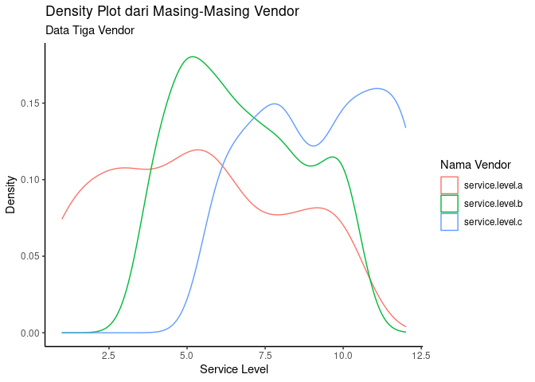
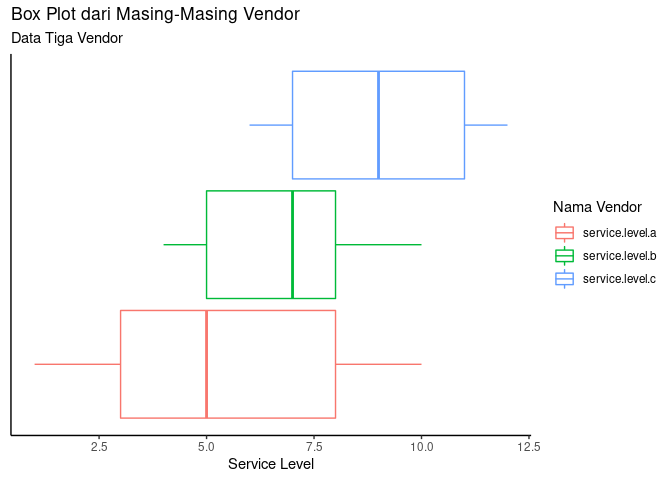

Mengingat Kembali Uji Hipotesis
================

Di suatu sore yang cerah, tiba-tiba salah satu aplikasi *messaging* saya
berbunyi. Notifikasi tersebut mengantarkan saya pada seorang teman yang
bertanya tentang suatu hal yang sudah lama tidak saya sentuh.

> Mas, saya ceritanya saya punya tiga vendor: A, B, dan C. Saya ingin
> menentukan siapa yang terbaik di antara ketiganya.

Begitu masalah yang ia ingin selesaikan.

Ia bekerja di departemen *procurement* di salah satu perusahaan **FMCG**
besar di Indonesia.

Lantas saya bertanya:

> Apa definisi **vendor terbaik**?

Ia menjelaskan bahwa definisi vendor terbaik adalah vendor yang memiliki
*service level* paling rendah. *Service level* adalah banyaknya hari
yang dibutuhkan oleh vendor untuk *fulfill* transaksi yang dijanjikan
kepadanya (misalkan lama hari mengirimkan barang kepada perusahaan teman
saya).

Jadi teman saya memiliki 200 data *service level* dari masing-masing
vendor tersebut.

| service.level.a | service.level.b | service.level.c |
| --------------: | --------------: | --------------: |
|               3 |               4 |               9 |
|               5 |               9 |              10 |
|               7 |               5 |               7 |
|               7 |               8 |              11 |
|               2 |               6 |              10 |
|               2 |               8 |              12 |
|               6 |               5 |              10 |
|               5 |               6 |               8 |
|               9 |               8 |               8 |
|               4 |               8 |              10 |
|               7 |               6 |               7 |
|               1 |               6 |              12 |
|               3 |               9 |               7 |
|               2 |               8 |               6 |
|               6 |              10 |               8 |
|              10 |              10 |              10 |
|               6 |              10 |              12 |
|              10 |               6 |               7 |
|               3 |               7 |               6 |
|               5 |               7 |               7 |
|               2 |               7 |               6 |
|               3 |               5 |               8 |
|               9 |               4 |               8 |
|               9 |               9 |               6 |
|               9 |               5 |               7 |
|               7 |               4 |              12 |
|               6 |               6 |               8 |
|               3 |               7 |              10 |
|              10 |               7 |               9 |
|               2 |               8 |               9 |
|               5 |               6 |              10 |
|               6 |               5 |               6 |
|               1 |               7 |               9 |
|               5 |              10 |               6 |
|               3 |               5 |              11 |
|               1 |               4 |              11 |
|               6 |               9 |              10 |
|              10 |               8 |              10 |
|               3 |               5 |               8 |
|               5 |               6 |               7 |
|               1 |               9 |               8 |
|               5 |               7 |               8 |
|               8 |              10 |               7 |
|               9 |               4 |              10 |
|               9 |               8 |              10 |
|               6 |               5 |              12 |
|               6 |               9 |               6 |
|               5 |               4 |              12 |
|               6 |              10 |               9 |
|               9 |               6 |              12 |
|              10 |               8 |              11 |
|               5 |              10 |              10 |
|               2 |               8 |              12 |
|               8 |               4 |              11 |
|               1 |               7 |              11 |
|               8 |              10 |              12 |
|               9 |               6 |               8 |
|               4 |               4 |               6 |
|               6 |               5 |               6 |
|               3 |               4 |               6 |
|               7 |               8 |               8 |
|               1 |              10 |               9 |
|               6 |               5 |               9 |
|               6 |               5 |               6 |
|               9 |               7 |               8 |
|               3 |               9 |               8 |
|               3 |               4 |              10 |
|               8 |               5 |               8 |
|               8 |               5 |              10 |
|               2 |               6 |               6 |
|               1 |               7 |               8 |
|               3 |              10 |              11 |
|               8 |               8 |              12 |
|               9 |               6 |               7 |
|               4 |               5 |              10 |
|               4 |               7 |              12 |
|               3 |               6 |               6 |
|              10 |               7 |               6 |
|              10 |               6 |              12 |
|               5 |               7 |              11 |
|               2 |               7 |              11 |
|               1 |              10 |               6 |
|              10 |               6 |               8 |
|               7 |               5 |               7 |
|               4 |              10 |               7 |
|               6 |               6 |               9 |
|               2 |               8 |               7 |
|               3 |               7 |              11 |
|               5 |               9 |              11 |
|               8 |               6 |               7 |
|               2 |               4 |              11 |
|               8 |              10 |              10 |
|               6 |               4 |              12 |
|               2 |              10 |               7 |
|               2 |               6 |               7 |
|              10 |               6 |              11 |
|               1 |               8 |               7 |
|               4 |               5 |              11 |
|               2 |               9 |              12 |
|               6 |               7 |              12 |
|               5 |              10 |              10 |
|               4 |               6 |              11 |
|               6 |               4 |              12 |
|               5 |               8 |               7 |
|              10 |               7 |              11 |
|              10 |               4 |               9 |
|               4 |              10 |              11 |
|              10 |               9 |              11 |
|               3 |               9 |              12 |
|               9 |              10 |               8 |
|               1 |               9 |               6 |
|               9 |               4 |               8 |
|               3 |               7 |              11 |
|               2 |               5 |              11 |
|               5 |               4 |              12 |
|               8 |               8 |               8 |
|               8 |               4 |               6 |
|               5 |               7 |               7 |
|               5 |               7 |               7 |
|               8 |               8 |               9 |
|               9 |               7 |               8 |
|              10 |              10 |               9 |
|               5 |               6 |               7 |
|               5 |               5 |               8 |
|               8 |              10 |               8 |
|               1 |               8 |              10 |
|               7 |               7 |               8 |
|               5 |               9 |               9 |
|               4 |               6 |               8 |
|              10 |               5 |              11 |
|               2 |               6 |              11 |
|               1 |               9 |               9 |
|               3 |               8 |              11 |
|               7 |               7 |              10 |
|               3 |               5 |               7 |
|               6 |               5 |              12 |
|               6 |               9 |               6 |
|               4 |               5 |              10 |
|               7 |               9 |               9 |
|              10 |               7 |              11 |
|               6 |               4 |              12 |
|               3 |               4 |              11 |
|              10 |               8 |              11 |
|               7 |               5 |               7 |
|               3 |               8 |               8 |
|               4 |               5 |               8 |
|               3 |               7 |              12 |
|               3 |               6 |              10 |
|               6 |               6 |              11 |
|               5 |               6 |              12 |
|               1 |               4 |              10 |
|               8 |               5 |               8 |
|               1 |              10 |               8 |
|               5 |               5 |              12 |
|               5 |               7 |              12 |
|               6 |               5 |              11 |
|               3 |               4 |               9 |
|               6 |              10 |               7 |
|               2 |               5 |               8 |
|               7 |              10 |              10 |
|               4 |               5 |               6 |
|               4 |               7 |              11 |
|               6 |               8 |              12 |
|               6 |               6 |               6 |
|              10 |              10 |               9 |
|               6 |              10 |              11 |
|               1 |               9 |              12 |
|               4 |               4 |              12 |
|              10 |               8 |               9 |
|               1 |               9 |              12 |
|               1 |               7 |               7 |
|               5 |               4 |              12 |
|               2 |               6 |               7 |
|               4 |               5 |              10 |
|               1 |              10 |              10 |
|               6 |               5 |              10 |
|               9 |               5 |               8 |
|               7 |              10 |               7 |
|               6 |               8 |              11 |
|               4 |               5 |              11 |
|               5 |               6 |               9 |
|               3 |               5 |               6 |
|               9 |               5 |              10 |
|               5 |               8 |              10 |
|              10 |              10 |               8 |
|               2 |               4 |               9 |
|               8 |               6 |               6 |
|               3 |               5 |               8 |
|               1 |               4 |               6 |
|              10 |               4 |              10 |
|               1 |               6 |              12 |
|              10 |               8 |              10 |
|              10 |               6 |              12 |
|               2 |               6 |              10 |
|               4 |              10 |               9 |
|               8 |               5 |               6 |
|               8 |               5 |              12 |
|               3 |               9 |              12 |
|               1 |               5 |               7 |
|               5 |               4 |               8 |

Data Service Level Vendor A, B, dan C

Bagaimana cara kita menyelesaikan permasalahan teman saya tersebut?

## Statistika Deskripsi

Mari kita lihat terlebih dahulu statistika deskripsi dari data di atas:

    ##  service.level.a  service.level.b service.level.c 
    ##  Min.   : 1.000   Min.   : 4.00   Min.   : 6.000  
    ##  1st Qu.: 3.000   1st Qu.: 5.00   1st Qu.: 7.000  
    ##  Median : 5.000   Median : 7.00   Median : 9.000  
    ##  Mean   : 5.305   Mean   : 6.78   Mean   : 9.175  
    ##  3rd Qu.: 8.000   3rd Qu.: 8.00   3rd Qu.:11.000  
    ##  Max.   :10.000   Max.   :10.00   Max.   :12.000

<!-- --><!-- -->

Jika dilihat secara visual, sudah bisa dipastikan bahwa vendor A
memiliki nilai rata-rata *service level* yang paling rendah. Namun perlu
dibuktikan, apakah nilai yang rendah tersebut benar-benar **signifikan**
terhadap nilai rata-rata vendor lainnya (B dan C).

Maka yang perlu dicek adalah pasangan data sebagai berikut:

1.  A vs B
2.  A vs C
3.  B vs C

-----

## Uji Hipotesis

Kita bisa melakukan uji hipotesis untuk mengecek apakah ada perbedaan
yang signifikan dari nilai rata-rata tersebut. Langkah-langkah dalam uji
hipotesis adalah:

1.  Tentukan hipotesis nol dan hipotesis tandingan.

<!-- end list -->

  - Notasi:  dan
    
  - Hipotesis nol adalah hipotesis yang mengandung unsur sama dengan.

<!-- end list -->

2.  Hitung statistik uji atau *p-value*.
3.  Kesimpulan: Tolak  jika *p-value* \< 0.05.
4.  Tuliskan kesimpulan dengan kalimat non matematis.

Dalam statistika inferensi, ada dua pendekatan yang bisa ditempuh,
yakni:

1.  Statistika parametrik. Syarat: data harus berdistribusi normal.
2.  Statistika non parametrik. Syarat: data tidak harus berdistribusi
    normal.

Untuk kasus ini, kita akan menggunakan `T-Test` (jika parametrik) atau
`Wilcox Test` (jika non parametrik). Oleh karena itu, langkah pertama
yang harus ditempuh adalah dengan mengecek normalitas dari ketiga data
tersebut.

### Cek Normalitas dari Data

Beberapa literatur menyebutkan bahwa *normality check* adalah hal yang
wajib dilakukan sebelum kita hendak melakukan uji parametrik. Namun,
beberapa literatur lainnya tidak mewajibkan hal tersebut jika *dataset*
yang kita miliki sudah relatif banyak sehingga cukup dengan [*Central
Limit Theorem*](https://en.wikipedia.org/wiki/Central_limit_theorem),
*dataset* yang kita miliki sudah bisa diasumsikan normal.

Sebenarnya untuk urusan begini, saya agak *males* *yah.* *Hahaha*. Tapi
*yuk* kita coba cek normalitas dari ketiga data tersebut.

Sesuai dengan [*post* saya
sebelumnya](https://passingthroughresearcher.wordpress.com/2019/11/12/oleh-oleh-pelatihan-di-telkom-university/),
saya akan menggunakan uji kenormalan *Kolmogorov-Smirnov*.

*Oh iya*, cek normalitas juga merupakan uji hipotesis, maka
langkah-langkah yang harus ditempuh:

1.  Tentukan hipotesis nol dan tandingan:

<!-- end list -->

  - : Data
    berdistribusi normal.
  - : Data tidak
    berdistribusi normal.

<!-- end list -->

2.  Hitung *p-value* dan lihat bagaimana hasilnya.

<!-- end list -->

``` r
test.a = ks.test(data$service.level.a,'pnorm')
test.b = ks.test(data$service.level.b,'pnorm')
test.c = ks.test(data$service.level.c,'pnorm')

hasil = data.frame(
  vendor = c('A','B','C'),
  p_value = c(test.a$p.value,test.b$p.value,test.c$p.value)
) %>% 
  mutate(kesimpulan = ifelse(p_value < 0.05,'Tolak H0','H0 diterima'),
         hasil_akhir = ifelse(p_value < 0.05,'Tidak berdistribusi normal','Berdistribusi Normal'))

knitr::kable(hasil)
```

| vendor | p\_value | kesimpulan | hasil\_akhir               |
| :----- | -------: | :--------- | :------------------------- |
| A      |        0 | Tolak H0   | Tidak berdistribusi normal |
| B      |        0 | Tolak H0   | Tidak berdistribusi normal |
| C      |        0 | Tolak H0   | Tidak berdistribusi normal |

Ternyata didapatkan bahwa ketiga data vendor tersebut **tidak
berdistribusi normal**. Oleh karena itu, saya akan menggunakan uji non
parametrik untuk menyelesaikan permasalahan ini.

### Wilcoxx Tes dari Pasangan Data Vendor

Sebagaimana yang telah saya infokan, saya akan melakukan tiga kali tes
dari pasangan data yang ada. Mari kita lakukan langkah-langkah uji
hipotesis berikut ini:

1.  Tentukan hipotesis nol dan tandingan:

<!-- end list -->

  - : Rata-rata
    *service level*
     = rata-rata *service level*
    
  - : Rata-rata
    *service level*
      rata-rata *service level*
    

<!-- end list -->

2.  Hitung *p-value* dan lihat bagaimana hasilnya.

<!-- end list -->

``` r
test_1 = wilcox.test(data$service.level.a,data$service.level.b)
test_2 = wilcox.test(data$service.level.a,data$service.level.c)
test_3 = wilcox.test(data$service.level.b,data$service.level.c)

hasil = data.frame(
  vendor_1 = c('A','A','B'),
  vendor_2 = c('B','C','C'),
  p_value = c(test_1$p.value,test_2$p.value,test_3$p.value)
) %>% 
  mutate(kesimpulan = ifelse(p_value < 0.05,'Tolak H0','H0 diterima'),
         hasil_akhir = ifelse(p_value < 0.05,
                              paste0(vendor_1,' tidak sama dengan ',vendor_2),
                              paste0(vendor_1,'=',vendor_2)))

knitr::kable(hasil)
```

| vendor\_1 | vendor\_2 | p\_value | kesimpulan | hasil\_akhir          |
| :-------- | :-------- | -------: | :--------- | :-------------------- |
| A         | B         |    1e-07 | Tolak H0   | A tidak sama dengan B |
| A         | C         |    0e+00 | Tolak H0   | A tidak sama dengan C |
| B         | C         |    0e+00 | Tolak H0   | B tidak sama dengan C |

## Kesimpulan

Dari hasil diatas, kita telah mendapati bahwa:

1.  A  B
2.  A  C
3.  B  C

Jika dilihat kembali dari grafik *boxplot* sebelumnya, kita bisa
simpulkan bahwa:

  
  

-----

# Masalah Belum Selesai

Setelah saya sampaikan temuan saya ini, teman saya lantas berkata:

> Jika Vendor A adalah yang terbaik, apakah vendor tersebut sudah
> memenuhi standar *service level* perusahaan saya?

Teman saya menginformasikan bahwa standar *service level* perusahaannya
adalah `4 hari`. Jadi sekarang tugas kita adalah mengecek apakah
`mean(service.level.a) < 5`.

Berhubung datanya tidak normal, saya akan tetap menggunakan *Wilcox
Test* untuk satu sampel. Mari kita lakukan langkah-langkah uji hipotesis
berikut ini:

1.  Tentukan hipotesis nol dan tandingan:

<!-- end list -->

  - : Rata-rata
    *service level* vendor A
     5 hari
  - : Rata-rata
    *service level* vendor A \< 5 hari

<!-- end list -->

2.  Hitung *p-value* dan lihat bagaimana hasilnya.

<!-- end list -->

``` r
test = wilcox.test(data$service.level.a, mu = 5, alternative = "less")
test
```

    ## 
    ##  Wilcoxon signed rank test with continuity correction
    ## 
    ## data:  data$service.level.a
    ## V = 8562, p-value = 0.9244
    ## alternative hypothesis: true location is less than 5

Ternyata didapatkan hasil *p-value* = 0.9244477.

Kesimpulan: H0 diterima alias Vendor A masih berada di atas standar
perusahaan teman saya.
