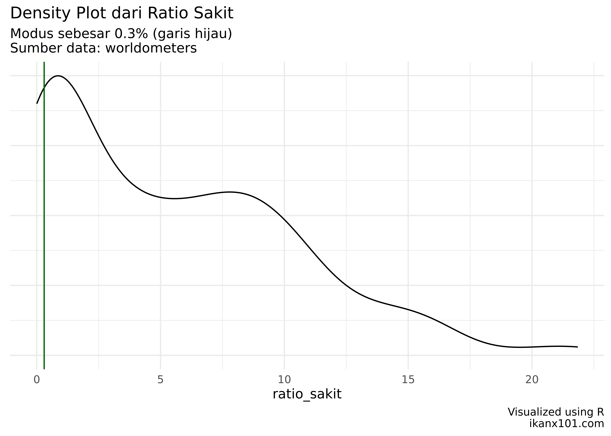

Kondisi Terkini Pandemi Covid 19 di Dunia
================

Tidak terasa sudah lebih dari satu setengah tahun kita melalui pandemi
Covid 19. Sejak tulisan pertama saya terkait [model matematika
penyebaran covid](https://ikanx101.com/blog/covid/), kini angka
pertambahan kasus positif relatif sudah mulai terkendali. Sampai bisa
seperti sekarang ini, Indonesia harus melalui jalan terjal dan berliku.
Mulai dari hantaman gelombang pertama dan gelombang kedua (varian delta)
pada kuartal I dan II tahun ini. Namun menurut saya, Indonesia belum
bisa dikatakan menang melawan Covid 19. Masih ada PR yang harus kita
selesaikan bersama sebagai negara. Selain itu korban yang berjatuhan
sampai saat ini **tidak menjadikan kita pantas** untuk berbangga hati.

Jika kita pantau dari berbagai sumber berita yang ada, sebenarnya ada
beberapa negara yang sudah jauh lebih dulu “terbebas” dari Covid 19 dan
kembali beraktivitas dengan “normal”. Sementara sebagian lainnya masih
berusaha keluar.

Sekarang mari kita lihat kondisi terkini Covid 19 per negara seperti
yang saya himpun dari situs <https://www.worldometers.info/coronavirus/>
per 2021-10-10 20:07:41. Saya akan membuat analisa deskriptif sederhana
dari data yang saya
dapatkan.

    ## Contoh 10 Data Teratas yang Didapatkan

| number | country\_other | population | active\_cases | total\_cases | total\_recovered | total\_deaths |
| -----: | :------------- | ---------: | ------------: | -----------: | ---------------: | ------------: |
|      1 | USA            |  333468970 |       9815497 |     45179209 |         34630654 |        733058 |
|      2 | India          | 1397235287 |        230939 |     33953475 |         33271915 |        450621 |
|      3 | Brazil         |  214479029 |        295953 |     21567181 |         20670348 |        600880 |
|      4 | UK             |   68339166 |       1363398 |      8120713 |          6619618 |        137697 |
|      5 | Russia         |  146014021 |        700831 |      7775365 |          6858119 |        216415 |
|      6 | Turkey         |   85491480 |        482494 |      7416182 |          6867704 |         65984 |
|      7 | France         |   65457114 |         97187 |      7052520 |          6838289 |        117044 |
|      8 | Iran           |   85357709 |        362299 |      5702890 |          5217999 |        122592 |
|      9 | Argentina      |   45722524 |         18791 |      5265528 |          5131279 |        115458 |
|     10 | Spain          |   46777803 |         86148 |      4973619 |          4800693 |         86778 |

Dari data tersebut, saya akan menghitung beberapa *ratio* seperti:

1.  `ratio_sakit`: rasio antara *total cases* dengan populasi.
2.  `ratio_aktif`: rasio antara *active cases* dengan *total cases*.
3.  `ratio_cured`: rasio antara *total recovered* dengan *total cases*.
4.  `ratio_death`: rasio antara *total death* dengan *total
cases*.

<!-- end list -->

    ## Contoh 10 Data Teratas Hasil Perhitungan Rasio

| country\_other | ratio\_sakit | ratio\_aktif | ratio\_death | ratio\_cured |
| :------------- | -----------: | -----------: | -----------: | -----------: |
| USA            |        13.55 |        21.73 |         1.62 |        76.65 |
| India          |         2.43 |         0.68 |         1.33 |        97.99 |
| Brazil         |        10.06 |         1.37 |         2.79 |        95.84 |
| UK             |        11.88 |        16.79 |         1.70 |        81.52 |
| Russia         |         5.33 |         9.01 |         2.78 |        88.20 |
| Turkey         |         8.67 |         6.51 |         0.89 |        92.60 |
| France         |        10.77 |         1.38 |         1.66 |        96.96 |
| Iran           |         6.68 |         6.35 |         2.15 |        91.50 |
| Argentina      |        11.52 |         0.36 |         2.19 |        97.45 |
| Spain          |        10.63 |         1.73 |         1.74 |        96.52 |

-----

## *Total Cases*

*Total cases* adalah angka *real infected person* di suatu negara.
Secara total dunia, sampai saat data ini saya *scrape*, sudah ada 238.44
juta orang yang terinfeksi Covid 19. Mari kita lihat sebaran dari
`ratio_sakit` semua
negara:

Mayoritas negara-negara di dunia memiliki *ratio infected person* **\<
10%**. Ada hal yang menarik menurut saya: China sebagai negara *suspect*
bagi *patient zero* ternyata “hanya” memiliki *ratio infected person*
sebesar **0.1%** saja. Berikut adalah 3 negara yang memiliki *ratio
infected person* terbesar:

    ## Seychelles Montenegro Andorra
