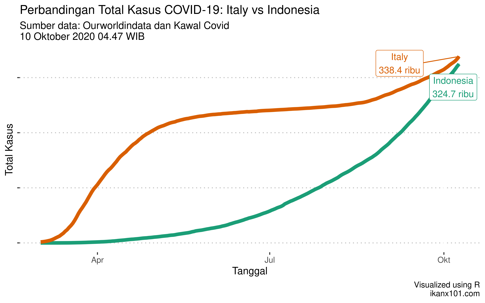
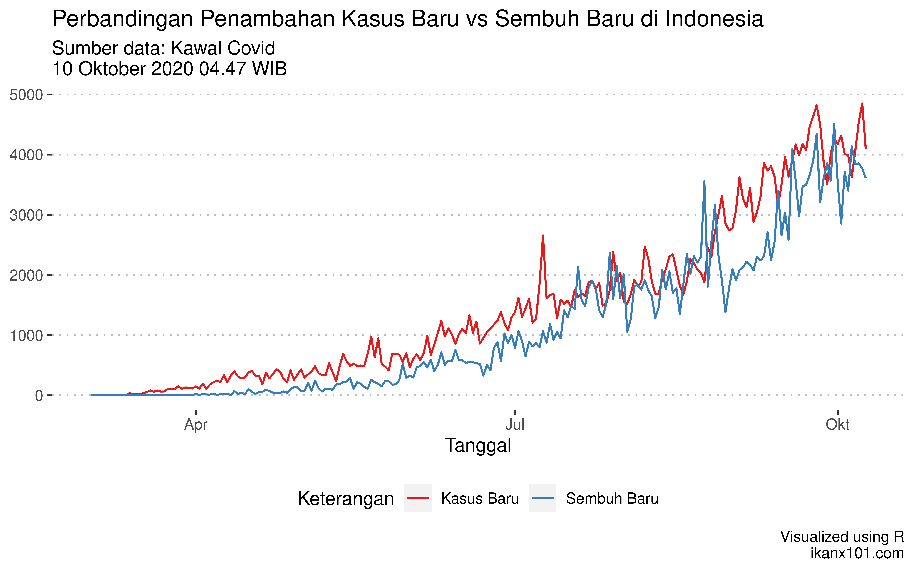
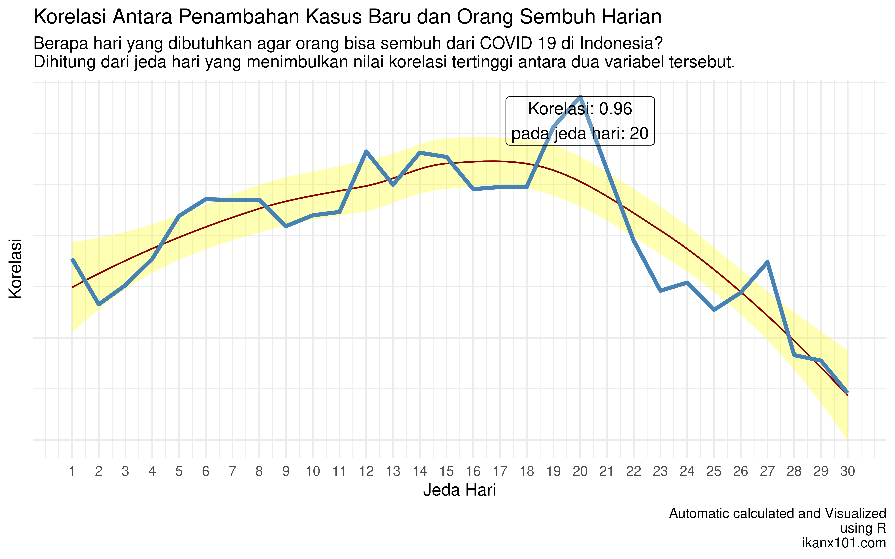

Update COVID-19: Indonesia Sudah Setara Italy dan Korelasi Antara Kasus
Baru dan Sembuh Baru
================

Kali ini masih tentang COVID 19 dan ada dua hal yang ingin saya lakukan:

1.  Bagaimana status **pertandingan** `Indonesia` vs `Italy`?
2.  Berapa hari *sih* orang bisa sembuh dari COVID 19 di Indonesia?

-----

# *Cumulative Cases* `Indonesia` vs `Italy`

Melanjuti tulisan saya
[sebelumnya](https://ikanx101.com/blog/recovery-indo/), kali ini kita
lihat posisi terkini dari balapan *cumulative cases* antara `Italy` dan
`Indonesia`.

Dengan penambahan kasus baru di angka `4` ribuan per hari, sepertinya
dalam beberapa hari ini `Indonesia` bisa menyalip `Italy`. Apalagi demo
yang dilakukan kemarin bisa jadi potensi *cluster* penyebaran terbaru.

> Tulisan ini mengandung sarkasme yah. No one should be proud of this
> number\! This is life, not just a number\!

-----

# Berapa Hari Pasien COVID 19 Bisa Sembuh?

Sebagaimana yang kita ketahui bersama, COVID 19 sejatinya adalah *self
limiting desease* (bisa sembuh dengan sendirinya) bagi sebagian orang.
Sebagian orang lainnya memerlukan perawatan medis secara intensif. Dari
beberapa kasus yang saya temui, durasi lamanya seorang pasien bisa
sembuh cukup beragam.

> Ada yang membutuhkan waktu hingga 2 minggu. Ada yang singkat tak lebih
> dari seminggu.

Sayang sekali saya tidak memiliki data yang lengkap untuk bisa
menghitung waktu rata-rata yang dibutuhkan pasien agar bisa sembuh.

Satu-satunya data yang saya miliki adalah sebagai berikut:

Berbekal data tersebut, bisakah kita menghitung durasi hari kesembuhan?

> Salah satu pendekatan yang bisa saya lakukan adalah dengan menggunakan
> analisa korelasi\!

Bagaimana maksudnya?

Secara logika, penambahan orang sembuh berasal dari pasien yang sakit.
Oleh karena itu kedua variabel tersebut pasti berkorelasi. Semakin
banyak orang yang sakit akan mengakibatkan semakin banyak pula orang
yang sembuh (bisa juga terjadi kebalikannya \~ dan ini adalah hal yang
tidak kita inginkan sama sekali).

Penambahan orang yang sakit di hari ke *n* tidak serta merta
mengakibatkan penambahan orang yang sembuh di hari tersebut.

> Pasti ada jeda\!

**Jeda hari yang memberikan korelasi tertinggi akan saya duga sebagai
durasi rata-rata hari kesembuhan.**

