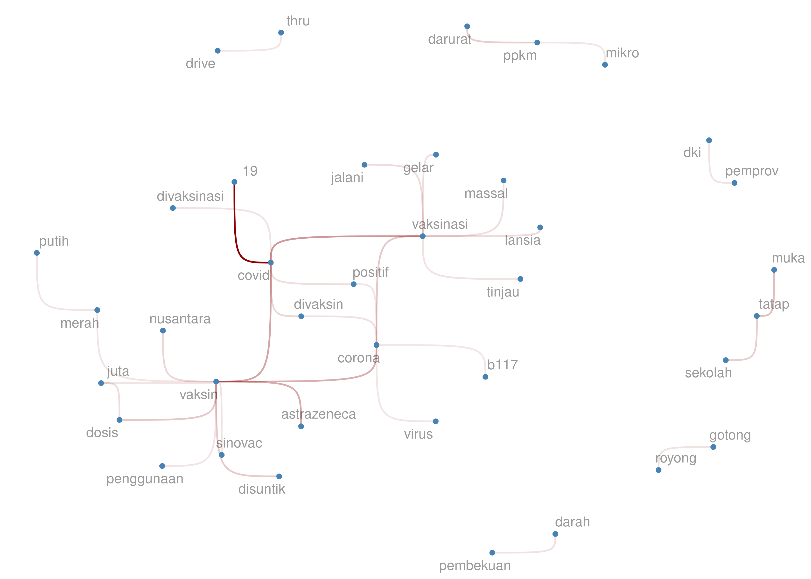

Serba-Serbi Vaksin Covid 19: Penelusuran Data
================

Hari ini tepat seminggu setelah saya menerima suntikan pertama dosis
vaksin ***Sinovac***. *Alhamdulillah*, saya mendapatkan kesempatan
vaksin dari kantor yang bekerja sama dengan Himpunan Penyewa Pusat
Perbelanjaan Indonesia ([HIPPINDO](https://www.hippindo.com/)).
Vaksinasi tersebut diselenggarakan di Gedung SMESCO Jakarta.

> Setelah divaksin, beberapa efek samping yang saya alami adalah pusing
> dan *ngantuk*. *hehe*

Efek samping tersebut saya alami selama dua hari.

------------------------------------------------------------------------

## *Progress* Vaksinasi

Akibat varian delta yang mengganas dalam beberapa pekan belakangan ini,
pemerintah berusaha mengebut proses vaksinasi kepada semua warga, tidak
terkecuali. Ditargetkan dalam sehari ada [satu juta
vaksin](https://www.presidenri.go.id/siaran-pers/pemerintah-terus-kejar-target-vaksinasi-di-indonesia/)
yang diberikan. Menurut saya pribadi, langkah yang dilakukan ini sudah
terlambat.

> Setelah tenaga kesehatan selesai divaksin, seharusnya sudah ada *mix
> proportion* target vaksin antara lansia dan usia produktif. Jadi tidak
> harus menunggu lansia selesai terlebih dahulu!

Saya mengambil data *progress* vaksinasi dunia di situs [Our World in
Data](https://ourworldindata.org/covid-vaccinations), saya akan coba
bandingkan *progress* vaksinasi Indonesia dengan beberapa negara lain
sebagai berikut:

Fig1. Progress Vaksinasi

Dengan cakupan vaksinasi yang masih rendah, tampaknya pemerintah harus
bekerja lebih keras lagi agar semakin banyak masyarakat yang divaksin.

> Jangan sampai ***herd immunity*** bisa tercapai gara-gara kasus alami.

------------------------------------------------------------------------

## Pemberitaan Terkait Vaksin

Pagi ini saya melakukan *scraping* terhadap `2.700` *latest headline
news* di situs [detik.com](https://www.detik.com/) yang mengandung kata
**vaksin**. Apa saja yang saya temukan?

Pertama-tama saya akan buat *wordcloud* dari *headlines* tersebut:

Fig2. Wordcloud

Ternyata ***Astrazeneca*** lebih banyak masuk *headline* dibandingkan
***Sinovac***. Hal ini wajar karena dalam beberapa pekan terakhir
pemerintah sedang `menghabiskan stok vaksin Astrazeneca`.

Sekarang saya akan buat *bigrams*-nya:

Fig3. Bigrams

Kita bisa lihat beberapa topik berita yang **sering muncul** ada di
*headlines* tersebut. Teman-teman bisa menelaah sendiri hasil di atas.

------------------------------------------------------------------------

## Jenis Vaksin Covid 19

Sepengetahuan saya selama ini, baru ada `2+1` jenis vaksin yang telah
digunakan di Indonesia, yakni:

1.  *Sinovac*,
2.  *Astrazeneca*, dan
3.  *Nusantara*.

Kalau diperhatikan dengan seksama, ketiganya masuk ke dalam *wordcloud*
*headlines* berita di atas.

> Apakah kalian tahu bahwa sebenarnya sudah ada `147` kandidat vaksin
> Covid-19 di dunia? Namun baru `19` yang sudah disetujui penggunaannya.

Saya mengambil data dari situs [*Track
Vaccines*](https://covid19.trackvaccines.org/vaccines/) sebagai berikut:

Fig4. Phase Vaksin

Sekarang kita lihat apa saja `19` vaksin yang telah mendapatkan
*approval*:

Fig5. 19 Approved Vaccines

**Astrazeneca** menjadi vaksin yang paling banyak disetujui
penggunaannya di dunia.

Hal yang menarik juga adalah ternyata **Sinopharm**, merek vaksin yang
hendak akan digunakan di Indonesia dengan skema **vaksin gotong
royong**, ternyata sudah disetujui di banyak negara dibandingkan
**Sinovac**.

Mari kita lihat *network* diagram negara-negara mana saja yang telah
menyetujui vaksin tersebut.

Saya hanya memilih `8` vaksin yang memiliki *approval* terbanyak:

Fig6. Network Vaccines - Countries

Catatan: warna yang berbeda menandakan jenis vaksin yang berbeda.

------------------------------------------------------------------------

`if you find this article helpful, support this blog by clicking the ads.`
