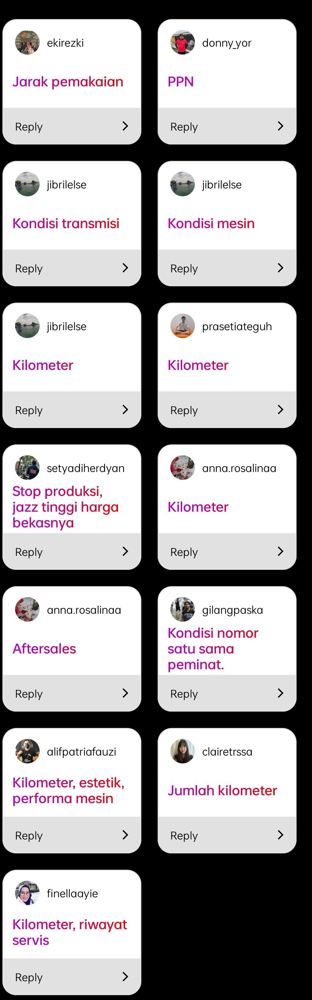

```{r setup, include=FALSE}
knitr::opts_chunk$set(echo = TRUE)

setwd("~/ikanx101 BLOG/_posts/Explainable AI/post 3")
#setwd("/cloud/project/_posts/Explainable AI/post 3")

rm(list=ls())
library(dplyr)
library(DALEX)
library(caret)
library(pROC)

load("siap_post.rda")
```

Pada saat menikah dulu, tidak pernah terbersit di kepala saya bahwa memiliki mobil adalah suatu kebutuhan primer hingga anak saya yang sulung lahir. Beberapa kali ada kondisi yang mengharuskan saya harus memiliki mobil sebagai sarana transportasi keluarga. Pada saat itu, uang saya tidak cukup untuk membeli mobil baru secara tunai. Akhirnya saya dan istri mencari-cari mobil bekas di salah satu _dealer_ mobil bekas milik Astra.  

Waktu itu, kami dijodohkan dengan mobil sedan Honda City warna hitam tahun 2003 yang _body_-nya masih _gres_. Kilometernya juga baru 100 ribuan (mengingat sudah 10 tahunan mobil itu berada di jalanan). Akhirnya dengan harga tak sampai 100 juta, kami pinang mobil tersebut.

Jika ditanyakan kepada saya:

> Apakah harga tersebut kemahalan atau tidak?

Saya akan langsung menjawab: __"tidak tahu"__.

---

Saya sendiri tidak terlalu mengerti apa yang menjadi patokan harga mobil bekas. Beberapa  faktor yang saya duga berpengaruh penting adalah:

1. _Brand_, dan
1. Kilometer tempuh.

Sabtu lalu, saya sempat membuat _polling_ kecil-kecilan di instagram mengenai hal ini.

```{r,echo=FALSE,fig.align='center'}
knitr::include_graphics("tanya.jpg")
```

Beberapa teman saya telah menjawabnya.

```{r out.width="30%",echo=FALSE,fig.align='center'}

```


---

Untuk menjawab rasa penasaran saya, saya akan mencoba membuat model yang bisa memprediksi harga mobil bekas dari beberapa _predictors_.

Saya mengambil data mobil bekas dengan cara _web scraping_ 500 data mobil bekas yang _listed_ di situs [Carmudi](https://www.carmudi.co.id/) pada Sabtu, 26 Juni 2021. Cara _scrape_-nya sudah pernah saya tulis di [sini](https://ikanx101.com/blog/blog-post-terios/).

Saya mengambil data sebagai berikut:

1. Harga mobil. 
    - Saya melakukan transformasi pada data ini dengan cara melakukan operasi _log natural_ ($ln()$).
    - Tujuannya adalah agar data lebih _compact_ dan tidak lebar _range_-nya.
    - Tipe data ini adalah numerik.
1. _Brand_.
    - Tipe data ini berupa kategorik.
1. Status: _new car_ dan _used car_. 
    - Ternyata ada sebagian kecil dari _listed car_ di Carmudi yang merupakan _new car_.
    - Tipe data ini berupa kategorik.
1. Tahun.
    - Tipe data ini adalah numerik.
1. _Seat_.
    - Tipe data ini adalah numerik.
1. _Mileage_.
    - Tipe data ini adalah numerik.
1. Kapasitas _cc_ mesin.
    - Tipe data ini adalah numerik.

Tujuan saya adalah membuat model sebagai berikut:

$$\text{harga} \sim \text{brand}+\text{status}+\text{tahun}+\text{seat}+\text{mileage}+\text{cc}$$

Oleh karena `brand` dan `status` memiliki tipe kategorik, saya akan lakukan _preprocessing_ berupa _one hot encoding_ agar menjadi numerik _binary_.

---

## Model Regresi Linear

Untuk membuat model regresi linearnya, saya menggunakan _deep learning_ via __Tensorflow__ dan __Keras__. 

Langkah kerjanya adalahh sebagai berikut:

```{r,echo=FALSE,fig.align='center',fig.cap="Gambar 1. Langkah Kerja"}

```

Berikut ini adalah performa modelnya yang saya hitung dengan _test dataset_:

```{r,echo=FALSE,fig.align='center',message=FALSE,warning=FALSE,fig.cap="Gambar 2. Performa Model (loss dan MAE) dengan Epoch=200"}
plot_model_keras
```

Berikut adalah _summary_ dari performa modelnya:

```{r,echo=FALSE}
performa_model
```

Dari performa model di atas, saya cukup puas dengan model regresinya karena angka $MSE \rightarrow 0$ dan $R^2>0.7$. 

Sekarang tinggal mendeskripsikan modelnya saja. Karena saya menggunakan _deep learning_ (___ANN___) untuk membuat modelnya, maka saya membutuhkan `DALEX` untuk membantu saya mendeskripsikan modelnya.

### _Feature Importance_

```{r,echo=FALSE,fig.cap="Gambar 2. Feature Importance"}
plot_importance
```

Dari __data yang terbatas ini__ saya dapatkan bahwa `cc mesin` dan `brand Toyota` merupakan variabel terpenting dan paling berpengaruh terhadap harga mobil yang _listed_ di Carmudi.

Beberapa variabel lain seperti `tahun` dan `mileage` juga cukup berpengaruh.

> Bagaimana bentuk pengaruhnya?

Mari kita lihat _model profile_ berikut ini.

### _Model Profile_

```{r,echo=FALSE,fig.height=10,fig.cap="Gambar 3. Accumulated Dependence Profile"}
plot(mp_ball)
```

Ada hal yang menarik dari grafik di atas. Saya bisa kategorikan beberapa variabel menjadi dua:

1. Variabel yang membuat harga semakin mahal.
    - `cc mesin` : semakin besar kapasitas dari mesin akan membuat harga mobil menjadi lebih mahal.
    - `tahun` : semakin muda tahunnya, mobil akan semakin mahal.
    - Jika dibandingkan antara `cc mesin` dan `tahun`, variabel yang paling _ngefek_ memberikan peningkata harga terbesar adalah `cc mesin`.
        
1. Variabel yang membuat harga semakin murah.
    - `mileage` : semakin besar jarak tempuh, mobil akan semakin murah.
    - `brand` : Di antara brand berikut: Toyota, Daihatsu, Honda, Mitsubishi, dan Suzuki kita bisa simpulkan:
            - `Toyota` memiliki penurunan yang relatif lebih landai dibandingkan mobil merek lainnya.
            - _Brand_ mobil yang memiliki penurunan harga terbesar jika saya urutkan adalah: `Daihatsu`, `Suzuki`, `Mitsubishi`, `Honda`, dan `Toyota`.

---

### _Notes_

Analisa ini berdasarkan data terbatas yang saya kumpulkan dari situs Carmudi. Jika ada data lebih banyak, misalkan:

1. _Service history_ per _listed_ mobil.
1. Kualitas _after service_ masing-masing _brand_ yang bisa dikuantifikasi.
1. Estetik interior dan exterior yang bisa dikuantifikasi.
1. dan lainnya.

Bisa jadi model ini akan lebih akurat.

---

`if you find this article helpful, support this blog by clicking the ads.`