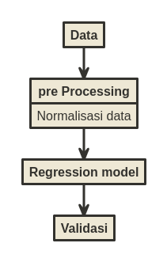

```{r setup, include=FALSE}
knitr::opts_chunk$set(echo = TRUE)
setwd("~/ikanx101 BLOG/_posts/Explainable AI/post 4")

rm(list=ls())

library(dplyr)
library(ggplot2)

load("bahan_blog.rda")
```

Di blog saya yang lama, saya pernah menuliskan tentang bagaimana [GDP memiliki hubungan dengan level kebahagiaan suatu negara](https://passingthroughresearcher.wordpress.com/2019/11/19/infografis-kemakmuran-vs-kebahagiaan-suatu-negara/). Pada 2021 ini, __Gallup__ telah mengeluarkan data terbaru ___World Happiness Report___, datanya saya ambil dari situs [Kaggle berikut ini](https://www.kaggle.com/ajaypalsinghlo/world-happiness-report-2021).

> Kali ini saya akan mencoba eksplorasi, faktor apa saja yang mempengaruhi kebahagiaan warga suatu negara?

---

## Analisa Deskriptif dari Data
Dari data yang saya ambil tersebut, ada `124` negara yang disurvey oleh __Gallup__. Saya mengambil `9` _variables_ utama dari data tersebut, yakni:

```{r,echo=FALSE}
str(data_sel)
```

1. `country_name`: nama negara.
1. `regional_indicator`: area atau region dari negara tersebut.
1. `ladder_score`: tingkat kebahagiaan.
1. `logged_gdp_per_capita`: angka ___GDP per capita___ yang telah ditransformasi dengan fungsi _lognormal_.
1. `social_support`: tingkat _social support_ dari warga suatu negara.
1. `healthy_life_expectancy`: angka harapan hidup.
1. `freedom_to_make_life_choices`: tingkat seberapa bebas seseorang bisa mengambil keputusan terhadap kehidupannya. 
1. `generosity`: tingkat __kemurahan hati__ dari warga suatu negara.
1. `perception_of_corruption`: persepsi tingkat korupsi warga di negaranya.

Mari kita bedah satu-persatu.

### 10 Negara dengan Kebahagiaan Tertinggi
Apa saja 10 negara dengan kebahagiaan tertinggi?

```{r,echo=FALSE,message=FALSE,warning=FALSE,fig.align='center'}
data %>% 
  select(country_name,ladder_score,upperwhisker,lowerwhisker) %>% 
  arrange(desc(ladder_score)) %>% 
  head(10) %>% 
  ggplot(aes(x = reorder(country_name,-ladder_score),
             y = ladder_score,
             ymin = lowerwhisker,
             ymax = upperwhisker)) +
  geom_errorbar(width = .2,
                color = "steelblue") +
  geom_point(shape = 5) +
  geom_label(aes(label = round(ladder_score,2),
                 y = ladder_score + .02),
             size = 2,
             alpha = .75,
             color = "steelblue") +
  theme_minimal() +
  scale_x_discrete(guide = guide_axis(n.dodge = 2)) +
  labs(title = "10 Negara dengan Tingkat Kebahagiaan Tertinggi",
       subtitle = "Indeks Kebahagiaan dan Rentang Nilainya",
       caption = "Visualized using R\nikanx101.com") +
  theme(plot.title = element_text(hjust = .5),
        plot.subtitle = element_text(hjust = .5),
        plot.caption = element_text(hjust = .5),
        axis.title = element_blank(),
        axis.text.y = element_blank())
```

Ternyata didominasi oleh negara-negara Eropa.

### 10 Negara dengan Kebahagiaan Terendah

Sekarang negara mana saja yang memiliki indeks kebahagiaan terendah?

```{r,echo=FALSE,message=FALSE,warning=FALSE,fig.align='center'}
data %>% 
  select(country_name,ladder_score,upperwhisker,lowerwhisker) %>% 
  arrange(desc(ladder_score)) %>% 
  tail(10) %>% 
  ggplot(aes(x = reorder(country_name,-ladder_score),
             y = ladder_score,
             ymin = lowerwhisker,
             ymax = upperwhisker)) +
  geom_errorbar(width = .2,
                color = "darkred") +
  geom_point(shape = 5) +
  geom_label(aes(label = round(ladder_score,2),
                 y = ladder_score + .02),
             size = 2,
             alpha = .75,
             color = "darkred") +
  theme_minimal() +
  scale_x_discrete(guide = guide_axis(n.dodge = 2)) +
  labs(title = "10 Negara dengan Tingkat Kebahagiaan Terendah",
       subtitle = "Indeks Kebahagiaan dan Rentang Nilainya",
       caption = "Visualized using R\nikanx101.com") +
  theme(plot.title = element_text(hjust = .5),
        plot.subtitle = element_text(hjust = .5),
        plot.caption = element_text(hjust = .5),
        axis.title = element_blank(),
        axis.text.y = element_blank())
```

Negara-negara tersebut didominasi oleh negara Afrika dan Asia yang memiliki sejarah konflik.

### Indonesia sebagai Negara yang Paling Murah Hati

> ___Apakah kalian pernah mendengar kalimat di atas?___

Setidaknya beberapa rekan saya di _timeline_ sempat membahas hal ini. Ternyata pernyataan tersebut berasal dari survey ___World Giving Index___ yang dirilis oleh badan amal [___Charities Aid Foundation___](https://www.femina.co.id/trending-topic/good-news-indonesia-dinobatkan-jadi-negara-paling-murah-hati-di-dunia).

Sekarang, dari data yang saya punya, saya akan melihat 10 negara dengan nilai _generosity_ tertinggi:

```{r,echo=FALSE,message=FALSE,warning=FALSE,fig.align='center'}
data %>% 
  select(country_name,generosity) %>% 
  arrange(desc(generosity)) %>% 
  head(10) %>%  
  ggplot(aes(x = reorder(country_name,-generosity),
             y = generosity)) +
  geom_col(width = .4,
           fill = "steelblue",
           color = "black") +
  geom_label(aes(label = round(generosity,2)),
             size = 2.5,
             color = "steelblue") +
  theme_minimal() +
  scale_x_discrete(guide = guide_axis(n.dodge = 2)) +
  labs(title = "10 Negara dengan Tingkat Kemurahan Hati Tertinggi",
       subtitle = "Indeks Generosity",
       caption = "Visualized using R\nikanx101.com") +
  theme(plot.title = element_text(hjust = .5),
        plot.subtitle = element_text(hjust = .5),
        plot.caption = element_text(hjust = .5),
        axis.title = element_blank(),
        axis.text.y = element_blank())
```

Ternyata dari data ini kita bisa mendapatkan kesimpulan yang sama.

> ___Indonesia menjadi negara yang paling generous.___

### Analisa Per Region
Berikut ini adalah nilai rata-rata dari semua variabel per region:

```{r,echo=FALSE,message=FALSE,warning=FALSE,fig.align='center'}
library(reshape2)

data_tabel = 
  data_sel %>% 
  group_by(regional_indicator) %>% 
  summarise(ladder_score = mean(ladder_score),
            logged_gdp_per_capita = mean(logged_gdp_per_capita),
            social_support = mean(social_support),
            healthy_life_expectancy = mean(healthy_life_expectancy),
            freedom_to_make_life_choices = mean(freedom_to_make_life_choices),
            generosity = mean(generosity),
            perceptions_of_corruption = mean(perceptions_of_corruption)) %>% 
  ungroup() %>% 
  mutate(ladder_score = round(ladder_score,2),
         logged_gdp_per_capita = round(logged_gdp_per_capita),
         social_support = round(social_support,2),
         healthy_life_expectancy = round(healthy_life_expectancy,2),
         freedom_to_make_life_choices = round(freedom_to_make_life_choices,2),
         generosity = round(generosity,2),
         perceptions_of_corruption = round(perceptions_of_corruption,2))

data_tabel %>% 
  melt(id.vars = "regional_indicator") %>% 
  mutate(warna = log(value)) %>% 
  ggplot(aes(y = regional_indicator,
             x = variable,
             fill = warna)) +
  geom_tile() + 
  scale_fill_gradient2(low = "darkred", mid = "white", high = "steelblue", midpoint = 1) +
  scale_x_discrete(guide = guide_axis(n.dodge = 4)) +
  geom_label(aes(label = value)) +
  theme_minimal() +
  theme(legend.position = "none",
        plot.title = element_text(hjust = .5),
        plot.subtitle = element_text(hjust = .5),
        plot.caption = element_text(hjust = .5)) +
  labs(y = "Region Negara",
       x = "Variabel Terkait",
       title = "Rata-rata Nilai per Variabel dari Masing-Masing\nRegion Negara",
       subtitle = "World Happiness Index Survey",
       caption = "Visualized using R\nikanx101.com")

```

## Analisa Prediktif dari Data

Sekarang saatnya melakukan analisa kausalitas dengan cara melakukan analisa multilinear regresi dari data yang ada.

Saya berharap mendapatkan model sebagai berikut:

$$ladder \sim gdp + social + healthy + freedom + generosity +corruption$$

Berikut ini adalah langkah-langkah yang saya lakukan:

```{r,echo=FALSE,warning=FALSE,message=FALSE,fig.align='center'}

```

Untuk proses _pre-processing_ data, saya melakukan normalisasi dengan menggunakan _range_. Untuk melakukan validasi dan mengecek _goodness of fit_ dari model, saya menggunakan beberapa prinsip yang pernah saya tuliskan di [sini](https://ikanx101.com/blog/belajar-regresi/). Saya akan gunakan tiga parameter, yakni: $R^2$, __RMSE__ dan __p-value__.

### Iterasi Pertama
Pada percobaan pertama, saya memasukkan semua variabel yang ada untuk memprediksi nilai `ladder_score`, hasilnya adalah sebagai berikut:

```{r,echo=FALSE}
summary(model_awal)
```

Dari hasil di atas ternyata `generosity` bukanlah variabel yang berpengaruh signifikan terhadap kebahagiaan. Berdasarkan temuan ini, saya akan membuat modelnya kembali tanpa variabel tersebut.

### Iterasi Kedua
Kali ini saya membuat model dengan menghilangkan variabel `generosity`, sebagai berikut:

```{r,echo=FALSE}
summary(model_1)
paste0("RMSE: ",rmse_model_1)
```

Jika kita lihat parameter-parameter _goodness of fit_ dari model:

1. `Adjusted R-squared` sebesar `0.745`. Bisa saya simpulkan model sudah cukup baik.
1. `p-value` sebesar $2.2 * 10^{-16} \sim 0$. Model menunjukkan pengaruh signifikan dari variabel prediktor terhadap variabel target.
1. `RMSE` sebesar `r round(rmse_model_1,4)`. Nilainya sudah bagus karena kecil.

Dari ketiga parameter di atas, artinya model regresi saya sudah baik.

### Interpretasi Model Regresi

Saya dapatkan model sebagai berikut:

$$ladder \simeq 0.09 + 0.25gdp + 0.24social + 0.16healthy + 0.24freedom - 0.11corruption$$

Ternyata:

> ___Kebahagiaan itu dipengaruhi oleh 3 variabel utama, yakni: `gdp per capita`, `social support`, dan `freedom to make choices`.___

Ketiganya memiliki hubungan positif. Artinya semakin tinggi nilai ketiga variabel tersebut mengakibatkan indeks kebahagiaan juga meningkat.

Sedangkan variabel lainnya seperti `healthy_life_expectancy` dan `perceptions_of_corruption` justru memiliki pengaruh yang relatif lebih kecil dibandingkan ketiganya.

---

> Selain harta, tampaknya _social support_ dan kebebasan dalam hidup adalah kunci bagi kebahagiaan berdasarkan survey ini.

---

`if you find this article helpful, support this blog by clicking the ads.`