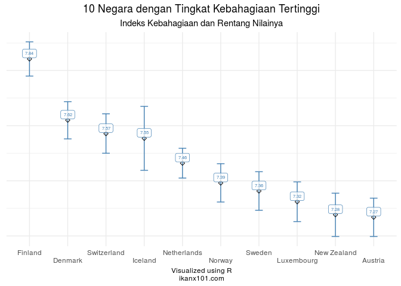
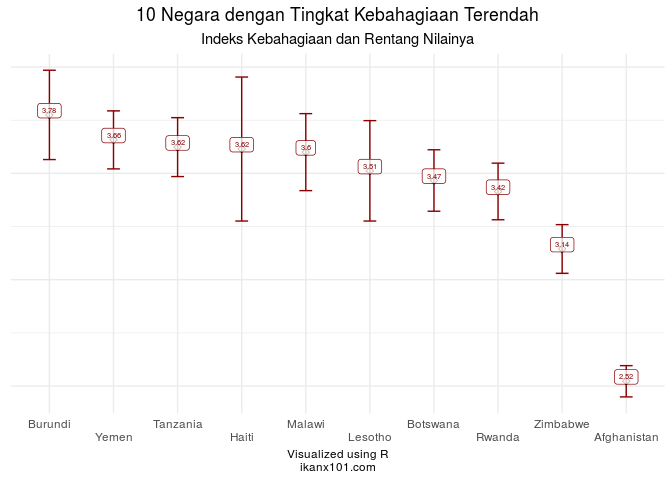
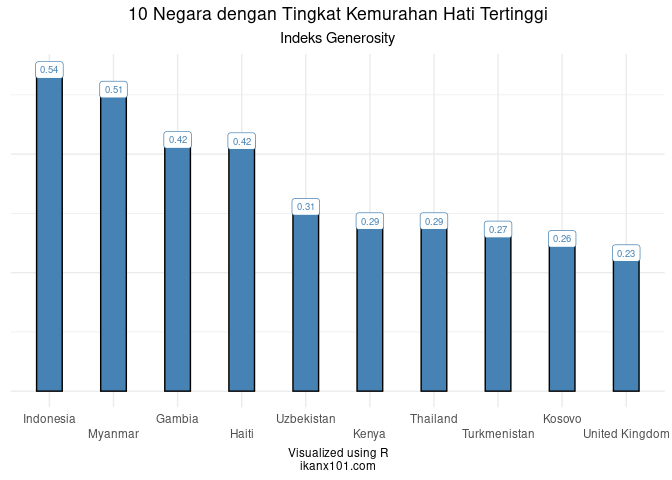

World Happiness Report 2021: Apa yang Membuat Warga Suatu Negara
Bahagia?
================

Di blog saya yang lama, saya pernah menuliskan tentang bagaimana [GDP
memiliki hubungan dengan level kebahagiaan suatu
negara](https://passingthroughresearcher.wordpress.com/2019/11/19/infografis-kemakmuran-vs-kebahagiaan-suatu-negara/).
Pada 2021 ini, **Gallup** telah mengeluarkan data terbaru ***World
Happiness Report***, datanya saya ambil dari situs [Kaggle berikut
ini](https://www.kaggle.com/ajaypalsinghlo/world-happiness-report-2021).

> Kali ini saya akan mencoba eksplorasi, faktor apa saja yang
> mempengaruhi kebahagiaan warga suatu negara?

------------------------------------------------------------------------

## Analisa Deskriptif dari Data

Dari data yang saya ambil tersebut, ada `124` negara yang disurvey oleh
**Gallup**. Saya mengambil `9` *variables* utama dari data tersebut,
yakni:

    ## 'data.frame':    149 obs. of  9 variables:
    ##  $ country_name                : chr  "Finland" "Denmark" "Switzerland" "Iceland" ...
    ##  $ regional_indicator          : chr  "Western Europe" "Western Europe" "Western Europe" "Western Europe" ...
    ##  $ ladder_score                : num  7.84 7.62 7.57 7.55 7.46 ...
    ##  $ logged_gdp_per_capita       : num  10.8 10.9 11.1 10.9 10.9 ...
    ##  $ social_support              : num  0.954 0.954 0.942 0.983 0.942 0.954 0.934 0.908 0.948 0.934 ...
    ##  $ healthy_life_expectancy     : num  72 72.7 74.4 73 72.4 73.3 72.7 72.6 73.4 73.3 ...
    ##  $ freedom_to_make_life_choices: num  0.949 0.946 0.919 0.955 0.913 0.96 0.945 0.907 0.929 0.908 ...
    ##  $ generosity                  : num  -0.098 0.03 0.025 0.16 0.175 0.093 0.086 -0.034 0.134 0.042 ...
    ##  $ perceptions_of_corruption   : num  0.186 0.179 0.292 0.673 0.338 0.27 0.237 0.386 0.242 0.481 ...

1.  `country_name`: nama negara.
2.  `regional_indicator`: area atau region dari negara tersebut.
3.  `ladder_score`: tingkat kebahagiaan.
4.  `logged_gdp_per_capita`: angka ***GDP per capita*** yang telah
    ditransformasi dengan fungsi *lognormal*.
5.  `social_support`: tingkat *social support* dari warga suatu negara.
6.  `healthy_life_expectancy`: angka harapan hidup.
7.  `freedom_to_make_life_choices`: tingkat seberapa bebas seseorang
    bisa mengambil keputusan terhadap kehidupannya.
8.  `generosity`: tingkat **kemurahan hati** dari warga suatu negara.
9.  `perception_of_corruption`: persepsi tingkat korupsi warga di
    negaranya.

Mari kita bedah satu-persatu.

### 10 Negara dengan Kebahagiaan Tertinggi

Apa saja 10 negara dengan kebahagiaan tertinggi?

Ternyata didominasi oleh negara-negara Eropa.

### 10 Negara dengan Kebahagiaan Terendah

Sekarang negara mana saja yang memiliki indeks kebahagiaan terendah?

Negara-negara tersebut didominasi oleh negara Afrika dan Asia yang
memiliki sejarah konflik.

### Indonesia sebagai Negara yang Paling Murah Hati

> ***Apakah kalian pernah mendengar kalimat di atas?***

Setidaknya beberapa rekan saya di *timeline* sempat membahas hal ini.
Ternyata pernyataan tersebut berasal dari survey ***World Giving
Index*** yang dirilis oleh badan amal [***Charities Aid
Foundation***](https://www.femina.co.id/trending-topic/good-news-indonesia-dinobatkan-jadi-negara-paling-murah-hati-di-dunia).

Sekarang, dari data yang saya punya, saya akan melihat 10 negara dengan
nilai *generosity* tertinggi:

Ternyata dari data ini kita bisa mendapatkan kesimpulan yang sama.

> ***Indonesia menjadi negara yang paling generous.***

### Analisa Per Region

Berikut ini adalah nilai rata-rata dari semua variabel per region:

<table>
<thead>
<tr>
<th style="text-align:center;">
regional\_indicator
</th>
<th style="text-align:center;">
ladder\_score
</th>
<th style="text-align:center;">
logged\_gdp\_per\_capita
</th>
<th style="text-align:center;">
social\_support
</th>
<th style="text-align:center;">
healthy\_life\_expectancy
</th>
<th style="text-align:center;">
freedom\_to\_make\_life\_choices
</th>
<th style="text-align:center;">
generosity
</th>
<th style="text-align:center;">
perceptions\_of\_corruption
</th>
</tr>
</thead>
<tbody>
<tr>
<td style="text-align:center;">
Central and Eastern Europe
</td>
<td style="text-align:center;">
5.98
</td>
<td style="text-align:center;">
10
</td>
<td style="text-align:center;">
0.89
</td>
<td style="text-align:center;">
68.34
</td>
<td style="text-align:center;">
0.80
</td>
<td style="text-align:center;">
-0.08
</td>
<td style="text-align:center;">
0.85
</td>
</tr>
<tr>
<td style="text-align:center;">
Commonwealth of Independent States
</td>
<td style="text-align:center;">
5.47
</td>
<td style="text-align:center;">
9
</td>
<td style="text-align:center;">
0.87
</td>
<td style="text-align:center;">
65.01
</td>
<td style="text-align:center;">
0.82
</td>
<td style="text-align:center;">
-0.04
</td>
<td style="text-align:center;">
0.73
</td>
</tr>
<tr>
<td style="text-align:center;">
East Asia
</td>
<td style="text-align:center;">
5.81
</td>
<td style="text-align:center;">
10
</td>
<td style="text-align:center;">
0.86
</td>
<td style="text-align:center;">
71.25
</td>
<td style="text-align:center;">
0.76
</td>
<td style="text-align:center;">
-0.06
</td>
<td style="text-align:center;">
0.68
</td>
</tr>
<tr>
<td style="text-align:center;">
Latin America and Caribbean
</td>
<td style="text-align:center;">
5.91
</td>
<td style="text-align:center;">
9
</td>
<td style="text-align:center;">
0.84
</td>
<td style="text-align:center;">
67.08
</td>
<td style="text-align:center;">
0.83
</td>
<td style="text-align:center;">
-0.07
</td>
<td style="text-align:center;">
0.79
</td>
</tr>
<tr>
<td style="text-align:center;">
Middle East and North Africa
</td>
<td style="text-align:center;">
5.22
</td>
<td style="text-align:center;">
10
</td>
<td style="text-align:center;">
0.80
</td>
<td style="text-align:center;">
65.61
</td>
<td style="text-align:center;">
0.72
</td>
<td style="text-align:center;">
-0.08
</td>
<td style="text-align:center;">
0.76
</td>
</tr>
<tr>
<td style="text-align:center;">
North America and ANZ
</td>
<td style="text-align:center;">
7.13
</td>
<td style="text-align:center;">
11
</td>
<td style="text-align:center;">
0.93
</td>
<td style="text-align:center;">
72.33
</td>
<td style="text-align:center;">
0.90
</td>
<td style="text-align:center;">
0.12
</td>
<td style="text-align:center;">
0.45
</td>
</tr>
<tr>
<td style="text-align:center;">
South Asia
</td>
<td style="text-align:center;">
4.44
</td>
<td style="text-align:center;">
9
</td>
<td style="text-align:center;">
0.70
</td>
<td style="text-align:center;">
62.68
</td>
<td style="text-align:center;">
0.76
</td>
<td style="text-align:center;">
0.04
</td>
<td style="text-align:center;">
0.80
</td>
</tr>
<tr>
<td style="text-align:center;">
Southeast Asia
</td>
<td style="text-align:center;">
5.41
</td>
<td style="text-align:center;">
9
</td>
<td style="text-align:center;">
0.82
</td>
<td style="text-align:center;">
64.89
</td>
<td style="text-align:center;">
0.91
</td>
<td style="text-align:center;">
0.16
</td>
<td style="text-align:center;">
0.71
</td>
</tr>
<tr>
<td style="text-align:center;">
Sub-Saharan Africa
</td>
<td style="text-align:center;">
4.49
</td>
<td style="text-align:center;">
8
</td>
<td style="text-align:center;">
0.70
</td>
<td style="text-align:center;">
55.89
</td>
<td style="text-align:center;">
0.72
</td>
<td style="text-align:center;">
0.01
</td>
<td style="text-align:center;">
0.77
</td>
</tr>
<tr>
<td style="text-align:center;">
Western Europe
</td>
<td style="text-align:center;">
6.91
</td>
<td style="text-align:center;">
11
</td>
<td style="text-align:center;">
0.91
</td>
<td style="text-align:center;">
73.03
</td>
<td style="text-align:center;">
0.86
</td>
<td style="text-align:center;">
0.00
</td>
<td style="text-align:center;">
0.52
</td>
</tr>
</tbody>
</table>

## Analisa Prediktif dari Data
