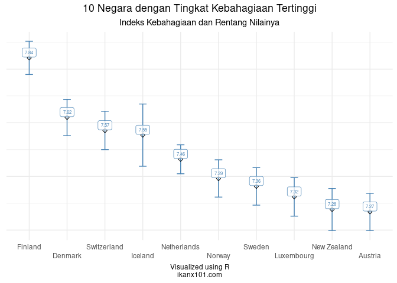

World Happiness Report 2021: Apa yang Membuat Warga Suatu Negara
Bahagia?
================

Di blog saya yang lama, saya pernah menuliskan tentang bagaimana [GDP
memiliki hubungan dengan level kebahagiaan suatu
negara](https://passingthroughresearcher.wordpress.com/2019/11/19/infografis-kemakmuran-vs-kebahagiaan-suatu-negara/).
Pada 2021 ini, **Gallup** telah mengeluarkan data terbaru ***World
Happiness Report***, datanya saya ambil dari situs [Kaggle berikut
ini](https://www.kaggle.com/ajaypalsinghlo/world-happiness-report-2021).

> Kali ini saya akan mencoba eksplorasi, faktor apa saja yang
> mempengaruhi kebahagiaan warga suatu negara?

------------------------------------------------------------------------

## Analisa Deskriptif dari Data

Dari data yang saya ambil tersebut, ada `124` negara yang disurvey oleh
**Gallup**. Saya mengambil `9` *variables* utama dari data tersebut,
yakni:

    ## 'data.frame':    149 obs. of  9 variables:
    ##  $ country_name                : chr  "Finland" "Denmark" "Switzerland" "Iceland" ...
    ##  $ regional_indicator          : chr  "Western Europe" "Western Europe" "Western Europe" "Western Europe" ...
    ##  $ ladder_score                : num  7.84 7.62 7.57 7.55 7.46 ...
    ##  $ logged_gdp_per_capita       : num  10.8 10.9 11.1 10.9 10.9 ...
    ##  $ social_support              : num  0.954 0.954 0.942 0.983 0.942 0.954 0.934 0.908 0.948 0.934 ...
    ##  $ healthy_life_expectancy     : num  72 72.7 74.4 73 72.4 73.3 72.7 72.6 73.4 73.3 ...
    ##  $ freedom_to_make_life_choices: num  0.949 0.946 0.919 0.955 0.913 0.96 0.945 0.907 0.929 0.908 ...
    ##  $ generosity                  : num  -0.098 0.03 0.025 0.16 0.175 0.093 0.086 -0.034 0.134 0.042 ...
    ##  $ perceptions_of_corruption   : num  0.186 0.179 0.292 0.673 0.338 0.27 0.237 0.386 0.242 0.481 ...

1.  `country_name`: nama negara.
2.  `regional_indicator`: area atau region dari negara tersebut.
3.  `ladder_score`: tingkat kebahagiaan.
4.  `logged_gdp_per_capita`: angka ***GDP per capita*** yang telah
    ditransformasi dengan fungsi *lognormal*.
5.  `social_support`: tingkat *social support* dari warga suatu negara.
6.  `healthy_life_expectancy`: angka harapan hidup.
7.  `freedom_to_make_life_choices`: tingkat seberapa bebas seseorang
    bisa mengambil keputusan terhadap kehidupannya.
8.  `generosity`: tingkat **kemurahan hati** dari warga suatu negara.
9.  `perception_of_corruption`: persepsi tingkat korupsi warga di
    negaranya.

Mari kita bedah satu-persatu.

### 10 Negara dengan Kebahagiaan Tertinggi

Apa saja 10 negara dengan kebahagiaan tertinggi?

### 10 Negara dengan Kebahagiaan Terendah

Sekarang negara mana saja yang memiliki indeks kebahagiaan terendah?

### Indonesia sebagai Negara yang Paling Murah Hati

> ***Apakah kalian pernah mendengar kalimat di atas?***

## Analisa Prediktif dari Data
