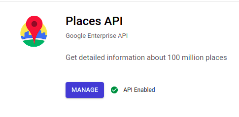
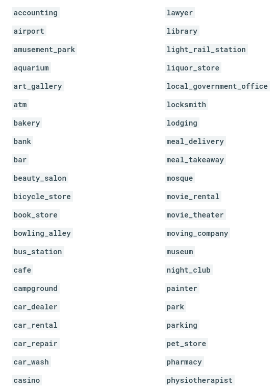
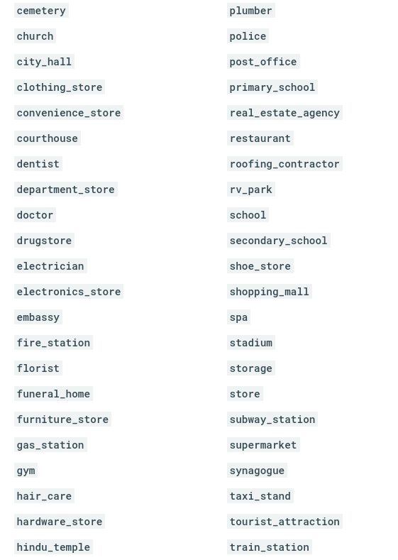
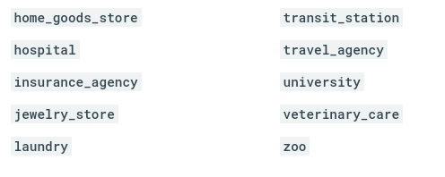

```{r setup, include=FALSE}
knitr::opts_chunk$set(echo = TRUE)
setwd("~/ikanx101 BLOG/_posts/Google Cloud/Google Places")

xxxxx = "rahasia"
```

Pada tahun 2018, pertama kali saya menggunakan layanan [_Google Geocoding_](https://passingthroughresearcher.wordpress.com/2018/09/24/geocoding-with-r-and-google-geocoding-api/) menggunakan __R__. Waktu itu saya memiliki ribuan alamat toko untuk dicari koordinat _longlat_-nya. Setelah menyelesaikan tugas tersebut, praktis saya tidak lagi menggunakan layanan _Google Cloud Console_ yang berbasis _geolocation_ secara masif.

Namun beberapa hari belakangan ini, saya tertarik untuk mengoprek layanan tersebut kembali namun bukan dalam hal _geocoding_.

> ___Kali ini saya berniat untuk mengambil data lokasi yang ada di Google Maps!___

---

Sebagaimana yang kita ketahui bersama, _Google Maps_ menggunakan prinsip _crowdsourcing_ pada layanannya. Setiap _user_ memiliki kesempatan untuk [meng-_edit_, menambah, atau bahkan menghapus](https://passingthroughresearcher.wordpress.com/2015/11/27/tips-improving-google-maps/) suatu lokasi yang ada di _Google Maps_. Tentunya tim _Google Maps_ akan melakukan verifikasi dan validasi atas masukan setiap _user_. Walaupun tentunya kita tidak bisa juga mempercayai 100% semua informasi yang tertera di _Google Maps_.

Sebagai contoh, saya pernah mencari suatu lokasi di _Google Maps_, namun setelah ditelusuri langsung lokasi tersebut tidak ada karena informasinya _out of date_.

Lantas bagaimana cara kita mengambil data dari _Google Maps_?

> ___Kita bisa menggunakan layanan Google Places API di Google Cloud Console!___

### Apa itu _Google Cloud Console_?

Saya mendefinisikan __GCC__ sebagai _marketplace_ bagi layanan Google dan mitranya dalam hal data, komputasi, dan _artificial intelligence_. Saya sendiri bisa mendapatkan banyak layanan yang berguna bagi pekerjaan saya sebagai _market researcher_ di sana.

Kali ini kita perlu mendaftar atau _enabling_ layanan _Google Places_.

```{r,echo=FALSE,fig.align='center'}

```

Setelah itu, kita memerlukan __API__ _key_ untuk mendapatkan data yang hendak kita ambil.

### Data apa saja yang bisa diambil?

Kita bisa mendapatkan data `nama tempat`, koordinat `longlat`, `rating` lokasi, `jam buka-tutup`, `review` lokasi, `alamat lengkap`, `photo` lokasi, dan lain-lain.

_Google Places_ memberikan gambaran tipe-tipe tempat apa saja yang bisa kita ambil datanya sebagai berikut:

```{r,echo=FALSE,fig.align='center'}



```

### Bagaimana cara mengambil datanya?

> ___Sebenarnya cukup mudah!___

Kalian hanya perlu menggunakan _function_ `google_places()` pada `library(googleway)` di __R__. Berikut saya berikan langkah-langkahnya:

1. _Enable_ layanan _Google Places API_ di __GCC__.
1. Buat __API__ _key_ pada halaman _credential_. Catat untuk kemudian dimasukkan ke dalam __R__ _environment_.
1. Tentukan titik pusat tempat kita akan mencari dalam format koordinat `longlat`.
1. Tentukan `radius` (dalam meter) pencarian kita.
1. Tentukan tipe lokasi yang hendak dicari.

> ___Mudah kan?___

Oke, begini _script_-nya:

### Masukkan __API__ _Key_

```{r}
library(googleway)
key = xxxxx # masukkan API key kalian di sini.
```

### Tentukan Titik Pusat Pencarian dan Tipe Lokasi

Misalkan saya ingin mencari `laundry` di sekitar __Summarecon Bekasi__. Saya bisa dengan mudah mendapatkan koordinat `longlat` dari __Summarecon Bekasi__, yakni (-6.2270906,106.9997416).

### Tentukan Radius Pencarian

Misalkan `radius` pencariannya adalah 1 km (1.000 m).

Maka skripnya menjadi sebagai berikut:

```{r}
hasil = google_places(location = c(-6.2270906,106.9997416),
                       keyword = "laundry",
                       radius = 1000,
                       key = key)
```

Hasil pencariannya saya simpan bernama `hasil` berstruktur ___list___.

```{r}
str(hasil)
```

> ___Bingung bacanya?___

Tenang saja, kita hanya akan ekstrak informasi yang dibutuhkan:

```{r}
data.frame(
  nama = hasil$results$name,
  alamat = hasil$results$vicinity,
  rating = hasil$results$rating,
  buka_sekarang = hasil$results$opening_hours$open_now,
  long = hasil$results$geometry$location$lng,
  lat = hasil$results$geometry$location$lat
) %>% 
  knitr::kable(align = "c")

```

---

`if you find this article helpful, support this blog by clicking the ads.`