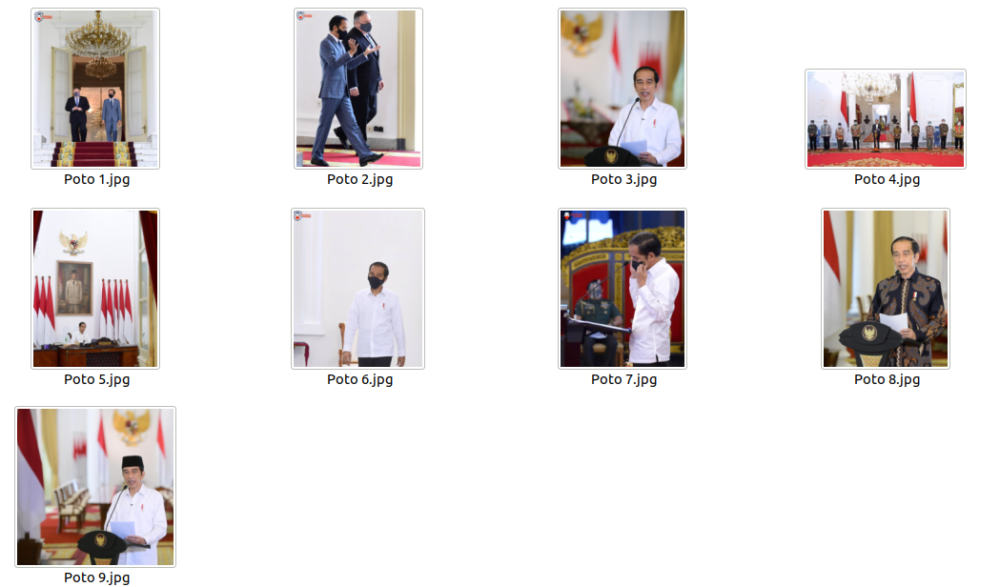

```{r setup, include=FALSE}
knitr::opts_chunk$set(echo = TRUE)
setwd("~/Documents/ikanx101/_posts/Google Image")
load("presiden jokowi.rda")
library(dplyr)
library(ggplot2)

dbase_poto = data.frame(
  id = paste0("Poto ",1:9),
  source = unique(data$source)
)

data =
  data %>%
  mutate(score = round(score*100,2)) %>%
  merge(dbase_poto) 
```

# Prolog

Di blog yang [lama](https://passingthroughresearcher.wordpress.com/2019/06/26/membaca-struk-belanja-optical-character-recognition/), saya pernah menjelaskan bagaimana __R__ dan _Google Vision_ bisa dijadikan suatu mesin otomasi untuk melakukan _data entry_ struk belanja yang _reliable_, cepat, murah, dan efisien.

Kali ini, dengan menggunakan _tools_ yang sama (_Google Vision_ dan __R__) saya akan melakukan _image recognition_ terhadap 9 _posts_ terakhir dari akun Instagram Presiden Jokowi (per 5 November pukul 07.10 WIB).

---

> Apa sih yang mau saya kerjakan?

_Google Vision_ memiliki satu fitur yang disebut dengan `label detection` yang mampu mengetahui isi dari sebuah _image_. Permasalahannya adalah label yang digunakan berasal dari _train dataset_ yang dimiliki oleh _Google_. Kita sebagai _user_ tidak mengetahui bagaimana datasetnya dan bagaimana cara _improving recognition model_-nya. 

> Percaya saja bahwa secara berkala Google terus memperbaiki modelnya.

---

Gimana langkah kerjanya?

```{r out.width="20%",echo=FALSE,fig.retina=10}
nomnoml::nomnoml("#direction: down,
                 [Download Photo] -> [Google Vision]
                 [Google Vision] -> [Tidy]
                 
                 [Download Photo|
                    [Akun IG Target] -> [Instagram Scraper]
                    [Instagram Scraper] -> [Target Photos]]
                 
                 [Google Vision|
                    Label Detection]
                 
                 [Tidy|
                    Data carpentry]
                 ")
```

Semuanya saya lakukan menggunakan __R__ _yah_. _hehe_

## Langkah I: _download photos_

Dengan menggunakan _instagram scraper_ yang berjalan di Python, saya mengambil `9` _posts_ terakhir dari akun IG official Presiden Jokowi.

## Langkah II: melempar poto-poto tersebut ke _Google Vision_

```{r,echo=FALSE}

```

Setelah itu, dari semua poto yang ada, saya akan lempar ke _Google Vision_ untuk dianalisa. 

> Label apa saja yang ada di dalam poto tersebut?

## Langkah III: merapikan dan visualisasi data

Dari data yang sudah terkumpul, saya akan membuat visualisasinya sebagai berikut:

```{r,fig.retina = 10,fig.height = 8,echo=FALSE}
data %>%
  ggplot(aes(y = reorder(description,score),
             x = score)) +
  geom_col(color = "darkred",
           fill = "white") +
  facet_wrap(~id,scales = "free") +
  labs(title = "Label apa saja yang ada di poto?",
       subtitle = "9 poto dari IG Presiden Jokowi",
       caption = "Scraped and Visualized\nusing R\nikanx101.com",
       x = "Confidence Level Google Prediction",
       y = "Label")

```

## _Kira-kira, hal ini bisa kita manfaatkan lebih lanjut gak yah?_