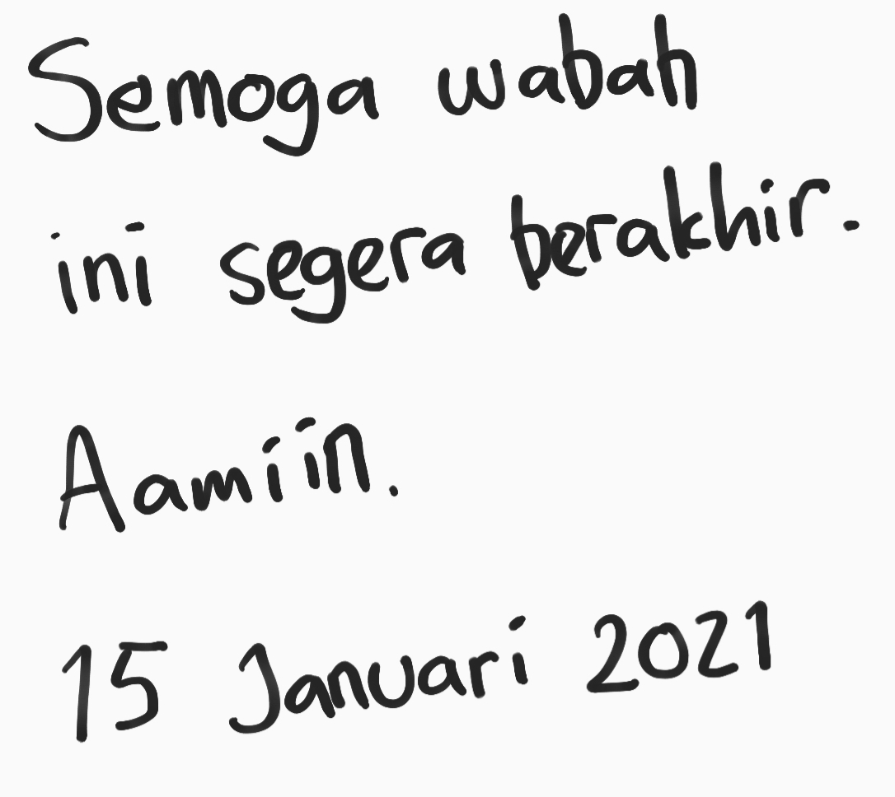
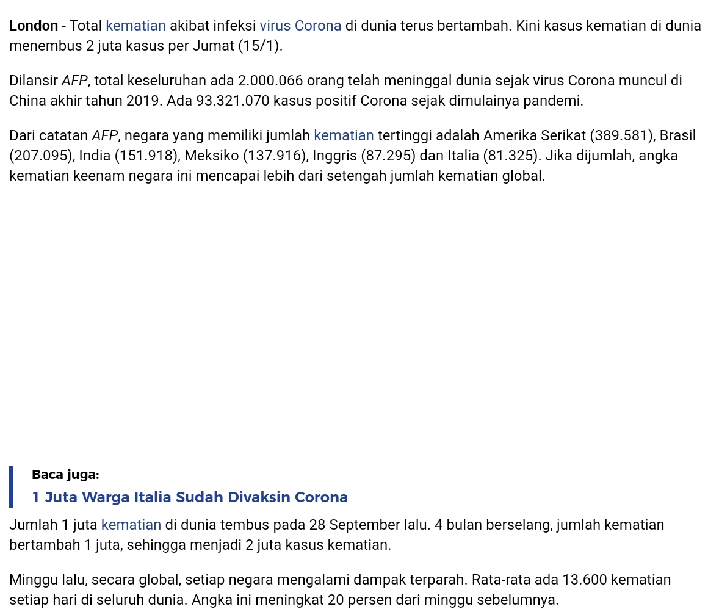
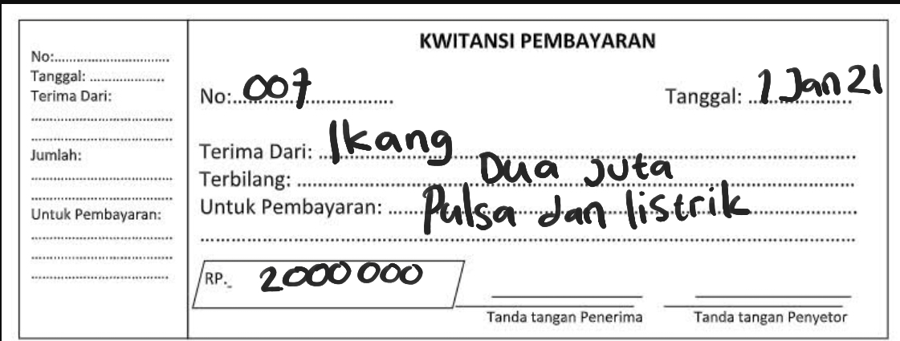

```{r setup, include=FALSE}
knitr::opts_chunk$set(echo = TRUE)
setwd("~/ikanx101.github.io/_posts/Google Image/post 3")
load("azure.rda")
load("google.rda")
load("tesseract.rda")
```

Beberapa hari ini, beberapa rekan saya sedang ramai-ramainya membahas terkait _Optical Character Recognition_ (__OCR__). Untuk melakukan __OCR__ secara mandiri dan __otomatis__ di __R__, setidaknya ada dua cara. Yakni:

1. Membuat model _recognition_ sendiri.
1. Menggunakan model yang sudah ada. Ini juga ada dua macam:
    1. Menggunakan `library(tesseract)` yang sudah tersedia secara gratis.
    1. Menggunakan _cloud service_ berbayar semacam Google Vision dan Azure Cognitive (Vision).

Mungkin dari kalian ada yang bertanya-tanya, kenapa harus pakai __R__?

> Karena untuk melakukan __OCR__ seperti yang saya infokan di atas memang harus _ngoding_. Apalagi jika kita punya __banyak__ _images_. _Automation_ adalah kuncinya.

Kalau dipikir-pikir sudah lama juga saya menuliskan [aplikasi __OCR__ di market riset](https://passingthroughresearcher.wordpress.com/2019/06/26/membaca-struk-belanja-optical-character-recognition/). Tampaknya kini ada pembaruan algoritma di sana-sini. Jadi kali ini saya akan membuat _review_ singkat __OCR__ mana yang lebih akurat. Saya akan membandingkan `3` kondisi _images_, yakni:

1. _Handwriting_.
1. _Screenshot_.
1. _Mixed text_, gabungan tulisan tangan dengan huruf cetak.

Terhadap 3 cara __OCR__, yakni:

1. `tesseract`
1. Google Vision.
1. Azure Vision.

---

# Ronde I: _Handwriting_

Ronde pertama akan saya mulai dengan seberapa akurat __OCR__ ini membaca tulisan tangan saya berikut:

```{r,echo=FALSE,fig.align='center'}
cat("Tulisan tangan saya yang bagus")

```

## `tesseract`

Berikut adalah hasil pembacaan dari `tesseract`:

```{r}
tess_handwrite
paste(tess_handwrite$word,collapse = " ")
```
Lumayan _lah yah_ hasilnya.

## Azure Vision

Berikut adalah hasil pembacaan dari Azure Vision:

```{r}
azure_handwrite
```

Hasilnya __sangat mengecewakan!__. Walaupun Azure bisa membaca [konteks dari _images_](https://ikanx101.com/blog/azure-vis/) tapi dia gagal membaca tulisan tangan.

## Google Vision

Berikut adalah hasil pembacaan dari Google Vision:

```{r}
vision_handwrite
cat(vision_handwrite$description[1])
```

Wah, luar biasa! Hasilnya sempurna! 

> _We got the winner!_

---

# Ronde II: _Screeshot_: Tulisan Cetak

Ronde berikutnya saya akan menggunakan _image_ hasil _screenshot_ dari tablet saya sebagai berikut:

```{r,echo=FALSE,fig.align='center'}

```

## `tesseract`

Berikut hasil pembacaan dari `tesseract`:

```{r}
paste(tess_screen$word,collapse = " ")
```

Hasilnya sempurna untuk tulisan cetak.

## Azure Vision

Berikut hasil pembacaan Azure Vision:

```{r}
paste(azure_screen[[1]],collapse = " ")
```

Hasil yang sempurna juga didapatkan.

## Google Vision

Berikut hasil pembacaan Google Vision:

```{r}
cat(vision_screen$description[1])
```

Hasilnya juga sempurna.

> Untuk  huruf cetak hasil _screenshot_, ketiga __OCR__ memberikan hasil yang memuaskan.

---

# Ronde Final: _Mixed_

Pada ronde final ini saya akan menggunakan gambar berikut:

```{r,echo=FALSE,fig.align='center'}

```

## `tesseract`

Berikut adalah hasil pembacaan dari `tesseract`:

```{r}
paste(tess_mixed$word,collapse = " ")
```

Hasilnya ternyata buruk.

## Azure Vision

Berikut adalah hasil pembacaan dari Azure Vision:

```{r}
azure_mixed
```

Ternyata Azure tidak mampu mendeteksi tulisan tangan saya. Hanya tulisan cetak saja yang bisa diambil.

## GoogleVision

Berikut adalah pembacaan dari Google Vision:

```{r}
cat(vision_mixed$description[1])
```

Luar biasa! Google Vision mampu membaca semuanya.

> _We got the winner!_

---

# _Summary_

Google Vision menjadi layanan terbaik dalam hal __OCR__. Kemampuannya untuk membaca semua tipe tulisan bisa diandalkan.

---

`if you find this article helpful, please support this blog by clicking the ads.`