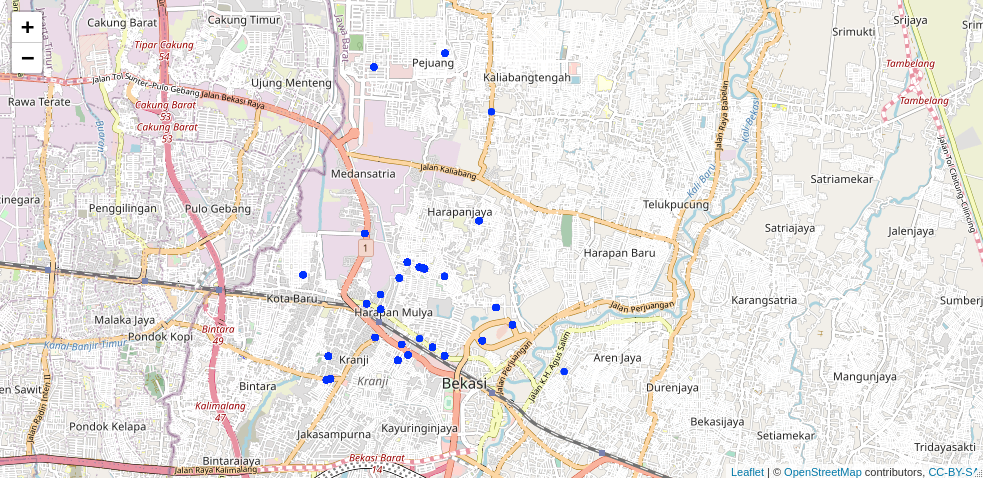

```{r setup, include=FALSE}
knitr::opts_chunk$set(echo = TRUE)
setwd("~/Documents/ikanx101/_posts/Grab")
rm(list=ls())
library(leaflet)
library(ggplot2)
library(dplyr)
library(tidytext)
library(igraph)
library(ggraph)
library(tidyr)
load("sekitar_sumarenkon.rda")

final = 
  final %>% 
  rowwise() %>% 
  mutate(menu = gsub(harga,"",menu)) %>% 
  ungroup() %>% 
  mutate(harga = gsub("\\.","",harga),
         harga = as.numeric(harga))
```

> Siapa sih yang gak pernah mesen makan di GoFood atau di GrabFood?

Walaupun pandemi tapi kebiasaan _food delivery_ sepertinya tidak berbeda jauh yah. Apalagi di masa-masa _pandemic fatigue_ seperti sekarang.

---

_Start-ups_ seperti Gojek dan Grab menguasai __hampir semua__ data dari tempat makan yang ada di kota-kota besar di Indonesia. Minimal mereka mengetahui lokasi, menu yang ditawarkan dan harga dari setiap menu tersebut. Percaya atau tidak, `3` data tersebut cukup berguna bagi perusahaan-perusahaan lain. Apalagi jika perusahaan tersebut bergerak di _food industry_.

Sejak GoFood dan GrabFood mulai merajalela beberapa tahun yang lalu, saya sudah mencoba dan mencari cara agar saya bisa mendapatkan data tersebut. Tapi _qodarullah_ baru bisa saya temukan secara tidak sengaja pas malam tahun baru (dan baru saya sempet tuliskan sekarang ini).

Memanfaatkan layanan _order via web_ dari __GrabFood__, saya berhasil mengambil data:

1. Nama merchant
1. Rating merchant
1. Semua pilihan menu
1. Harga

Sayang sekali data `lokasi` tidak bisa diambil. Tapi tidak mengapa, karena saya akan bisa mendapatkan data lokasi dengan cara menembak `nama merchant` ke layanan __Google Geocode__.

---

# Data yang saya dapatkan

Ceritanya saya mengambil `35` _merchant_ GrabFood yang berada di sekitar rumah saya di wilayah Bekasi. Saya melakukan _scraping_ pada pagi ini (2 Februari 2021) pukul 08.00 WIB.

> Kenapa hanya `35`?

Ini sebagai contoh saja. Saya bisa mengambil sebanyak-banyaknya _merchant_ tapi konsekuensinya lama pengambilan data juga akan semakin panjang.

Data apa saja yang saya ambil?

```{r,echo=FALSE}
str(final)
```

Berikut adalah sebaran dari `35` _merchants_ tersebut:

```{r,echo=FALSE}
#longlat = 
#  final %>% 
#  select(nama_merchant,long,lat) %>% 
#  mutate(long = as.numeric(long),
#         lat = as.numeric(lat))

#leaflet() %>% 
#  addTiles() %>% 
#  addCircles(longlat$long,longlat$lat,popup = longlat$nama_merchant,radius = 10)


```

Dari data yang ada, saya bisa menganalisa sebaran harga dari setiap _merchant_ yang ada. 

```{r,echo=FALSE,message=FALSE,warning=FALSE,fig.align='center',fig.height=6}
final %>% 
  ggplot(aes(y = nama_merchant,
             x = harga)) +
  geom_boxplot() +
  labs(title = "Sebaran Harga 35 Merchant\nGrabFood\ndi Sekitar Rumah Saya",
       subtitle = "Hasil Web Scrape GrabFood",
       caption = "Scraped and Visualized with love\nusing R\nikanx101.com",
       y = "Nama Merchant",
       x = "Harga dalam Rupiah") +
  theme_minimal()
```

Dari visualisasi di atas, saya dapatkan beberapa _merchant_ memiliki _range_ harga yang sangat lebar. Sedangkan sebagian _merchant_ lainnya memiliki _range_ harga yang pendek.

Bagaimana dengan menu yang ada?

Jika saya melakukan _text analysis_ dari semua menu yang ada, saya dapatkan:

```{r,echo=FALSE,message=FALSE,warning=FALSE,fig.align='center'}
id_stop = readLines("https://raw.githubusercontent.com/ikanx101/ID-Stopwords/master/id.stopwords.02.01.2016.txt")
final$id = c(1:2671)

menu = 
  final %>% 
  select(id,menu) %>% 
  mutate(menu = tolower(menu),
         menu = gsub("[^[:alnum:] ]","",menu),
         menu = stringr::str_trim(menu)) %>% 
  unnest_tokens("words",menu) %>% 
  filter(!words %in% id_stop) %>% 
  group_by(id) %>% 
  summarise(menu = paste(words,collapse = " ")) %>% 
  ungroup() 

wc = 
  menu %>% 
  unnest_tokens("words",menu) %>% 
  group_by(words) %>% 
  summarise(n = n()) %>% 
  ungroup() %>% 
  filter(stringr::str_length(words) > 2) %>% 
  filter(n > 20)

wordcloud::wordcloud(wc$words,
                     wc$n,
                     random.order=FALSE, 
                     max.words=900,
                     rot.per=0.35)
```

Ini adalah detail _bigrams_ dari menu yang ada:

```{r,echo=FALSE,message=FALSE,warning=FALSE,fig.align='center'}
menu %>% 
  unnest_tokens("bigrams",menu,token = "ngrams",n = 2) %>% 
  separate(bigrams,into = c("from","to"),sep = " ") %>% 
  group_by(from,to) %>% 
  summarise(n = n()) %>% 
  ungroup() %>% 
  arrange(desc(n)) %>% 
  filter(!grepl("1|2|00|rp",from)) %>% 
  filter(!grepl("1|2|00|rp",to)) %>% 
  filter(stringr::str_length(from) > 1) %>% 
  filter(stringr::str_length(to) > 1) %>% 
  filter(n>10) %>% 
  graph_from_data_frame() %>% 
  ggraph(layout = 'fr') +
  geom_edge_bend(aes(edge_alpha=n),
                 show.legend = F,
                 color='darkred') +
  geom_node_point(size=1,color='steelblue') +
  geom_node_text(aes(label=name),alpha=0.4,size=3,repel = T) +
  theme_void()
```

Dari data ini, saya bisa mengecek dengan mudah keberadaan dari suatu produk makanan atau minuman yang saya gemari dari `35` _merchants_ ini.

Saya akan coba melihat apakah minuman seperti Teh Botol Sosro, NutriSari, Coca Cola, Fanta, dan Milo dijual di _merchants_ ini?

```{r,echo=FALSE,warning=FALSE,message=FALSE}
final %>% 
  mutate(minuman = case_when(
    grepl("nutri",menu) ~ "NutriSari",
    grepl("coca",menu) ~ "Coca Cola",
    grepl("sosro",menu) ~ "Teh Botol Sosro",
    grepl("milo",menu) ~ "Milo",
    grepl("fanta",menu) ~ "Fanta"
            )
        ) %>% 
  filter(!is.na(minuman)) %>% 
  group_by(nama_merchant,minuman) %>% 
  summarise(n = n()) %>% 
  ungroup() %>% 
  rename("Nama merchant" = nama_merchant,
         "Merek minuman" = minuman,
         "Banyak menu yang menggunakan minuman tsb" = n) %>% 
  knitr::kable()
```

---

Tentunya banyak analisa lain yang bisa dilakukan. Kira-kira apa lagi ya?

`if you find this article helpful, support this blog by clicking the ads.`