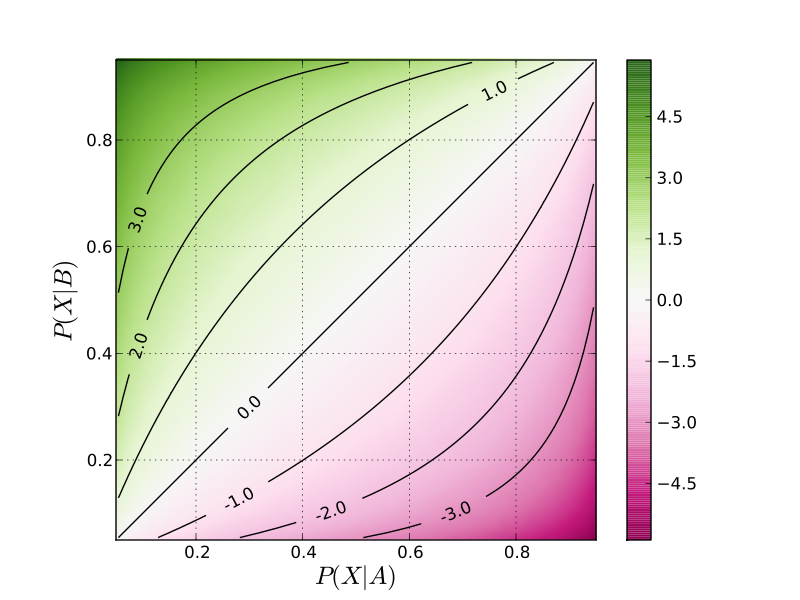

```{r setup, include=FALSE}
knitr::opts_chunk$set(echo = TRUE)
setwd("~/Documents/ikanx101.com/_posts/HBR")
rm(list=ls())
library(dplyr)
library(tidytext)
library(ggplot2)
library(ggthemes)
library(wordcloud2)
load("/home/ikanx101githubio/Documents/belajaR/Bukan Infografis/HBR/clean.rda")
```

Pernah rekan saya bertanya seperti ini:

> [Data berupa teks bisa dianalisa apa saja ya?](https://ikanx101.com/blog/QnA-1/#pertanyaan-9)

Setidaknya ada tiga tulisan terkait _text analysis_ yang pernah saya buat, yakni:

1. Komentar netizen pada webseries [Sunyi](https://ikanx101.com/blog/blog-posting-sunyi/).
1. _Keywords_ di [tahun baru](https://ikanx101.com/blog/tahun-baru/).
1. Membaca artikel diabetes di [detik.com](https://passingthroughresearcher.wordpress.com/2019/08/15/menelusuri-pencarian-keyword-diabetes-mellitus-di-detikhealth/).

Sekarang saya akan membuat sesuatu yang berbeda. Apa itu? Ada `2` analisa yang mau saya coba kali ini, yakni:

1. _Crosswords analysis_ dan
1. _Log odds ratio_.

Tujuan dari `2` analisa itu adalah membandingkan dan menemukan kata-kata yang menjadi pembeda antara `2` topik atau kategori data teks.

---

Sebagai contoh, saya akan menggunakan [data teks](https://github.com/ikanx101/belajaR/blob/master/Bukan%20Infografis/HBR/clean.rda) berupa `14` artikel terbaru dari situs [HBR](https://hbr.org/) yang saya _scrape_ pagi ini (30 September 2020 pukul 10.30 WIB). `14` artikel tersebut terdiri dari `7` artikel dari kategori `leadership` dan `7` artikel dari kategori `technology`.

```{r out.width="75%",echo=FALSE,fig.align='center',fig.retina=10}
nomnoml::nomnoml("[Tujuan|
                    [14 Artikel HBR] -> [7 Artikel Leadership]
                    [14 Artikel HBR] -> [7 Artikel Technology]
                    [7 Artikel Leadership] -- [Apakah ada perbedaan?]
                    [7 Artikel Technology] -- [Apakah ada perbedaan?]
                  ]
                 ")
```

## Pre Processing Data

Sebelum jauh melakukan analisa, ada beberapa langkah _pre processing_ yang saya lakukan:

1. _Stemming_: Yakni mengubah kata menjadi bentuk dasarnya di Bahasa Inggris. Saya membuat _function_ dari `library(hunspell)`.
1. _Remove stopwords_ bahasa Inggris. _Database_ _stopwords_ saya ambil dari [sini](https://raw.githubusercontent.com/stopwords-iso/stopwords-en/master/stopwords-en.txt).
1. Hapus tanda baca dan _trim white space_. Saya menggunakan `library(janitor)`.

## _Crosswords Analysis_

Cara kerja analisa ini cenderung sangat mudah. Begini caranya:

1. Buat tabulasi frekuensi dari kata-kata yang muncul dari `2` kategori. Misal kategori __A__ dan __B__.
1. Pilih semua kata yang beririsan dari kategori __A__ dan __B__.
1. Buat _scatterplot_ dari data tersebut $(A \sim B)$.

Jika ternyata kedua kategori ini __sama__, maka akan terlihat bahwa mayoritas kata-kata yang digunakan berkumpul di membentuk garis lurus.

> Masih bingung? Ini saya berikan contohnya ya.

Saya mulai dengan menghitung frekuensi dari kata-kata yang muncul pada kategori `leadership`, lalu saya buat _wordcloud_ sebagai berikut:

```{r,echo=FALSE,fig.retina=10,fig.align='center',message=FALSE}
leader_wc = 
  new %>% 
  filter(kategori == "leadership") %>% 
  unnest_tokens("words",baca) %>% 
  group_by(words) %>% 
  summarise(n = n()) %>% 
  arrange(desc(n))

wc = wordcloud2::wordcloud2(leader_wc,color = "random-dark")

library(htmlwidgets)
saveWidget(wc,"1.html",selfcontained = F)
webshot::webshot("1.html","wordcloud1.png",vwidth = 1200, vheight = 1000, delay = 40)
```

Berikutnya adalah frekuensi dari kata-kata yang muncul pada kategori `technology` :

```{r,echo=FALSE,fig.retina=10,fig.align='center',message=FALSE}
tech_wc = 
  new %>% 
  filter(kategori == "technology") %>% 
  unnest_tokens("words",baca) %>% 
  group_by(words) %>% 
  summarise(n = n()) %>% 
  arrange(desc(n))

wc = wordcloud2::wordcloud2(tech_wc,color = "random-dark")

library(htmlwidgets)
saveWidget(wc,"1.html",selfcontained = F)
webshot::webshot("1.html","wordcloud2.png",vwidth = 1200, vheight = 1000, delay = 40)
```

Jika saya gabung kedua _wordclouds_ tersebut, maka hasilnya seperti ini:

```{r,echo=FALSE}
leader_wc = leader_wc %>% rename(leader = n)
tech_wc = tech_wc %>% rename(tech = n)

data = merge(leader_wc,tech_wc)
data %>% 
  arrange(desc(leader)) %>% 
  head(20) %>% 
  knitr::kable("html",caption = "TOP 20 Kata-Kata yang Beririsan dari 2 Kategori")
```

Tabel di atas saya akan buat plot berikut:

```{r,echo=FALSE,fig.retina=10,fig.align='center',message=FALSE,fig.width=8}
data %>% 
  ggplot(aes(x = leader,
             y = tech)) +
  geom_point(alpha = 0.3, size = 2.5) +
  geom_text(aes(label = words,
                size = leader+tech), check_overlap = TRUE) +
  geom_abline(color = "red") +
  theme_tufte() +
  theme(legend.position = "none") +
  labs(x = "Kata-kata dari kategori LEADER",
       y = "Kata-kata dari kategori TECHNOLOGY",
       title = "Crosswords Analysis: Kata apa saja yang sering digunakan oleh dua kategori ini?",
       subtitle = "Source: 14 Artikel HBR",
       caption = "Visualized using R\nikanx101.com")

```

Dari _scatterplot_ di atas, kita bisa menghitung korelasi antara kata-kata tersebut:

```{r,echo=FALSE,warning=FALSE,message=FALSE}
tes = cor.test(data$leader,data$tech)
tes
```

Ternyata didapatkan korelasinya signifikan (tidak bisa diabaikan) walaupun nilainya relatif lemah $(r = 0.349)$.

---

## _Log Odds Ratio_

[_Log Odds Ratio_](https://en.wikipedia.org/wiki/Odds_ratio#:~:text=The%20logarithm%20of%20the%20odds,%2F27%20maps%20to%20%E2%88%923.296.) adalah kelanjutan dari _crosswords analysis_. Frekuensi kata dari `2` kelompok akan dihitung nilai `logratio`-nya dengan rumus: 

$$logratio = ln(\frac{freq_{kel1}}{freq_{kel2}})$$

Angka tersebut akan menunjukkan kata mana yang _less or most likely come from each group_.

```{r out.width="75%",echo=FALSE}

```


```{r,echo=FALSE,fig.retina=10,fig.align='center',message=FALSE}
data %>% 
  mutate(log_ratio = log(leader / tech)) %>% 
  filter(abs(log_ratio) > 2) %>% 
  mutate(penanda = ifelse(log_ratio<0,"a","b")) %>% 
  group_by(penanda) %>% 
  ggplot(aes(x = reorder(words,log_ratio),
             y = log_ratio)) +
  geom_col(aes(fill = log_ratio<0)) +
  scale_fill_manual(values = c("steelblue", "darkred"),name = "", labels = c("Leader", "Tech")) +
  theme_minimal() +
  theme(axis.text.x = element_text(angle = 90,hjust = 1,size=7)) +
  theme(legend.position = "bottom") +
  labs(x = "Kata-Kata yang Digunakan",
       y = "Log Odds Ratio",
       title = "Log Odds Ratio antara Artikel Kategori Leadership dan Technology",
       subtitle = "Source: 14 Artikel HBR") +
  coord_flip()
```

Sekarang kelihatan _deh_ kata-kata mana saja yang sering keluar di `leadership` dan `technology`. 