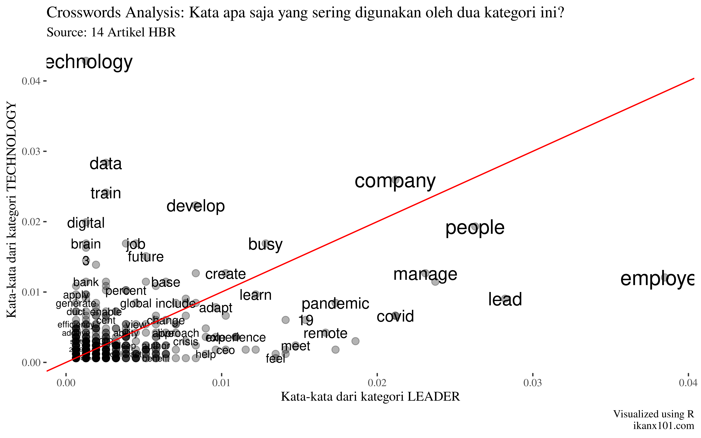

Text Analysis: Membandingkan Dua Topik Artikel dari Harvard Business
Review
================

Pernah rekan saya bertanya seperti ini:

> [Data berupa teks bisa dianalisa apa saja
> ya?](https://ikanx101.com/blog/QnA-1/#pertanyaan-9)

Setidaknya ada tiga tulisan terkait *text analysis* yang pernah saya
buat, yakni:

1.  Komentar netizen pada webseries
    [Sunyi](https://ikanx101.com/blog/blog-posting-sunyi/).
2.  *Keywords* di [tahun baru](https://ikanx101.com/blog/tahun-baru/).
3.  Membaca artikel diabetes di
    [detik.com](https://passingthroughresearcher.wordpress.com/2019/08/15/menelusuri-pencarian-keyword-diabetes-mellitus-di-detikhealth/).

Sekarang saya akan membuat sesuatu yang berbeda. Apa itu? Ada `2`
analisa yang mau saya coba kali ini, yakni:

1.  *Crosswords analysis* dan
2.  *Log odds ratio*.

Tujuan dari `2` analisa itu adalah membandingkan dan menemukan kata-kata
yang menjadi pembeda antara `2` topik atau kategori data teks.

-----

Sebagai contoh, saya akan menggunakan [data
teks](https://github.com/ikanx101/belajaR/blob/master/Bukan%20Infografis/HBR/clean.rda)
berupa `14` artikel terbaru dari situs [HBR](https://hbr.org/) yang saya
*scrape* pagi ini (30 September 2020 pukul 10.30 WIB). `14` artikel
tersebut terdiri dari `7` artikel dari kategori `leadership` dan `7`
artikel dari kategori `technology`.

## Pre Processing Data

Sebelum jauh melakukan analisa, ada beberapa langkah *pre processing*
yang saya lakukan:

1.  *Stemming*: Yakni mengubah kata menjadi bentuk dasarnya di Bahasa
    Inggris. Saya membuat *function* dari `library(hunspell)`.
2.  *Remove stopwords* bahasa Inggris. *Database* *stopwords* saya ambil
    dari
    [sini](https://raw.githubusercontent.com/stopwords-iso/stopwords-en/master/stopwords-en.txt).
3.  Hapus tanda baca dan *trim white space*. Saya menggunakan
    `library(janitor)`.

## *Crosswords Analysis*

Cara kerja analisa ini cenderung sangat mudah. Begini caranya:

1.  Buat tabulasi frekuensi dari kata-kata yang muncul dari `2`
    kategori. Misal kategori **A** dan **B**.
2.  Pilih semua kata yang beririsan dari kategori **A** dan **B**.
3.  Buat *scatterplot* dari data tersebut ").

Jika ternyata kedua kategori ini **sama**, maka akan terlihat bahwa
mayoritas kata-kata yang digunakan berkumpul di membentuk garis lurus.

> Masih bingung? Ini saya berikan contohnya ya.

Saya mulai dengan menghitung frekuensi dari kata-kata yang muncul pada
kategori `leadership`, lalu saya buat *wordcloud* sebagai berikut:

Berikutnya adalah frekuensi dari kata-kata yang muncul pada kategori
`technology` :

Jika saya gabung kedua *wordclouds* tersebut, maka hasilnya seperti ini:

| words        | leader | tech |
| :----------- | -----: | ---: |
| employee     |     60 |   20 |
| lead         |     44 |   15 |
| people       |     41 |   32 |
| time         |     37 |   19 |
| manage       |     36 |   21 |
| company      |     33 |   43 |
| covid        |     33 |   11 |
| team         |     33 |   11 |
| support      |     29 |    5 |
| pandemic     |     27 |   14 |
| response     |     27 |    3 |
| remote       |     26 |    7 |
| 19           |     24 |   10 |
| meet         |     23 |    4 |
| heal         |     22 |    2 |
| organization |     22 |   10 |
| value        |     22 |    3 |
| feel         |     21 |    1 |
| office       |     21 |    2 |
| busy         |     20 |   28 |

TOP 20 Kata-Kata yang Beririsan dari 2 Kategori

Tabel di atas saya akan buat plot berikut:

Dari *scatterplot* di atas, kita bisa menghitung korelasi antara
kata-kata tersebut:

    ## 
    ##  Pearson's product-moment correlation
    ## 
    ## data:  data$leader and data$tech
    ## t = 9.5837, df = 662, p-value < 2.2e-16
    ## alternative hypothesis: true correlation is not equal to 0
    ## 95 percent confidence interval:
    ##  0.2804146 0.4141413
    ## sample estimates:
    ##       cor 
    ## 0.3490537

Ternyata didapatkan korelasinya signifikan (tidak bisa diabaikan)
walaupun nilainya relatif lemah ").

-----

## *Log Odds Ratio*

[*Log Odds
Ratio*](https://en.wikipedia.org/wiki/Odds_ratio#:~:text=The%20logarithm%20of%20the%20odds,%2F27%20maps%20to%20%E2%88%923.296.)
