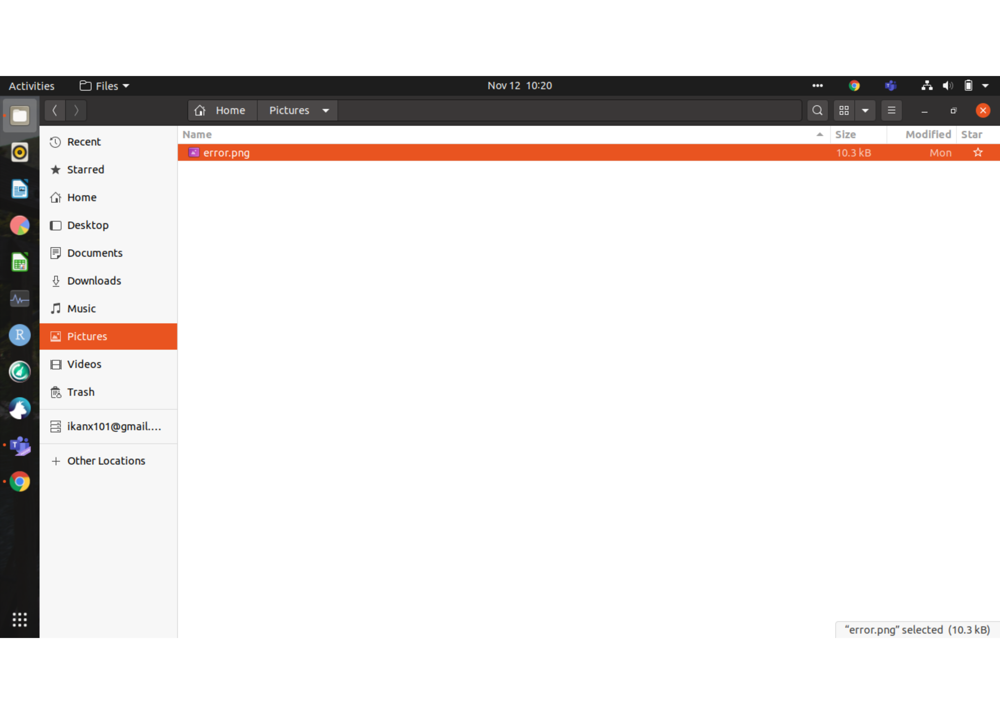
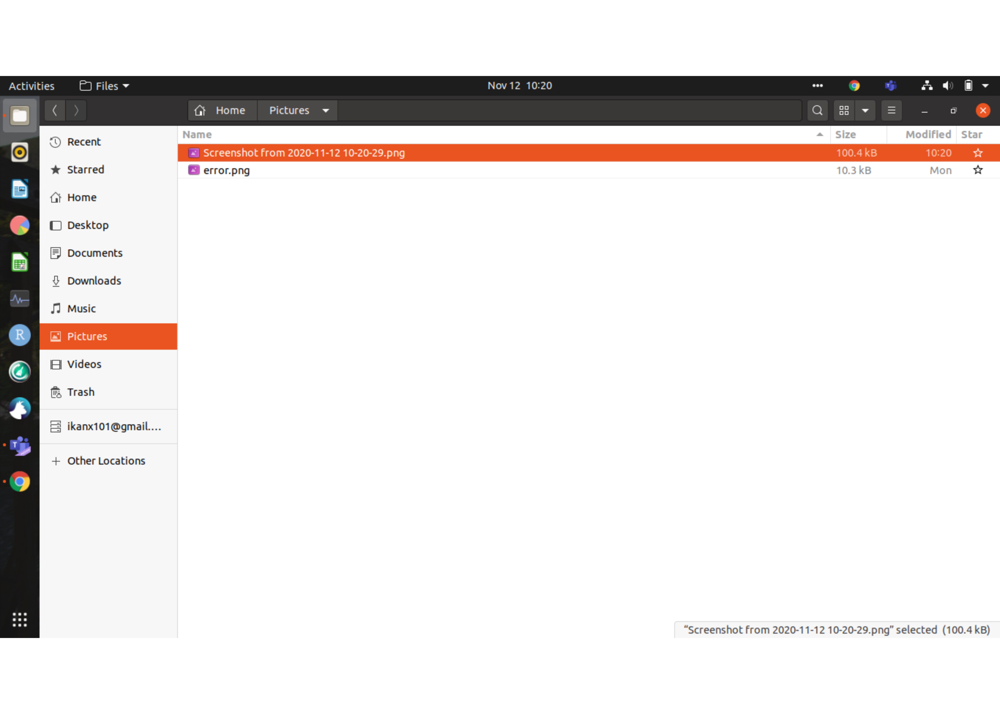
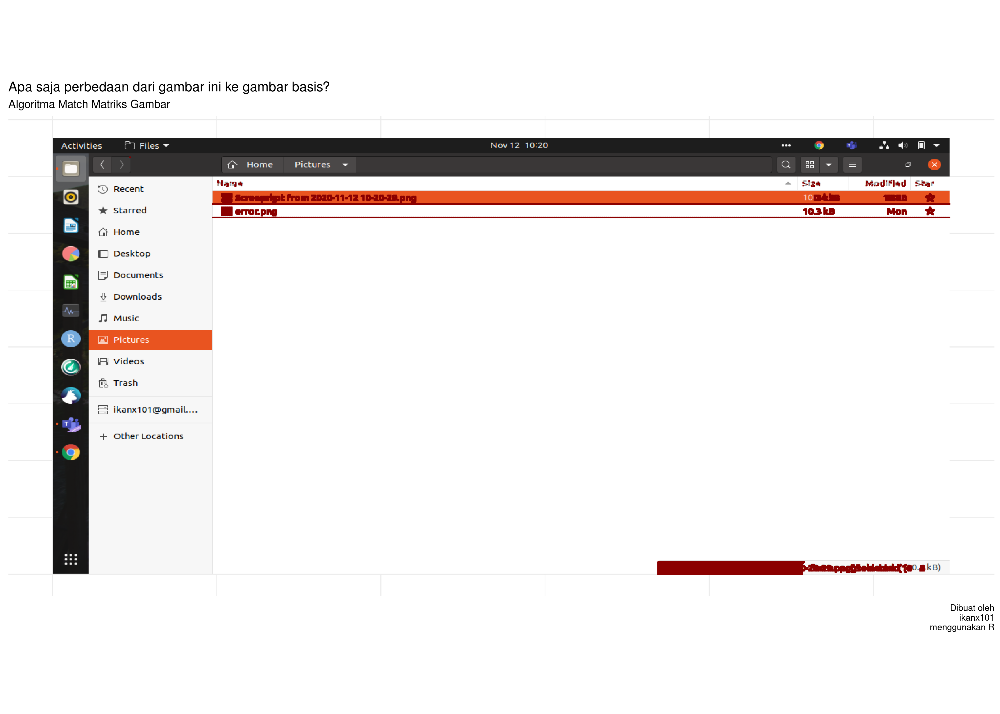
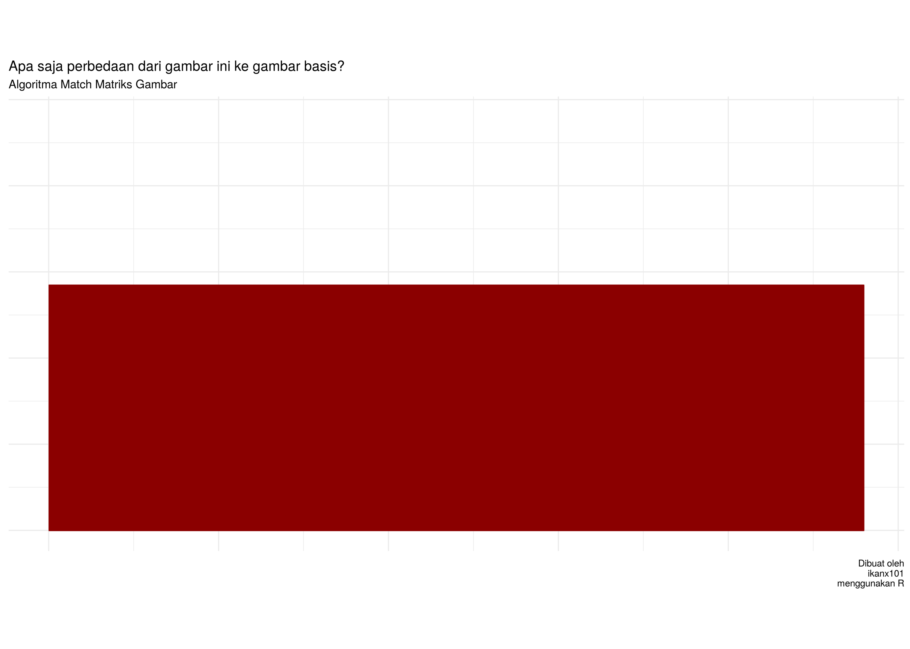
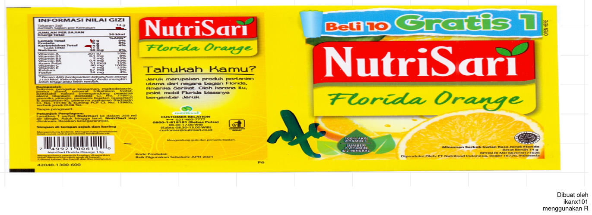

Penjelasan Algoritma Images Comparison
================

Ternyata tulisan saya terakhir terkait algoritma perbandingan kesamaan
mutlak antara dua gambar mendapatkan sambutan yang lumayan. Namun
beberapa rekan mengatakan bahwa contoh yang saya tampilkan itu terlalu
sederhana. Jika ada *images* lain yang lebih rumit, belum tentu
berhasil.

Seperti yang telah saya jelaskan di [tulisan
sebelumnya](https://ikanx101.com/blog/image-comparison/), data berupa
*image* atau gambar bisa dibaca menjadi matriks penyusunnya. Matriks
tersebut berisi angka nilai dari dimensi (`width` x `height`) dan
*layer* yang ada. Sebagai contoh:

1.  *Image* ber-*extension* `.jpg` disusun berdasarkan `3` *layers* RGB.
2.  *Image* ber-*extension* `.png` disusun berdasarkan `4` *layers*.

Sehingga dari satu buah *image*, kita bisa mendapatkan matriks penyusun
berukuran `w x h x layer`.

> Perbandingan yang saya lakukan itu adalah membandingkan dua matriks
> data gambar.

Jadi secara logika mau gambar seperti apapun bisa diaplikasikan.

Dari sebuah *image*, kita bisa mendapatkan satu buah matriks yang
*unique*. Jika kita hendak menemukan kesamaan dan perbedaan dari dua
buah *images*, maka kita sebenarnya hendak membandingkan dua buah
matriks.

Oleh karena itu, berikut beberapa syarat yang harus dipenuhi:

1.  Ukuran matriks harus sama. Konsekuensinya adalah:
2.  Dimensi harus sama. Idealnya kedua *images* harus berasal dari
    dimensi yang sama. Walaupun berbeda, kita bisa melakukan proses
    *resizing* agar kedua *images* tersebut memiliki dimensi yang sama.
    Tapi akan ada konsekuensi dari hal ini.
3.  Banyaknya *layer* harus sama (kedua *images* berasal dari
    *extension* yang sama).
4.  Kedua *images* harus memiliki *start* yang sama. Maksudnya, *margin*
    gambar harus sama persis. Tidak ada perbedaan rotasi *images*.

-----

## *Case I*

Misalkan saya coba *images* hasil *screenshot* di bawah ini:

    ## [1] "Gambar Base:"

    ## [1] "Gambar yang akan dicek:"

    ## [1] "hasil pengecekan: (red dots)"

Seperti dilihat, algoritmanya berjalan sempurna. Berhasil menemukan
perbedaan-perbedaan **kecil** yang ada.

-----

## *Case II*

Komplikasi muncul saat saya menggunakan *images* hasil *scan*. Kenapa?
Kita belum tentu bisa mendapatkan konsistensi pembacaan warna hasil
*scan*. Sebagai contoh, saat algoritma berusaha menemukan perbedaan
antara dua gambar berikut:

    ## [1] "Gambar Base:"

    ## [1] "Gambar yang akan dicek:"

Hasil pengecekannya cukup mencengangkan:

> Semua area dinilai berbeda\!

### *Improvement* ke Algoritma

Hal ini terjadi karena algoritma awal saya benar-benar mengecek kesamaan
mutlak *values* dari dua matriks *images* yang ada. Oleh karena itu,
saya memperbaiki algoritmanya dengan menambahkan parameter
*sensitivitas*.

> Apa maksudnya?

Misalkan kita hendak membandingkan nilai
 dan
.

Dengan algoritma yang sekarang, .

Kita bisa memberikan *rules* baru: jika perbedaan nilai antara keduanya
masih dalam *safety range*, maka .

Maka, berikut adalah hasil algoritma barunya:

> Mmmh, masih belum memuaskan yah…

TAPI jika saya mengubah sensitivitas menjadi `10%`, kita dapatkan:

Nah dapet deh sekarang perbedannya di mana.

Jangan-jangan kalian juga *gak ngeh* bedanya di mana?
