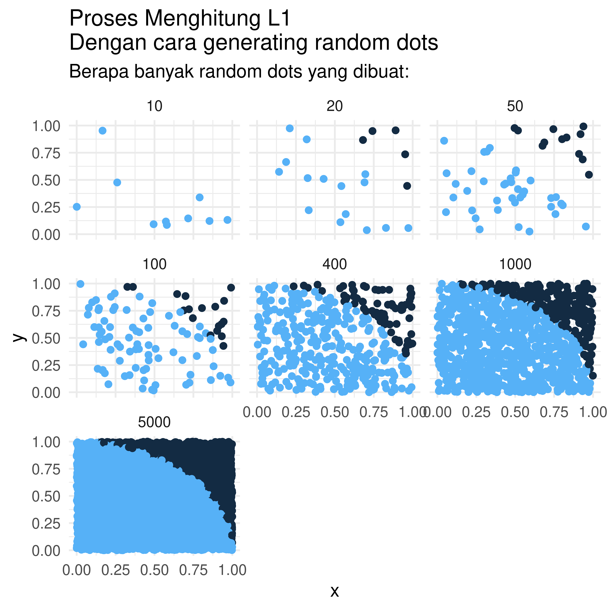

SIMULASI MONTECARLO: Menghitung Nilai Pi
================

Suatu ketika di salah satu sekolah dasar di kota Bekasi. Jam menunjukkan
pukul 11.50, sekitar 10 menit menuju jam pulang siswa. Sang guru
memberikan kuis matematika kepada murid-muridnya.

> Jika ada yang bisa menyelesaikan soal ini, boleh pulang duluan\!

Begitu ujarnya.

Lantas beliau menggambar sebuah lingkaran yang diberi keterangan
memiliki radius 7 cm di papan tulis. Soalnya: Hitung luas lingkaran
tersebut\!

Semua murid sudah hapal bahwa rumus luas lingkaran adalah:

  
  

Sebagian murid menggunakan  sedangkan sebagian yang lain menggunakan .

Jadi timbullah dua jawaban:

1.  154 cm
2.  153.86 cm

Kedua nilai tersebut dibenarkan oleh sang guru. Murid-murid yang
menjawab salah satu dari kedua jawaban tersebut diperbolehkan pulang.

-----

# Pertanyaan Mendasar: Sebenarnya berapa nilai ?

Ada satu pertanyaan yang menggelayuti pikiran saya selama ini.

> Berapa sih nilai  yang sebenarnya?

Sebagai orang yang pernah kuliah di jurusan matematika, saya mengetahui
fakta menarik bahwa  sejatinya bukanlah
.

Baik angka
 dan  hanyalah aproksimasi dari nilai
 yang
sebenarnya. *Gak* percaya? Dengan menggunakan nilai
 yang ada di
*base* **R**, saya akan hitung selisihnya ke dua nilai aproksimasi
tersebut:

1.   -0.0012645
2.   0.0015927

Setelah kita tahu bahwa sejatinya nilai
 yang
sebenarnya berbeda dengan apa yang kita ketahui selama ini, lalu berapa
nilai sesungguhnya?

Apa ada cara menghitung nilai
?

## Cara Menghitung 

Bagi matematikawan, ada banyak cara menghitung nilai pi. Ada yang cara
deterministik dan ada cara probabilistik.

Kali ini saya akan mencoba menghitung nilai
 dengan cara
kedua yakni dengan pendekatan simulasi MonteCarlo. Bagaimana cara
kerjanya? *Yuk* perhatikan dengan seksama.

### Lingkaran dengan 

Saya mulai dari lingkaran dengan  berikut
ini:


Dari gambar di atas, luas area pada
 di range
![\[0,1\]](https://latex.codecogs.com/png.latex?%5B0%2C1%5D "[0,1]")
saya tuliskan sebagai berikut:

  
  

  
 = \\frac{1}{4} * \\pi")  

### Mencari Nilai 

Kunci untuk mencari nilai
 adalah dengan
menghitung .

> Bagaimana menghitung ?

Untuk menghitungnya saya akan gunakan metode yang tidak biasa, yakni
dengan melakukan *generating random dots* di area ![x \\in
\[0,1\]](https://latex.codecogs.com/png.latex?x%20%5Cin%20%5B0%2C1%5D
"x \\in [0,1]") dan ![y \\in
\[0,1\]](https://latex.codecogs.com/png.latex?y%20%5Cin%20%5B0%2C1%5D
"y \\in [0,1]"). Setiap titik yang memenuhi persyaratan  akan saya tandai sebagai `inner` dan diluar itu
akan saya tandai sebagai `outer`.

Perhatikan grafik di bawah ini:



Jika dilihat dari grafik di atas, semakin banyak *dots* yang saya buat,
semakin banyak area 
yang ter-*cover*. Luas  dapat saya tuliskan sebagai:

  
}{count(all.dots)}")  

Lalu: 

Berikut algoritma dan hasil perhitungan saya:

``` r
hitung_pi = function(n){
  x = runif(n)
  y = runif(n)
  data = data.frame(x,y)
  data =
    data %>%
    mutate(jatuh = x^2 + y^2,
           ket = ifelse(jatuh <= 1, 1,0))
  return(4 * sum(data$ket)/n)
}
```


Ternyata hasil perhitungan saya lebih akurat dibandingkan pendekatan
.
