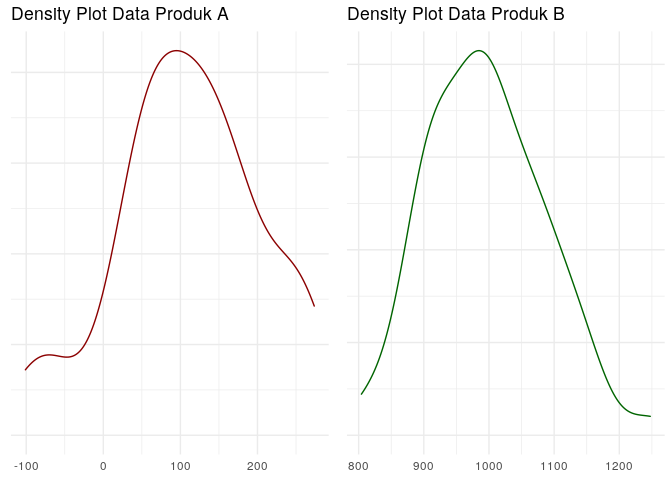

Menentukan Apakah Suatu Data Fluktuatif atau Tidak?
================

#### Pada pagi hari ini:

*Salesperson* : *“Mas, bagaimana ya caranya agar saya bisa menentukan
suatu data itu fluktuatif atau tidak?”*

*Saya* : *“Fluktuatif yang kamu maksud itu variability?”*

*Salesperson* : *“Bukan tentang sebaran data.”*

*Saya* : *“Lantas bagaimana maksudnya?”*

*Salesperson* : *“Misalkan saya punya data *sales* harian selama 2
bulan. Produk A rata-ratanya 100 *pcs* dan standar deviasinya juga 70
*pcs*. Lalu produk B dengan rata-rata 500 *pcs* dan standar deviasinya
juga 70 *pcs*. Produk A kan seharusnya lebih fluktuatif yah dibanding
produk B?”*

*Saya* : *“Ooh, saya mengerti maksudnya. Jadi begini…..”*

------------------------------------------------------------------------

Begitu kira-kira percakapan antara saya dan salah seorang rekan kerja
yang berasal dari divisi *sales*. Sebuah pertanyaan sederhana menurut
saya namun sangat bermanfaat dan *strategic* bagi dirinya.

Untuk menyelesaikan permasalahan tersebut, mari kita lihat terlebih
dahulu dua konsep sederhana dalam statistika yakni:

1.  Pemusatan data (*centrality*) dan
2.  Sebaran data (*variability*).

Sesuai dengan namanya, *centrality* adalah suatu pengukuran untuk
menentukan dimana data tersebut berpusat (atau berkumpul). Kita bisa
menghitung 3 *metrics* pada *centrality*, yakni *mean*, median, dan
modus.

*Variability* adalah suatu pengukuran yang menentukan seberapa data
tersebar. Ada beberapa *metric* yang bisa dihitung seperti: variansi,
standar deviasi, dan *range*.

Masalah yang ditemui oleh rekan saya itu adalah:

> Bagaimana menentukan suatu data itu fluktuatif atau tidak?

Awalnya saya menjawab hanya dengan mengandalkan *variability*. Namun
setelah saya pikirkan kembali, saya akan kehilangan informasi yang
sangat penting jika semata hanya mengandalkan *variability*. Oleh karena
itu saya harus menyandingkannya dengan di mana data tersebut terpusat.

Sebagai contoh, saya akan gunakan data
 dan
 ilustrasi yang
diberikan teman saya berikut ini:

### Ilustrasi

Misalkan saya memiliki data *sales* harian dua produk selama 2 bulan
berdistribusi normal:

1.  Produk :
    .
2.  Produk :
    .

Jika saya gambarkan dalam bentuk *density plot*, kita dapatkan bentuk
seperti ini:

<!-- -->

Keduanya punya *variability* yang sama, tapi secara fluktuatif
sebenarnya produk  lebih
berfluktuatif. Dari *density plot* di atas mungkin tidak semua orang
bisa melihatnya. Tapi kalau data yang sama di atas saya ubah bentuknya
menjadi *linechart* seperti ini:

<!-- -->
