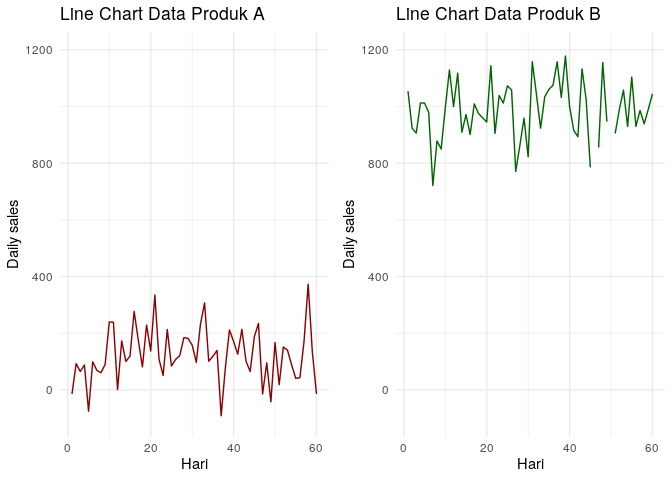

Menentukan Apakah Suatu Data Fluktuatif atau Tidak?
================

#### Pada pagi hari ini:

*Salesperson* : *“Mas, bagaimana ya caranya agar saya bisa menentukan
suatu data itu fluktuatif atau tidak?”*

*Saya* : *“Fluktuatif yang kamu maksud itu variability?”*

*Salesperson* : *“Bukan tentang sebaran data.”*

*Saya* : *“Lantas bagaimana maksudnya?”*

*Salesperson* : *“Misalkan saya punya data *sales* harian selama 2
bulan. Produk A rata-ratanya 150 *pcs* dan standar deviasinya juga 100
*pcs*. Lalu produk B dengan rata-rata 600 *pcs* dan standar deviasinya
juga 100 *pcs*. Produk A kan seharusnya lebih fluktuatif yah dibanding
produk B?”*

*Saya* : *“Ooh, saya mengerti maksudnya. Jadi begini…..”*

------------------------------------------------------------------------

Begitu kira-kira percakapan antara saya dan salah seorang rekan kerja
yang berasal dari divisi *sales*. Sebuah pertanyaan sederhana menurut
saya namun sangat bermanfaat dan *strategic* bagi dirinya.

Untuk menyelesaikan permasalahan tersebut, mari kita lihat terlebih
dahulu dua konsep sederhana dalam statistika yakni:

1.  Pemusatan data (*centrality*) dan
2.  Sebaran data (*variability*).

Sesuai dengan namanya, *centrality* adalah suatu pengukuran untuk
menentukan dimana data tersebut berpusat (atau berkumpul). Kita bisa
menghitung 3 *metrics* pada *centrality*, yakni *mean*, median, dan
modus.

*Variability* adalah suatu pengukuran yang menentukan seberapa data
tersebar. Ada beberapa *metric* yang bisa dihitung seperti: variansi,
standar deviasi, dan *range*.

Masalah yang ditemui oleh rekan saya itu adalah:

> Bagaimana menentukan suatu data itu fluktuatif atau tidak?

Awalnya saya menjawab hanya dengan mengandalkan *variability*. Namun
setelah saya pikirkan kembali, saya akan kehilangan informasi yang
sangat penting jika semata hanya mengandalkan *variability*. Oleh karena
itu saya harus menyandingkannya dengan di mana data tersebut terpusat.

Sebagai contoh, saya akan gunakan data
 dan
 ilustrasi yang
diberikan teman saya berikut ini:

### Ilustrasi

Misalkan saya memiliki data *sales* harian dua produk selama 2 bulan
berdistribusi normal:

1.  Produk :
    .
2.  Produk :
    .

| hari_ke |     A |     B |
|--------:|------:|------:|
|       1 |  72.1 | 502.4 |
|       2 | 205.9 | 580.0 |
|       3 |  56.1 | 764.9 |
|       4 |  57.9 | 484.7 |
|       5 | 159.1 | 679.8 |
|       6 |  80.4 | 492.0 |
|       7 |  98.0 | 550.6 |
|       8 | 162.9 | 847.0 |
|       9 |  80.4 | 453.6 |
|      10 | -77.4 | 707.3 |
|      11 | 113.0 | 581.4 |
|      12 | 328.0 | 519.1 |
|      13 |  99.3 | 558.1 |
|      14 | -29.0 | 569.0 |
|      15 | 202.0 | 654.4 |
|      16 |   4.0 | 615.0 |
|      17 |  54.5 | 554.3 |
|      18 | 135.0 | 421.5 |
|      19 | 217.2 | 494.3 |
|      20 | -27.5 | 509.6 |
|      21 | 313.2 | 696.6 |
|      22 | 218.8 | 587.1 |
|      23 | 211.0 | 723.2 |
|      24 | 132.9 | 709.0 |
|      25 | 131.2 | 431.9 |
|      26 | 139.1 | 567.2 |
|      27 |  33.7 | 562.0 |
|      28 | 159.2 | 630.1 |
|      29 | 259.3 | 474.5 |
|      30 | 201.1 | 580.1 |
|      31 |  81.9 | 532.4 |
|      32 | 246.6 | 678.4 |
|      33 | 201.2 | 495.2 |
|      34 |  49.2 | 764.3 |
|      35 | 152.2 | 617.1 |
|      36 | 165.4 | 634.7 |
|      37 | 186.7 | 553.8 |
|      38 |  71.8 | 598.2 |
|      39 |  95.2 | 534.3 |
|      40 | 129.8 | 672.1 |
|      41 | 218.2 | 754.7 |
|      42 | 232.3 | 764.5 |
|      43 | 161.4 | 595.7 |
|      44 |  25.5 | 521.9 |
|      45 |  98.7 | 494.3 |
|      46 | 123.2 | 383.1 |
|      47 | 200.8 | 590.5 |
|      48 |  92.9 | 755.7 |
|      49 | 271.1 | 375.2 |
|      50 | -16.1 | 583.4 |
|      51 |  26.1 | 592.4 |
|      52 |  49.7 | 531.9 |
|      53 | 288.0 | 391.5 |
|      54 | 168.7 | 535.8 |
|      55 | 256.0 | 601.1 |
|      56 | 200.8 | 557.3 |
|      57 |  16.3 | 491.5 |
|      58 |  40.8 | 567.4 |
|      59 | 182.8 | 558.6 |
|      60 | 156.8 | 565.9 |

Jika saya gambarkan dalam bentuk *density plot*, kita dapatkan bentuk
seperti ini:

<!-- -->

Terlihat dari *plot* di atas, keduanya punya *variability* yang sama.
Lantas bagaimana saya menentukan mana yang lebih fluktuatif? Kalau saya
buatkan dalam bentuk *linechart* sebagai berikut apakah sudah lebih
terlihat?

<!-- -->

Masih belum terlihat juga ya? Oke kalau saya modifikasi kembali menjadi
bentuk seperti ini:

<!-- -->
