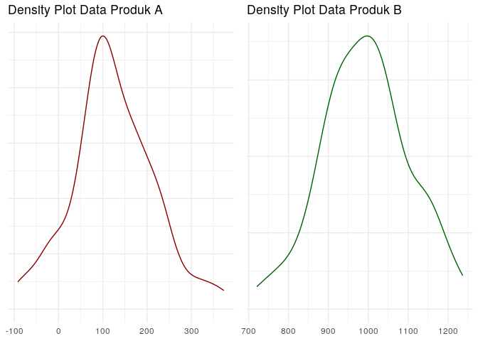
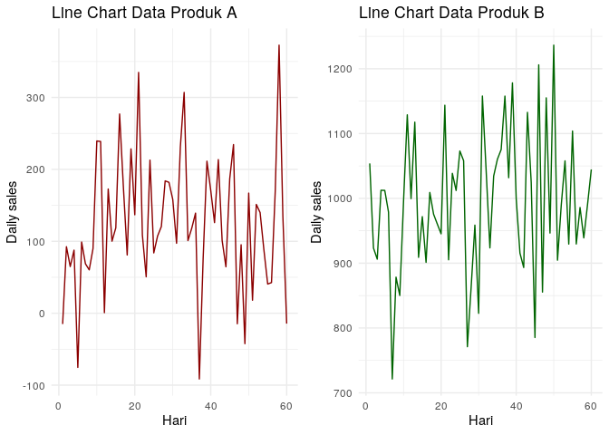

Menentukan Apakah Suatu Data Fluktuatif atau Tidak?
================

#### Pada pagi hari ini:

*Salesperson* : *“Mas, bagaimana ya caranya agar saya bisa menentukan
suatu data itu fluktuatif atau tidak?”*

*Saya* : *“Fluktuatif yang kamu maksud itu variability?”*

*Salesperson* : *“Bukan tentang sebaran data.”*

*Saya* : *“Lantas bagaimana maksudnya?”*

*Salesperson* : *“Misalkan saya punya data *sales* harian selama 2
bulan. Produk A rata-ratanya 150 *pcs* dan standar deviasinya juga 100
*pcs*. Lalu produk B dengan rata-rata 1000 *pcs* dan standar deviasinya
juga 100 *pcs*. Produk A kan seharusnya lebih fluktuatif yah dibanding
produk B?”*

*Saya* : *“Ooh, saya mengerti maksudnya. Jadi begini…..”*

------------------------------------------------------------------------

Begitu kira-kira percakapan antara saya dan salah seorang rekan kerja
yang berasal dari divisi *sales*. Sebuah pertanyaan yang tidak mudah,
pikir saya.

Untuk menyelesaikan permasalahan tersebut, mari kita lihat terlebih
dahulu dua konsep sederhana dalam statistika yakni:

1.  Pemusatan data (*centrality*) dan
2.  Sebaran data (*variability*).

Sesuai dengan namanya, *centrality* adalah suatu pengukuran untuk
menentukan dimana data tersebut berpusat (atau berkumpul). Kita bisa
menghitung 3 *metrics* pada *centrality*, yakni *mean*, median, dan
modus.

*Variability* adalah suatu pengukuran yang menentukan seberapa data
tersebar. Ada beberapa *metric* yang bisa dihitung seperti: variansi,
standar deviasi, dan *range*.

Masalah yang ditemui oleh rekan saya itu adalah:

> Bagaimana menentukan suatu data itu fluktuatif atau tidak?

Awalnya saya menjawab hanya dengan mengandalkan *variability*. Namun
setelah saya pikirkan kembali, saya akan kehilangan informasi yang
sangat penting jika semata hanya mengandalkan *variability*. Oleh karena
itu saya harus menyandingkannya dengan di mana data tersebut terpusat.

Sebagai contoh, saya akan gunakan data
 dan
 ilustrasi yang
diberikan teman saya berikut ini:

### Ilustrasi

Misalkan saya memiliki data *sales* harian dua produk selama 2 bulan
berdistribusi normal:

1.  Produk :
    .
2.  Produk :
    .

| hari_ke |     A |      B |
|--------:|------:|-------:|
|       1 |  75.2 |  998.7 |
|       2 | -37.4 | 1108.1 |
|       3 | 148.0 |  902.0 |
|       4 | 274.3 |  919.1 |
|       5 | 137.7 |  931.8 |
|       6 |  74.5 |  934.4 |
|       7 | 221.1 |  958.5 |
|       8 | 167.1 | 1036.9 |
|       9 | -27.2 |  952.2 |
|      10 | 113.0 |  879.5 |
|      11 | 197.4 |  897.8 |
|      12 | 204.6 |  901.6 |
|      13 | 187.6 |  963.5 |
|      14 | 246.4 | 1097.6 |
|      15 |  -7.3 |  860.9 |
|      16 | 311.9 | 1093.9 |
|      17 | 113.5 |  991.1 |
|      18 |  41.8 |  977.6 |
|      19 | 431.1 | 1063.2 |
|      20 | 312.6 | 1068.6 |
|      21 | 127.1 |  847.5 |
|      22 | 315.9 | 1164.0 |
|      23 |  44.6 |  958.6 |
|      24 |  86.2 |  979.0 |
|      25 |  73.5 |  924.3 |
|      26 | 127.1 | 1055.4 |
|      27 | 339.5 |  910.1 |
|      28 | 160.3 | 1237.7 |
|      29 |  59.1 |  968.2 |
|      30 |  80.6 | 1069.9 |
|      31 | 208.2 | 1060.9 |
|      32 |  72.7 |  965.4 |
|      33 | 114.3 |  988.0 |
|      34 | 270.9 |  996.5 |
|      35 | 147.4 |  978.4 |
|      36 | 199.4 |  810.7 |
|      37 | 168.0 | 1037.4 |
|      38 | 231.7 | 1070.7 |
|      39 | 236.6 |  767.1 |
|      40 | 137.4 | 1026.3 |
|      41 | 268.4 | 1129.2 |
|      42 | 166.0 | 1029.9 |
|      43 | 192.3 | 1056.6 |
|      44 | 198.7 |  860.2 |
|      45 | 296.8 |  955.6 |
|      46 |  80.6 | 1002.3 |
|      47 | 161.5 | 1000.9 |
|      48 | 285.0 |  984.7 |
|      49 | 195.4 | 1117.0 |
|      50 | 181.2 | 1036.8 |
|      51 | 100.2 | 1038.1 |
|      52 |  62.8 |  924.5 |
|      53 | 138.7 | 1017.8 |
|      54 | 258.5 | 1011.0 |
|      55 |  44.5 | 1097.3 |
|      56 |  48.0 |  962.1 |
|      57 | 237.0 |  929.6 |
|      58 | 170.7 |  941.5 |
|      59 | 216.5 | 1056.0 |
|      60 | 262.2 |  989.6 |

Jika saya gambarkan dalam bentuk *density plot*, kita dapatkan bentuk
seperti ini:

<!-- -->

Terlihat dari *plot* di atas, keduanya punya *variability* yang sama.
Jika hanya bermodalkan informasi tersebut, saya hanya akan mengatakan
bahwa kedua produk tersebut memiliki fluktuasi yang sama.

Namun saat saya melihat kembali data tersebut dalam bentuk *linechart*
sebagai berikut:

<!-- -->

Saya kembai berpikir, jangan-jangan keduanya tidak berfluktuasi dengan
tingkat yang sama. Kenapa? Pada produk
 kita dapati bahwa nilai
*sales*-nya bergerak naik dan turun secara “ekstrim”. Sedangkan produk
, walaupun bergerak naik
dan turun dalam *range* yang sama dengan produk
, tapi rata-rata
*sales*-nya masih “aman”.

<!-- -->
