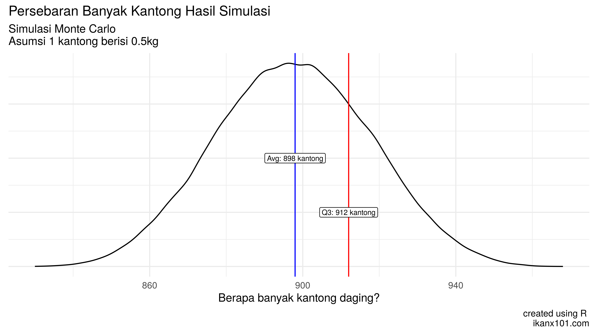

# Perhitungan Berapa Banyak Kantong Daging Qurban Menggunakan Simulasi Monte Carlo


Berbeda dengan tahun-tahun sebelumnya, pada tahun ini saya
diikutsertakan dalam kepanitiaan Idul Qurban di komplek perumahan yang
baru saya tempati selama setahun belakangan ini. Walau hanya sebatas
menjadi bendahara yang mengumpulkan dan mendokumentasikan arus uang
masuk dan keluar dari warga dan panitia. Sapi yang hendak dibeli oleh
panitia memiliki harga sekitar Rp24 juta dengan kisaran berat 340 - 350
kg. Total ada tiga plus satu (total empat) sapi yang hendak dipotong
pada hari Idul Adha.

Kemarin saat saya berkunjung ke rumah mertua, bapak mertua saya
bertanya:

> Di komplek kamu berapa sapi? Berapa kantong daging nanti yang mau
> dibagiin?

Saya hanya bisa menjawab pertanyaan pertama saja. Terkait berapa banyak
kantong daging, saya baru sadar bahwa saya belum tahu (karena memang
bukan tanggung jawab saya terkait itu pada kepanitiaan).

Berhubung bapak mertua saya adalah **Plt. Ketua DKM Mushalla** di
kompleknya sejak lama dan memang sudah biasa mengurusi masalah Idul
Qurban, beliau segera mencari kertas HVS dan memberikan saya **formula
perhitungan daging qurban dari sapi sembelihan**. Singkat cerita,
ternyata panitia di komplek saya juga menggunakan formula serupa.

Formula ini adalah formula standar yang disebarluaskan kepada masyarakat
umum oleh *Nasional Qurban Center*.

Bagaimana formulanya? Berikut adalah penjelasannya:

------------------------------------------------------------------------

## Formula Perhitungan *Nasional Qurban Center*

Misalkan berat seekor sapi adalah **350 kg**.

- Maka berat **karkas**-nya adalah **50%** dari berat hidup sapi
  tersebut.
- Sedangkan berat daging adalah **70%** dari berat karkas.

Sehingga berat daging sapi adalah **35%** dari berat hidup sapi.


**Karkas** adalah **daging dengan tulas** tanpa jeroan, kotoran, kepala,
kaki, dan kulit.

Sedangkan berat jeroan adalah **10%** dari berat karkas. Sehingga berat
jeroan adalah **5%** dari berat hidup sapi.


Berat empat kaki plus daging yang menempel rata-rata sebesar
.

Berat kepala **4%** dari berat hidup sapi.


Berat ekor **0.7%** dari berat hidup sapi.


------------------------------------------------------------------------

## Simulasi Monte Carlo

Dari formula di atas, tentunya kita tidak bisa memungkiri bahwa
kemampuan tim pemotong tentu bisa mengubah angka di atas. Jika tim
pemotong, penyayat, dan pencacah kurang ahli, tentunya berat daging bisa
berkurang akibat tercecer atau tidak terlepas secara sempurna. Selain
itu, kita juga kan tidak bisa mendapatkan berat sapi secara *real*
sesaat sebelum dipotong.

Bapak mertua saya pernah berkata:

> **Kira-kira berat daging itu berkisar antara 30% - 35%**.

Berdasarkan kondisi ini, saya akan coba membuat simulasi Monte Carlo
untuk menghitung kira-kira berapa banyak kantong daging sapi yang bisa
dibuat dari empat ekor sapi dengan berat antara 340 - 350 kg.

Asumsinya adalah satu kantong diisi oleh 0.5 kg daging sapi.

*Flowchart*-nya adalah sebagai berikut:

Berikut adalah skripnya menggunakan **R**.

``` r
# berapa banyak simulasi onte carlo dilakukan
n_simulasi = 10^5

# berapa kg daging dalam satu kantong
kantong_1 = .5

# berapa banyak core terlibat
n_core = detectCores()

# function untuk men-generate sapi
buat_sapi = function(){
  runif(4,340,350)
}

# function proporsi berat daging dari berat sapi hidup
potong_sapi = function(){
  runif(4,30,35) / 100
}

# function untuk menghitung total kantong dari daging sapi yang dipotong
berapa_kantong = function(dummy){
  n_kant = sum(buat_sapi() * potong_sapi()) / kantong_1
  ceiling(n_kant)
}

# sekarang kita akan lakukan simulasinya
# saya gunakan paralel computing karena saya pakai linux
# windows user, pakai cara lain aja ya
berapa_kantong = mcmapply(berapa_kantong,1:n_simulasi,mc.cores = n_core)
```

Sekarang kita akan lihat persebaran berapa banyak kantongnya menggunakan
*density plot* berikut:



*Expected* kantong daging yang bisa didapatkan dari empat ekor sapi
tersebut adalah sekitar **898** kantong. Namun, jika saya ingin
menggunakan angka **optimis - realistis**, maka saya akan gunakan batas
quartil 3 sebesar **912** kantong. Maksudnya apa?

> Ada peluang sebesar 76.196% kantong sapi yang dihasilkan sebanyak
> 
> kantong.

------------------------------------------------------------------------

`if you find this article helpful, support this blog by clicking the ads.`
