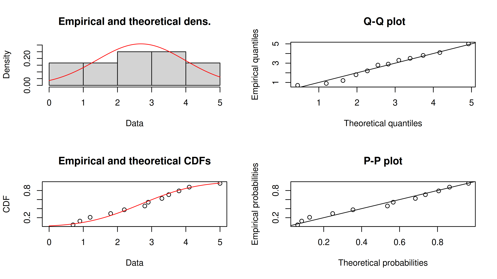

## Prolog: Pertanyaan yang Sering Muncul Saat *Meeting*

Bayangkan Saya sedang *meeting* bersama tim *marketing*. *Slides* sudah terbuka,
angka-angka kuartal lalu sudah dibahas. Lalu tiba-tiba tim *marketing*
melempar pertanyaan:

> ***“Kalau kita mau campaign bulan depan, kira-kira spend berapa yang
> optimal?”***

Sebagai data *analyst* merangkap *market researcher*, saya mungkin akan
langsung menghitung *budget* secara sederhana di kepala. Saya ambil
*mean* **ROI** secara historikal, kemudian dibagi dengan *target
revenue* dengan angka itu, selesai.

Tapi tunggu dulu. Apakah semudah itu? Masalahnya **ROI** dari suatu
*campaign* adalah angka yang dinamis. Pada saat bulan Ramadan bisa
menghasilkan ROI 5x tapi saat bulan sepi bisa hanya mencapai 0.8x. Lalu
pada saat kompetitor tiba-tiba agresif, ROI bisa terjun bebas. Maka dari
itu, kika kita hanya pakai angka *mean* **ROI**, kita sedang
berpura-pura bahwa dunia itu deterministik — padahal tidak.

Kali ini saya akan coba membahas bagaimana [Simulasi Monte
Carlo](https://ikanx101.com/tags/#monte-carlo) bisa membantu kita
membuat keputusan *budget* *campaign* yang lebih cerdas, dengan
merangkul ketidakpastian sebagai bagian dari modelnya.

## Mengapa Pendekatan “Rata-rata” Saja Tidak Cukup?

Mari kita mulai dengan contoh sederhana. Misalkan saya memiliki data
historikal **ROI** suatu *campaign* selama 12 bulan terakhir adalah
sebagai berikut:

| bulan | ROI |
|------:|----:|
|     1 | 1.2 |
|     2 | 3.5 |
|     3 | 2.8 |
|     4 | 0.9 |
|     5 | 4.1 |
|     6 | 2.2 |
|     7 | 5.0 |
|     8 | 1.8 |
|     9 | 3.3 |
|    10 | 0.7 |
|    11 | 2.9 |
|    12 | 3.8 |

    ## 📊 Statistika Deskriptif ROI Historis

    **Jumlah observasi:** 12
    **Rentang nilai:** 0.7 - 5
    **Rata-rata:** 2.68

    ### 📈 Ringkasan Statistika

    | Statistik | Nilai |
    |-----------|-------|
    | Jumlah Data | 12 |
    | Rata-rata | 2.68 |
    | Median | 2.85 |
    | Standar Deviasi | 1.35 |
    | Varians | 1.82 |
    | Minimum | 0.7 |
    | Maksimum | 5 |
    | Range | 4.3 |
    | Kuartil 1 (Q1) | 1.65 |
    | Kuartil 3 (Q3) | 3.58 |
    | IQR | 1.93 |
    | Skewness | 0 |
    | Kurtosis | -1.34 |

    ### 📋 Ringkasan 5-Angka

    | Statistik | Nilai |
    |-----------|-------|
    | Minimum | 0.7 |
    | Q1 | 1.5 |
    | Median | 2.85 |
    | Q3 | 3.65 |
    | Maksimum | 5 |

    ### 🔍 Interpretasi

    - **Skewness:** 0 - distribusi hampir simetris
    - **Kurtosis:** -1.34 - distribusi platykurtik (puncak rendah)

Rata-rata ROI kita adalah 2.68. Jika target revenue bulan depan adalah
Rp 500 juta, maka *budget* “optimal” versi perhitungan sederhana adalah:

> **Budget = Target Revenue / Rata-rata ROI = Rp 500 juta / 2.68 = Rp
> 186 juta**.

Kelihatannya masuk akal. Tapi ada beberapa pertanyaan yang tidak
terjawab:

1.  Berapa probabilitas kita benar-benar mencapai Rp 500 juta dengan
    *budget* tersebut?
2.  Apa yang terjadi jika **ROI** bulan depan hanya 0.7 (seperti yang
    pernah terjadi)?
3.  Apakah ada *level budget* yang lebih aman secara statistik?

Masalah utama saat kita menggunakan *mean* adalah ***mean***
**menyembunyikan variabilitas**. Standar deviasi dari data historikal
ROI kita adalah sebesar 1.26 (hampir separuh dari nilai *mean*). Hal ini
mengindikasikan **ketidakpastian yang sangat tinggi dan tidak boleh
diabaikan**.

Untuk mengatasi hal ini, saya akan melakukan simulasi Monte Carlo.
Analogi sederhana dari simulasi Monte Carlo adalah sebagai berikut:

> **Bayangkan kita melempar dua buah dadu lalu kita ingin mengetahui
> peluang mendapat angka total \> 7. Secara *analitik* peluang ini bisa
> dihitung secara matematis. Tapi secara Monte Carlo, kita bisa
> melakukan pelemparan dua buah dadu sebanyak 100.000 kali, lalu
> menghitung berapa kali kejadian dua buah dadu muncul dengan angka
> total hasilnya \> 7. Dari berapa kali kejadian, kita bisa hitung
> proporsi / peluangnya. Hasilnya akan sangat mendekati jawaban
> analitik.**

### Tiga Komponen Utama Simulasi Monte Carlo

1.  *Input* yang tidak pasti → didefinisikan sebagai distribusi
    probabilitas, bukan angka tunggal.
2.  Model deterministik → hubungan matematis antar variabel (misal:
    Revenue = Budget x ROI).
3.  Output berupa distribusi → hasil simulasi N iterasi yang menunjukkan
    *range* kemungkinan.

Untuk kasus *campaign budget* kita, *input*-nya adalah distribusi
**ROI** (yang tidak pasti), modelnya adalah **Revenue = Budget x ROI**,
dan *output*-nya adalah distribusi *revenue* yang mungkin dihasilkan
untuk setiap *level budget*.

### Membuat Simulasi Monte Carlo

Misalkan saya memiliki beberapa informasi dan parameter sebagai berikut:

- Data historis **ROI**: 12 bulan terakhir (seperti pada tabel di atas).
- Target *profit* minimum: Rp 0 (minimal balik modal).
- *Range campaign budget* yang akan dievaluasi: **Rp 50 juta hingga Rp
  500 juta**.
- Jumlah simulasi: 10.000 iterasi per *level budget*.
- Biaya produksi (*COGS*) tetap: Rp 300 juta.

Sehingga profit bisa didefinisikan sebagai **profit = revenue - budget -
COGS**.

Sebelum simulasi, kita perlu mengetahui distribusi probabilitas yang
paling cocok untuk data historikal **ROI** kita. ROI yang kita punya
adalah angka positif dengan kecenderungan *skewness* 0 alias simetris.
Oleh karena itu distribusi *normal* adalah kandidat yang baik.

Untuk melakukan *fitting* distribusi, kita bisa menggunakan
`library(fitdistrplus)`.

``` r
# Fitting distribusi ormal
fit_norm <- fitdist(roi_historis,"norm")

# 1. Plot diagnostik - 4 plot sekaligus
plot(fit_norm)
```



``` r
# 2. Goodness-of-fit statistics
gof_stats <- gofstat(fit_norm)
print(gof_stats)
```

    Goodness-of-fit statistics
                                 1-mle-norm
    Kolmogorov-Smirnov statistic 0.12438373
    Cramer-von Mises statistic   0.02950794
    Anderson-Darling statistic   0.20859934

    Goodness-of-fit criteria
                                   1-mle-norm
    Akaike's Information Criterion   44.21838
    Bayesian Information Criterion   45.18820

``` r
# 3. Ringkasan lengkap
summary(fit_norm)
```

    Fitting of the distribution ' norm ' by maximum likelihood 
    Parameters : 
         estimate Std. Error
    mean 2.683333  0.3732056
    sd   1.292822  0.2638955
    Loglikelihood:  -20.10919   AIC:  44.21838   BIC:  45.1882 
    Correlation matrix:
         mean sd
    mean    1  0
    sd      0  1

Berikut adalah parameter distribusi *normal* yang saya dapatkan:

- **mean** = 2.683333 ± 0.3732056 (*Standard Error*).
- **sd** = 1.292822 ± 0.2638955 (*Standard Error*).

Sebelum lanjut ke simulasinya, mari kita lihat *goodness of fit*
perhitungan *fitting* distribusi yang kita dapatkan. **Catatan
penting**: Dengan hanya 12 *data points*, hasil *fitting* mungkin kurang
stabil.

Indikator kualitas baik:

1.  Dari parameter distribusi:

- **Mean**: 2.68 dengan *standard error* 0.37 (presisi cukup baik).
- **SD**: 1.29 dengan *standard error* 0.26 (presisi cukup baik).

2.  **Plot Diagnostik**:
    - Density plot: Kurva teoritis cukup mengikuti histogram empiris.
    - CDF plot: Kurva teoritis mendekati CDF empiris.
    - Q-Q plot: Titik-titik mendekati garis diagonal.
    - P-P plot: Titik-titik mendekati garis diagonal.
3.  **Goodness-of-fit Tests**:
    - KS test p-value \> 0.05: distribusi normal *acceptable*.

Tahap berikutnya, saya akan membuat *function* untuk melakukan simulasi
Monte Carlo:

``` r
# Fungsi utama simulasi Monte Carlo
simulasi_monte_carlo <- function(budget_juta,
                                 cogs_juta = 300,
                                 n_sim = 10000,
                                 meanlog = 2.683333,
                                 sdlog   = 1.292822) {

  # Konversi ke juta rupiah
  budget <- budget_juta * 1e6
  cogs   <- cogs_juta   * 1e6

  # Simulasi ROI dari distribusi log-normal
  roi_sim <- rnorm(n_sim, mean = meanlog, sd = sdlog)

  # Hitung revenue dan profit
  revenue_sim <- budget * roi_sim
  profit_sim  <- revenue_sim - budget - cogs

  # Kembalikan ringkasan hasil
  list(
    budget_juta      = budget_juta,
    prob_profit       = mean(profit_sim > 0),
    median_profit     = median(profit_sim) / 1e6,
    mean_profit       = mean(profit_sim)   / 1e6,
    p10_profit        = quantile(profit_sim, 0.10) / 1e6,
    p90_profit        = quantile(profit_sim, 0.90) / 1e6,
    profit_sim_juta   = profit_sim / 1e6
  )
}
```

Oke, kemudian saya akan jalankan simulasi untuk berbagai level *campaign
budget*. Berikut adalah hasil simulasinya:

       budget_juta prob_profit median_profit p10_profit  p90_profit
    1           50      0.0003  -216.7390851  -297.0794 -133.143505
    2           55      0.0018  -209.0260101  -297.3883 -116.003193
    3           60      0.0047  -198.6973405  -297.4523  -99.593640
    4           65      0.0113  -188.9625895  -297.9096  -83.736526
    5           70      0.0207  -182.8113635  -299.4593  -66.572108
    6           75      0.0372  -171.6849368  -295.8965  -49.825335
    7           80      0.0481  -164.0022682  -299.8807  -35.668908
    8           85      0.0796  -157.8704121  -294.2263  -12.718496
    9           90      0.1019  -148.5981845  -297.4028    1.315149
    10          95      0.1236  -140.9970059  -297.9231   15.046040
    11         100      0.1508  -130.4996351  -292.8958   33.232975
    12         105      0.1840  -124.5840798  -296.3917   49.109563
    13         110      0.2131  -116.2066153  -295.2536   69.578761
    14         115      0.2390  -102.7401350  -292.5841   84.476424
    15         120      0.2621  -100.3239572  -301.9472  102.944441
    16         125      0.2818   -92.2722298  -299.1311  113.513925
    17         130      0.3196   -80.2426842  -294.5644  135.719891
    18         135      0.3461   -70.2996135  -294.4576  156.600322
    19         140      0.3616   -64.9327747  -295.9204  164.567252
    20         145      0.3875   -53.8659877  -295.4122  184.429490
    21         150      0.4035   -48.3414561  -295.1301  204.684248
    22         155      0.4260   -35.4142080  -291.7360  216.548250
    23         160      0.4494   -26.1056192  -292.6844  239.256845
    24         165      0.4633   -19.2319472  -294.2406  257.301737
    25         170      0.4720   -17.4159997  -298.5615  265.682283
    26         175      0.5020     0.7132798  -291.4240  289.760435
    27         180      0.5071     4.4458167  -286.1673  302.656620
    28         185      0.5284    18.0708370  -290.3959  311.967358
    29         190      0.5343    20.6157919  -290.6321  345.165271
    30         195      0.5475    28.5210190  -288.8961  347.017417
    31         200      0.5630    39.3142826  -301.2589  362.731624
    32         205      0.5715    44.8386231  -296.3747  385.196845
    33         210      0.5753    51.2903780  -294.0831  407.678469
    34         215      0.5981    69.8214574  -292.5100  424.305369
    35         220      0.5943    65.9135507  -291.2019  434.524506
    36         225      0.5993    73.9065228  -300.8161  449.782592
    37         230      0.6177    89.9398278  -290.9717  471.770987
    38         235      0.6201    93.3570002  -293.8813  475.570416
    39         240      0.6299   107.6338600  -297.6423  506.259271
    40         245      0.6409   112.4804805  -292.5634  523.269848
    41         250      0.6422   123.0912820  -297.7452  536.866600
    42         255      0.6468   124.2243894  -299.9585  556.291884
    43         260      0.6610   140.9224313  -294.2167  566.979949
    44         265      0.6662   145.1753357  -283.8945  581.284108
    45         270      0.6623   148.1668145  -298.8905  601.776810
    46         275      0.6782   173.6020173  -292.8914  624.196001
    47         280      0.6891   176.8723599  -291.6194  639.894426
    48         285      0.6861   178.5823409  -293.6288  650.356195
    49         290      0.6873   185.7700406  -306.1511  667.857297
    50         295      0.6938   192.1102311  -299.8727  680.017119
    51         300      0.7008   205.3044997  -287.1884  693.071305
    52         305      0.7081   220.4799385  -293.3401  719.280328
    53         310      0.7065   218.6490355  -292.4587  724.984285
    54         315      0.7137   224.7283901  -291.9526  745.286414
    55         320      0.7161   240.0037470  -283.7522  761.297549
    56         325      0.7125   235.3137138  -302.7385  769.959569
    57         330      0.7241   250.4967475  -288.8786  784.219502
    58         335      0.7304   265.6412138  -281.3954  816.613977
    59         340      0.7247   266.9316158  -288.1297  847.953002
    60         345      0.7440   286.1583141  -287.6320  857.490313
    61         350      0.7360   285.7303211  -293.8980  875.140277
    62         355      0.7467   302.6765856  -283.1762  881.743034
    63         360      0.7557   318.0018361  -273.5186  899.329118
    64         365      0.7524   318.4370750  -278.1709  924.049042
    65         370      0.7483   331.2425128  -301.1960  938.998662
    66         375      0.7484   328.4359817  -300.5686  952.478996
    67         380      0.7455   324.6820166  -298.7187  964.579038
    68         385      0.7537   338.3958750  -293.2711  973.897527
    69         390      0.7595   361.9626015  -285.8817 1003.171604
    70         395      0.7598   365.2308570  -284.2029 1020.976330
    71         400      0.7604   375.5274971  -290.0661 1051.991860
    72         405      0.7640   379.7711010  -297.7401 1056.810553
    73         410      0.7675   390.1176694  -294.3017 1082.827328
    74         415      0.7766   399.1246882  -279.7416 1090.103120
    75         420      0.7754   401.9360027  -296.0662 1109.417087
    76         425      0.7748   422.9025910  -292.1304 1123.544488
    77         430      0.7798   422.5098563  -288.7896 1131.732629
    78         435      0.7718   421.4694904  -289.2938 1134.041746
    79         440      0.7825   429.6928577  -285.8676 1167.567690
    80         445      0.7783   441.3411582  -303.7280 1179.386493
    81         450      0.7859   443.9129223  -284.6625 1209.048780
    82         455      0.7870   471.0323352  -281.7832 1218.281138
    83         460      0.7839   468.8262512  -280.7295 1218.294336
    84         465      0.7924   491.9542466  -276.5838 1252.931065
    85         470      0.7906   488.1633845  -301.8233 1269.934811
    86         475      0.7933   503.8424082  -280.7754 1278.153063
    87         480      0.7975   505.2695270  -280.7350 1291.092751
    88         485      0.7979   526.1117008  -291.4082 1309.729303
    89         490      0.7956   526.8600340  -297.2694 1344.474450
    90         495      0.7998   541.2070555  -259.4067 1341.100250
    91         500      0.7980   536.5030542  -297.7734 1367.520546

Beberapa titik kritis yang teridentifikasi:

1.  **Break-even Point**: *Budget* Rp 175 juta adalah titik dimana
    *profit* median menjadi positif (Rp 0.7 juta).
2.  **Profitability Threshold**: *Budget* Rp 200 juta memberikan
    probabilitas *profit* \>50% (56.3%).
3.  **Optimal Efficiency Point**: *Budget* Rp 275 juta memberikan
    probabilitas *profit* 67.8% dengan *profit* median Rp 173.6 juta.
4.  **Diminishing Returns Start**: Setelah budget Rp 400 juta,
    peningkatan probabilitas *profit* melambat signifikan.

## Visualisasi Lengkap Hasil Simulasi

Grafik pertama adalah grafik probabilitas perusahaan mendapatan *profit
positif* (*profit* \> Rp 0) di setiap level *campaign budget*.


Dari grafik di atas, pada rentang *campaign budget* Rp 50 - Rp 500 juta,
masih belum ditemukan *budget* minimal yang bisa **memastikan 90%
peluang perusahaan akan mendapatkan *profit* positif**. Namun, jika kita
menggunakan angka 75% peluang, kita bisa dapatkan *campaign budget*
minimal sebesar Rp 360 juta.

Salah satu kelebihan aplikasi simulasi Monte Carlo adalah kita bisa
menghitung nilai omset versi optimis, pesimis, dan median. Berikut
adalah visualisasinya:


Berikut adalah distribusi profit untuk beberapa level *campaign budget*
tertentu:


## Rekomendasi Strategis

Dari tabel hasil simulasi, saya bisa membuat [*AI agent marketing
expert*](https://ikanx101.com/tags/#agentic-ai) untuk menghasilkan
beberapa strategi yang bisa dilakukan oleh perusahaan:

### Strategi Pesimis (Konservatif)

Target Utama:

- **Capital Preservation**: Melindungi modal dari kerugian besar.
- **Sustainable Growth**: Pertumbuhan bertahap dengan risiko minimal.
- **Market Testing**: Validasi model bisnis dengan investasi terbatas.

*Budget* Rekomendasi: Rp 100-150 juta.

- **Rp 100 juta**: Probabilitas *profit* 15.1%, *profit* median -Rp
  130.5 juta, P90 *profit* Rp 33.2 juta.
- **Rp 125 juta**: Probabilitas *profit* 28.2%, *profit* median -Rp 92.3
  juta, P90 *profit* Rp 113.5 juta.
- **Rp 150 juta**: Probabilitas *profit* 40.4%, *profit* median -Rp 48.3
  juta, P90 *profit* Rp 204.7 juta.

Taktik Implementasi:

1.  **Phase 1 (Rp 100 juta)**:
    - Fokus pada *channel marketing* dengan ROI tercepat (social media,
      SEM).
    - A/B testing intensif untuk optimasi *creative.*
    - Target: *Break-even* atau *minimal loss.*
2.  **Phase 2 (Scale to Rp 150 juta)**:
    - Scale channel yang terbukti efektif.
    - Diversifikasi ke 2-3 channel tambahan.
    - Implementasi *marketing automation*.
3.  **Risk Management**:
    - *Stop-loss mechanism*: Evaluasi setiap Rp 25 juta.
    - *Maximum acceptable loss*: Rp 100 juta.
    - *Exit strategy* jika tidak mencapai target dalam 3 bulan.

### Strategi Menengah (*Balance*)

Target Utama:

- **Profit Maximization**: Mencapai *profit* optimal dengan risiko
  terkendali.
- **Market Penetration**: Mendapatkan *market share* yang signifikan.
- **Brand Building**: Membangun *brand awareness* yang *sustainable*.

*Budget* Rekomendasi: Rp 200-300 juta.

- **Rp 200 juta**: Probabilitas *profit* 56.3%, *profit* median Rp 39.3
  juta, P90 *profit* Rp 362.7 juta.
- **Rp 250 juta**: Probabilitas *profit* 64.2%, *profit* median Rp 123.1
  juta, P90 *profit* Rp 536.9 juta.
- **Rp 275 juta (Sweet Spot)**: Probabilitas *profit* 67.8%, *profit*
  median Rp 173.6 juta, P90 *profit* Rp 624.2 juta.
- **Rp 300 juta**: Probabilitas *profit* 70.1%, *profit* median Rp 205.3
  juta, P90 *profit* Rp 693.1 juta.

Taktik Implementasi:

1.  Lakukan *channel allocation strategy* yang terukur. Misalkan:
    - **40%**: *High-performance digital channels* (SEM, *Social Media
      Ads*).
    - **30%**: *Content marketing & SEO* (*long-term growth*).
    - **20%**: *Partnership & influencer marketing*.
    - **10%**: *Experimentation & innovation*.
2.  **Performance Optimization**:
    - *Real-time dashboard* dengan KPI *tracking*.
    - *Weekly performance review* dengan *budget reallocation*.
    - *Customer journey optimization*.
3.  **Scalability Framework**:
    - *Marketing technology stack implementation*.
    - *Team expansion* dengan *specialist per channel*.
    - *Data-driven decision making process*.

### Strategi Optimis (agresif)

Target Utama:

- **Market Leadership**: Menjadi *market leader* dalam kategori.
- **Exponential Growth**: Mencapai *scale* yang signifikan.
- **Competitive Advantage**: Membangun *moat* yang *sustainable*.

*Budget* Rekomendasi: Rp 400-500 juta.

- **Rp 400 juta**: Probabilitas *profit* 76.0%, *profit* median Rp 375.5
  juta, P90 *profit* Rp 1,052 juta.
- **Rp 450 juta**: Probabilitas *profit* 78.6%, *profit* median Rp 443.9
  juta, P90 *profit* Rp 1,209 juta.
- **Rp 500 juta**: Probabilitas *profit* 79.8%, *profit* median Rp 536.5
  juta, P90 *profit* Rp 1,367 juta.

Taktik Implementasi:

1.  **Omni-channel Dominance**:
    - *Full-funnel marketing strategy*.
    - *Integrated campaign across all channels*.
    - *Brand building* dengan *premium positioning*.
2.  **Innovation & Technology**:
    - *AI-powered marketing optimization*.
    - *Advanced customer segmentation & personalization*.
    - *Marketing technology ecosystem*.
3.  **Competitive Strategy**:
    - *Aggressive customer acquisition*.
    - *Market share expansion*.
    - *Barrier to entry creation*.
4.  **Risk Considerations**:
    - *Cash flow management* yang ketat.
    - *Scenario planning* untuk berbagai kondisi ekonomi.
    - *Contingency fund* 20% dari *total budget*.

**Kesimpulan Final**: Berdasarkan analisis komprehensif seluruh data
hasil simulasi, **Strategi Menengah dengan budget Rp 275 juta**
memberikan *optimal balance* untuk sebagian besar perusahaan. Namun,
keputusan akhir harus mempertimbangkan faktor-faktor spesifik perusahaan
seperti *cash flow position*, *risk appetite*, *competitive landscape*,
dan *strategic objectives* jangka panjang.

## Limitasi Simulasi Ini

Seperti semua model kuantitatif, Monte Carlo bukan *magic bullet*. Ada
beberapa hal yang perlu dicatat:

1.  *Garbage in, garbage out*. Kualitas simulasi sangat bergantung pada
    asumsi distribusi *input*. Jika distribusi **ROI** yang kita
    *fitting* tidak merepresentasikan kondisi nyata, hasil simulasi pun
    tidak bisa dipercaya.
2.  Membutuhkan data historis yang cukup. *Fitting* distribusi dari 12
    titik data memberikan estimasi yang kasar. Semakin banyak data
    historis, semakin akurat distribusi yang dihasilkan.
3.  Tidak menangkap perubahan struktural. Jika ada perubahan besar di
    pasar (resesi, pandemi, kompetitor baru), distribusi historis
    mungkin tidak relevan untuk masa depan.
4.  Model sederhana. Dalam contoh ini kita hanya memodelkan **ROI
    sebagai satu-satunya sumber ketidakpastian**. Di dunia nyata,
    **COGS**, harga jual, dan *conversion rate* juga bisa bervariasi dan
    semuanya bisa dimasukkan ke dalam model.

Agar simulasi bisa lebih baik dan realistis, kita bisa melakukan
*sensitivity analysis* dengan cara mencoba-coba mengubah asumsi
distribusi dan lihat seberapa sensitif hasilnya. Jika hasil berubah
drastis, itu pertanda model Anda sangat tergantung pada asumsi tersebut.

## *Epilog*

Kita sering tergoda untuk menyederhanakan masalah yang kompleks menjadi
satu angka tunggal.

> Rata-rata **ROI** 2.68x, *campaign budget* optimal Rp 186 juta —
> selesai, *meeting kelar*.

Tapi ketidakpastian itu nyata dan menyembunyikannya di balik angka
rata-rata hanya membuat kita merasa lebih pasti dari yang seharusnya.

Simulasi Monte Carlo mengajarkan kita cara berpikir yang berbeda:
alih-alih mencari jawaban tunggal, kita pelajari distribusi dari semua
kemungkinan jawaban. Hasilnya bukan hanya lebih jujur secara statistik,
tapi juga lebih berguna untuk pengambilan keputusan. Hal yang menarik,
implementasinya di **R** tidak serumit yang dibayangkan. Dengan beberapa
puluh baris kode, kita sudah bisa menghasilkan analisis yang jauh lebih
kaya dari sekadar rata-rata.

------------------------------------------------------------------------

`if you find this article helpful, support this blog by clicking the ads.`
