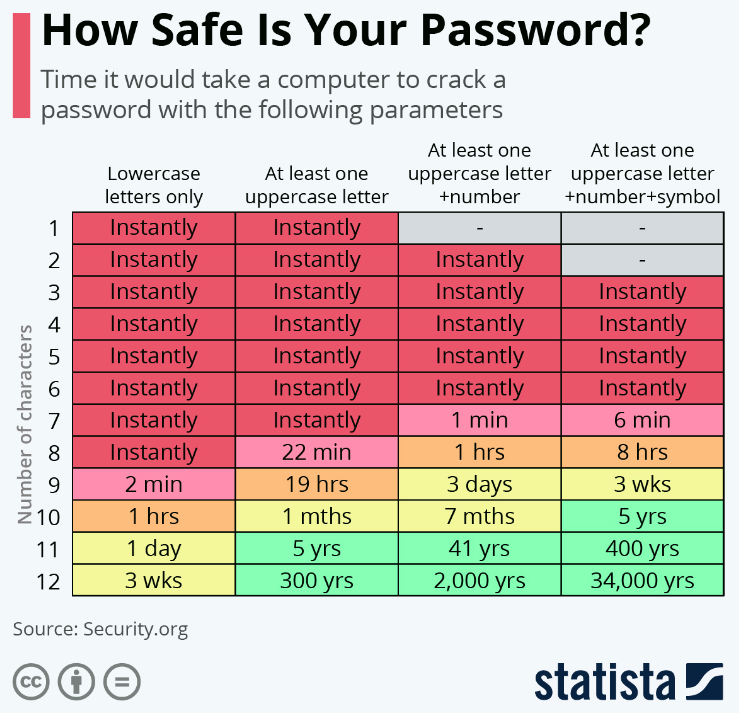
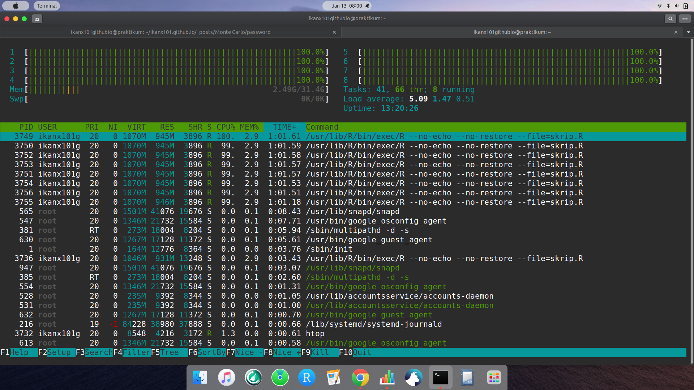

```{r setup, include=FALSE}
knitr::opts_chunk$set(echo = TRUE)
```

Beberapa waktu lalu, seorang rekan membagikan infografis mengenai keamanan dari _password_ yang biasa kita gunakan untuk _login_ di berbagai aplikasi dan _online services_ (seperti _email_, _e-commerce_, dst). 

```{r out.width="50%",echo=FALSE,fig.align='center',fig.cap="sumber: Statista"}

```

Suatu hal yang perlu dipahami adalah dengan semakin cepatnya kemampuan komputer dalam melakukan _processing_ dan _simulation_, maka akan semakin cepat juga _runtime_ komputer dalam __menebak__ _password_ kita tersebut.

Lantas bagaimana? Apakah kita harus merasa takut karena hal tersebut? Bagaimana dengan PIN ATM yang hanya terdiri dari __enam digit__ angka saja? Seberapa aman PIN tersebut?

---

## PIN ATM

Di Indonesia sendiri, PIN ATM menggunakan enam digit angka (0-9). Artinya ada $10^6$ kemungkinan PIN yang bisa digunakan oleh setiap penggunannya.

Sebenarnya untuk menebak PIN ATM, kita bisa menggunakan algoritma sederhana berbasis simulasi Monte Carlo. Jika dibuat dengan memanfaatkan _parallel processing_, dijamin dalam waktu singkat PIN ATM kita bisa dengan mudah ditebak.

NAMUN demikian, perlu kita ingat kembali bahwa setiap bank memiliki __jaring pengaman__ tambahan berupa:

> __Jika kita salah memasukkan PIN ATM sebanyak tiga kali, maka ATM akan terblokir dan tidak bisa digunakan.__

Percayalah bahwa jaring pengaman tersebut adalah hal yang paling penting karena __hampir tidak mungkin__ ada orang asing yang bisa menebak dengan tepat PIN ATM kita dalam maksimal tiga kali percobaan.

_Percaya gak?_

Oke, saatnya kita lakukan __simulasi__!

## Simulasi

Prinsip simulasi yang saya lakukan sangat sederhana, berikut adalah alurnya:

```{r out.width="50%",echo=FALSE,fig.align='center',fig.cap="Flowchart Simulasi"}
nomnoml::nomnoml("#direction:down
                 [<start> start] -> [<input> INPUT|PIN\nMax iter]
                 [<input> INPUT] -> [i = 1|hasil = 0]
                 [i = 1] -> [<choice>i <= Max iter]
                 
                 [<choice>i <= Max iter] -> N [print|sum(hasil) / Max iter]
                 [print] -> [<end>end]
                 
                 [<choice>i <= Max iter] -> Y [percobaan = 1|benar = 0]
                 [percobaan = 1] -> [<choice>percobaan <= 3]
                 
                 [<choice>percobaan <= 3] -> Y [<choice>Tebakan == PIN]
                 [<choice>Tebakan == PIN] -> Y [benar = benar + 1]
                 
                 [benar = benar + 1] -> [percobaan = percobaan + 1]
                 
                 [<choice>Tebakan == PIN] -> N [percobaan = percobaan + 1]
                 
                 [<choice>percobaan <= 3] -> N [if benar > 1|hasil = hasil + 1]
                 [if benar > 1|hasil = hasil + 1] -> [i = i + 1]
                 ")
```

Saya akan gunakan `Max iter` sebanyak $50 \times 10^6$.

Agar tidak terlalu lama, saya gunakan prinsip [_parallel processing_](https://ikanx101.com/blog/serial-parallel/) menggunakan [_virtual machine_ Google](https://ikanx101.com/blog/vm-cloud/).

Berikut adalah bukti bahwa `8` _cores_ bekerja semua secara _parallel_:

```{r out.width="75%",echo=FALSE,fig.align='center',fig.cap="sumber: Semua Cores Bekerja"}

```

Butuh waktu simulasi selama `12.16005` menit.

Hasilnya adalah:

> Dari $50 \times 10^6$ usaha meretas PIN, hanya `` kali komputer berhasil menebak PIN dalam maksimal tiga kali percobaan.

## Kesimpulan

Ternyata dengan adanya __jaring pengaman__ tersebut, peluang PIN ATM kita diretas dalam maksimal tiga kali percobaan sangat kecil.

---

`if you find this article helpful, support this blog by clicking the ads.`