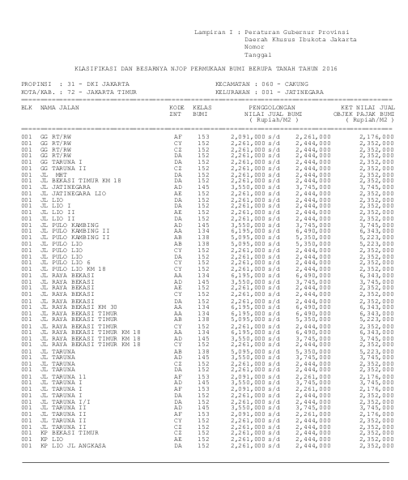

```{r setup, include=FALSE}
knitr::opts_chunk$set(echo = TRUE)
rm(list=ls())
library(dplyr)
library(tidyr)
library(ggplot2)
```

```{r,echo=FALSE,fig.align='center'}

load("njop.rda")
```


Suatu ketika saya disuruh mencari __Nilai Jual Objek Pajak__ (__NJOP__) per kelurahan di provinsi DKI Jakarta.

> Jangan tanya ini untuk apa ya... _hehe_

Singkat cerita, setelah mencari sana sini, saya tidak menemukan rekapan lengkapnya di internet. Salah satu sumber paling lengkap adalah file _pdf_ Pergub Nomor 260 Tahun 2015 yang saya dapatkan dari situs resmi Pemprov DKI Jakarta.

Masalahnya adalah file tersebut bukan _pdf_ hasil _export_ dari _file digital_ seperti _Ms. Words_ tapi berasal dari _scan_ dokumen fisik.

Pertanyaannya:

> Bisakah saya mengambil data tabel dari file `pdf` tersebut?

---

# Ide untuk Pengambilan Data

Pada Pergub tersebut, ada `3741` halaman dengan `3734` halaman berisi tabel rekapan __NJOP__. Bukan pilihan yang bijak untuk kita melakukan _copy-paste_ manual dari sekian banyak halaman tersebut.

Nah, sekarang saya akan berikan contoh cara mengambil data tersebut dengan memanfaatkan `library(pdftools)` di __R__.

Saya akan tunjukkan cara mengambil satu tabel dari satu halaman. Dari cara tersebut, kita nantinya tinggal melakukan _looping_ untuk semua halaman yang dibutuhkan.

---

# Proses Pengambilan Data

## Import `.pdf` ke dalam __R__ _Environment_

Pertama-tama, kita akan _import file_ `.pdf` ke dalam __R__ _environment_ menggunakan `library(pdftools)`:

```{r,warning=FALSE,message=FALSE}
# hasil = pdftools::pdf_text(nama_file)
```

Kita lihat struktur datanya:

```{r,warning=FALSE,message=FALSE}
str(hasil)
```

Data tersebut berbentuk _vector_ `character`. Satu _element vector_ menandakan `1` halaman.

Tabel pertama yang akan saya jadikan contoh adalah pada halaman ke `6`.

```{r,warning=FALSE,message=FALSE}
hasil[6]
```

Bentuknya masih sangat berantakan _yah_. Sekarang kita harus merapikannya.

## Proses Perapihan

### _Trim White Spaces_

Langkah pertama adalah menghapus semua _whitespaces_ yang ada dalam _vector_ tersebut. Ada banyak cara untuk melakukannya tapi saya ingin melakukannya dengan membuat _looping_ (alih-alih menggunakan `library` seperti `stringr`).

```{r,warning=FALSE,message=FALSE}
tes_lagi = hasil[[6]]
for(i in 1:10){
  tes_lagi = gsub("  "," ",tes_lagi)
}
```

### _Exporting_ ke Dalam `.txt` _Files_

Langkah berikutnya adalah mengekspor _vector_ tersebut ke `.txt` _file_. Gunanya apa? Agar bisa kita baca dengan `readLines()`, sehingga terlihat dengan jelas data perbarisnya kelak.

```{r,warning=FALSE,message=FALSE}
# sink("tes.txt")
# writeLines(tes_lagi)
# sink()
```

### _Importing_ `.txt` _Files_ Kembali ke __R__ _Environment_

Sekarang kita akan `readLines()` _file_ tersebut, lalu kita lihat bagaimana hasilnya:

```{r,warning=FALSE,message=FALSE}
atas = readLines('tes.txt')
atas
```

Sekarang bentuknya sudah mulai terlihat kan yah?

Walaupun masih berisi vector, tapi setidaknya kita bisa melihat ada `63` baris data.

Tugas selanjutnya adalah tinggal memilih, data apa saja yang akan kita ambil.

### Mengambil Data yang Diperlukan

#### Data Kota, Kecamatan, dan Kelurahan

```{r,warning=FALSE,message=FALSE}
kecamatan = atas[grepl("propinsi",atas,ignore.case = T)]
kecamatan
kota_kelurahan = atas[grepl("kota/kab",atas,ignore.case = T)]
kota_kelurahan
```

Dari _single object_ tersebut, kita akan rapikan dan bentuk ke dalam _data frame_.

Saya akan menggunakan _function_ `separate()` dari `library(tidyr)` dalam prinsip _tidy_ tentunya.

```{r,warning=FALSE,message=FALSE}
dummy = 
    data.frame(kecamatan,kota_kelurahan) %>% 
    separate(kecamatan,
             into = c("provinsi","kecamatan"),
             sep = "KECAMATAN") %>% 
    select(-provinsi) %>% 
    mutate(kecamatan = gsub("[0-9]","",kecamatan),
           kecamatan = gsub("\\:","",kecamatan),
           kecamatan = stringr::str_trim(kecamatan)) %>% 
    separate(kota_kelurahan,
             into = c("hapus","kota","kelurahan"),
             sep = "\\:") %>% 
    mutate(kelurahan = gsub("[0-9]","",kelurahan),
           kelurahan = gsub("\\:","",kelurahan),
           kelurahan = stringr::str_trim(kelurahan),
           hapus = NULL,
           kota = gsub("[0-9]","",kota),
           kota = gsub("KELURAHAN","",kota),
           kota = stringr::str_trim(kota)) %>% 
    mutate(kecamatan = trimws(kecamatan),
           kota = trimws(kota),
           kelurahan = trimws(kelurahan))
dummy
```

#### Data NJOP

Sekarang bagian pamungkasnya adalah mengambil nilai NJOP per baris dari _vector_ `atas`.

Saya harus memastikan bahwa saya mengambil baris yang tepat dan hanya akan mengambil `character` di ujung kanan saja.

```{r,warning=FALSE,message=FALSE}
harga_t = atas[grepl("s/d",atas,ignore.case = T)]
harga = substr(harga_t,stringr::str_length(harga_t)-11,stringr::str_length(harga_t))
```

Kita lihat bentuknya seperti apa sekarang:

```{r,warning=FALSE,message=FALSE}
data = data.frame(dummy,harga)
data
```

Sudah mulai terlihat dengan jelas datanya kan?

Tinggal _final touch_ saja dengan merapikan variabel `harga` pada _data frame_ tersebut.

### _Final Touch_

```{r,warning=FALSE,message=FALSE}
final = 
  data %>% 
  mutate(harga = gsub("\\,","",harga)) %>% 
  separate(harga,
           into = c("hapus","harga"),
           sep = " ") %>% 
  select(-hapus) %>% 
  mutate(harga = as.numeric(harga))
```

```{r,echo=FALSE}
cat("Hasil Ambil Data Halaman 6")
knitr::kable(final)
```

---

# Kesimpulan

Dari algoritma di atas, saya tinggal melakukan _looping_ untuk `3733`an halaman tersisa dari `.pdf` tersebut. Prosesnya sendiri relatif singkat, tidak sampai `5` menit.

Berikut adalah summarynya:

```{r,echo=FALSE,warning=FALSE,message=FALSE,fig.align='center',fig.height=9}
load("clean.rda")
options(scipen = 99)
final %>% 
  mutate(harga = harga/1000000) %>% 
  group_by(kota,kecamatan) %>% 
  summarise(max = max(harga),
            min = min(harga),
            median = median(harga)) %>% 
  ungroup() %>% 
  ggplot() +
  geom_errorbar(aes(x = kecamatan,
                    ymin = min,
                    ymax = max),
                width = 0.2,
                color = "steelblue") +
  geom_point(aes(x = kecamatan,
                 y = median),
             size = 1,
             color = "darkred") +
  coord_flip() +
  facet_wrap(~kota,scales = "free",ncol = 2) +
  theme_minimal() +
  labs(title = "Sebaran NJOP di Beberapa Kecamatan di DKI Jakarta\nNJOP dalam juta rupiah",
       subtitle = "Sumber: Pergub DKI Jakarta Nomor 260 Tahun 2015",
       caption = "Titik menandakan median (nilai tengah)\nScrape from pdf\nusing R\nikanx101.com") +
  theme(axis.title = element_blank())
```


