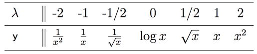

```{r setup, include=FALSE}
knitr::opts_chunk$set(echo = TRUE)
setwd("~/Documents/ikanx101.com/_posts/QnA NBC Sep")
```

## Pertanyaan 1

> Apakah ada _tips_ and _trick_ untuk menyaring _the right data_ dari sebuah _big data_? Bagaimana mengasah diri agar dapat mendapatkan _insight_ dari data yang sekarang cenderung terlalu banyak?

Untuk menjawab ini, saya akan menggunakan konsep berikut ini:

```{r,echo=FALSE}
nomnoml::nomnoml("[Data] <-> [People]
                 [Data] <-> [Tools]
                 [Tools] <-> [People]")
```

Sebelum jauh berbicara mengenai analisa data. Ada baiknya kita [memahami terlebih dahulu](https://ikanx101.com/blog/mengenal-data/) tipe dan jenis data yang kita miliki itu seperti apa. Mungkin hal ini terlihat _remeh_ tapi percayalah bahwa dengan memahami data yang kita miliki, kita bisa lebih baik dalam menganalisa data tersebut. 

Untuk menganalisa data, setidaknya ada dua pendekatan yang bisa dilakukan, yakni:

1. Eksplorasi, bahasa simpelnya bertualang _ngoprek_ dari data yang ada. Apakah ada _insights_ yang bisa diambil dari data tersebut?
1. Konfirmasi, bahasa simpelnya mengecek hipotesis yang kita miliki. Apakah hipotesa tersebut bisa diterima atau ditolak?

Namun demikian, hal yang terpenting adalah menetapkan [tujuan terlebih dahulu](https://ikanx101.com/blog/tujuan/). Jika kita memiliki tujuan yang jelas, setidaknya kita bisa menentukan dari sekian banyak variabel yang ada dalam data, mana saja yang perlu diperhatikan dan diprioritaskan. Kita juga bisa menentukan _filter_ apa saja yang harus diaplikasikan dalam data dan model perhitungan.

Mengekstrak _insights_ dari data sama halnya dengan semua keahlian atau kompetensi lainnya: __harus dilatih__ dan tidak boleh berhenti di suatu titik (harus tetap belajar terus). Sedikit bercerita, saya kuliah di [jurusan Matematika](https://passingthroughresearcher.wordpress.com/2018/04/06/kuliah-di-matematika-itu-belajar-apa-saja-satudekade/). Jangan pernah berpikir kuliah di Matematika itu akan menemukan angka dan mengolah data ini itu _yah_! Justru baru belajar dan mengenal data saat bekerja di bidang _market research_. 

Salah satu panduan yang saya pelajari di dunia _market research_ adalah: _follow the rabbit_.

Mungkin sebagai inspirasi agar teman-teman mau mulai belajar walau sedikit adalah artikel berjudul [__Competing on Analytics__](https://hbr.org/2006/01/competing-on-analytics). 

Setiap perusahaan bisa menawarkan produk yang sama, bisa memberikan jasa yang sama. Lalu apa pembedanya? Kemampuan melakukan _analytics_.

Mengenai masalah _data preparation_ dan _data cleaning_ dalam suatu _workflow_ pengerjaan data:

```{r out.width="70%",echo=FALSE}
knitr::include_graphics("https://raw.githubusercontent.com/ikanx101/ikanx101.github.io/master/_posts/tujuan_files/figure-gfm/unnamed-chunk-3-1.png")
```

Ada beberapa _rules_ yang bisa diaplikasikan:

- _Consistency check_; yakni melihat konsistensi _content_ dari suatu _cells_ yang ada di dalam data. Hal yang biasa dicek adalah:
  - Konsistensi antara `character` atau `number`.
  - Penggunaan tanda baca tertentu seperti: `,` atau `.`.
  - Standarisasi penulisan `character` di dalam _cell_.
  - _Structured_ dan _format checked_. 
  
Contohnya data pada tabel berikut ini:
  
```{r,echo=FALSE}
berat_badan = c('45,7kg','69 kilogr','45.7 kilo','70,5','80 kilogram','67 kg','71,4','69kg')
nama = randomNames::randomNames(length(berat_badan),
                                gender = 'male',
                                which.names = 'first')

data = data.frame(nama = as.character(nama),berat_badan)
data$nama = as.character(data$nama)
data$nama[3] = toupper(data$nama[1])
data$nama[8] = tolower(data$nama[2])
colnames(data) = c("Nama","Berat Badan")
knitr::kable(data)
```

Proses _data cleaning_ mencakup:

- Ada kemungkinan kita menemui data yang kosong (bolong-bolong). Bagaimana menghadapi masalah ini?
  - Jangan terburu-buru untuk menghapus baris data yang kosong tersebut!
  - Jika kita memiliki baris data yang relatif banyak, kita bisa mempertimbangkan untuk menghapus baris data yang kosong tersebut.
  - Kita bisa mengisi kekosongan data yang ada dengan nilai `mean`, `median`, atau `modus` tergantung dari tipe data yang kita miliki.
  
- Ada kemungkinan kita menemui data yang memiliki nilai pencilan (_extreme values_). Bagaimana menghadapi masalah ini?
  - Jangan terburu-buru untuk menghapus baris data yang memiliki nilai pencilan tersebut!
  - Ingat! untuk menghapus nilai pencilan ada aturan secara statistik yang harus dilakukan (analisa _boxplot_). 
  - Daripada menghapus baris data yang mengandung nilai pencilan, ada baiknya untuk menambah banyaknya baris data kita.

Perlu diperhatikan bahwa __tidak ada jawaban baku__ dalam hal penanganan data kosong dan _outlier_. Kita bisa mengembalikannya ke _business process_ yang terjadi.

Selain itu, _right tools may help you finding the right answers_. Pernah mendengar istilah _machine learning_ dan _artificial intelligence_? Kemampuan otak manusia dalam _crunching numbers_ itu terbatas. Oleh karena itu, mereka memerlukan komputer yang telah diprogram sedemikian rupa agar bisa melakukan _crunching a lot of big numbers in a seconds_. 

----

# Pertanyaan 2

> Dalam hal pengambilan _final decision_, berarti pengalaman menjadi faktor penentu juga ya?

Pertanyaan ini masih berhubungan dengan pertanyaan pertama barusan _yah_.

Perlu diingat kembali bahwa yang namanya _science_ adalah aproksimasi yang berlaku dalam suatu limitasi dan asumsi tertentu. Ada kalanya hasil perhitungan berbeda dengan kondisi _real_. Oleh karena itu, diperlukan _wisdom_ dalam membaca dan menginterpretasikan hasil model.

Banyak orang mempertentangkan _intuition-based decision making_ dengan _data-based decision making_. Menurut saya, intuisi berasal dari pengalaman dan semua data yang sudah masuk ke alam bawah sadar. Saya sendiri berada di posisi bukan untuk mempertentangkan intuisi dengan data. Namun lebih bersifat _balancing_ antara keduanya.

Salah satu cara termudah untuk menentukan _final decision_ dengan berdiskusi dengan membawa hasil analisa data untuk mendapatkan _another point of views_.

Pernah suatu ketika saya membantu _business user_ untuk membuat analisa dari data mereka. Setelah selesai, saya mempresentasikan hasil analisa saya. Sebagai seorang _data analyst_ yang tidak memiliki pengetahuan _business process_ yang mendalam, saya memerlukan _another point of view_ dari _business user_. _Final decision_ yang akhirnya disepakati adalah jalan tengah di mana analisa masih bisa dipertanggungjawabkan secara keilmuan dan memudahkan _business user_ untuk mengeksekusinya.

----

## Pertanyaan 3

> Bagaimana cara menentukan _tools_ pengolahan data? Hal-hal apa saja yang tidak bisa diasumsikan dalam _analytics_? 

Pertanyaan ini masih berhubungan dengan pertanyaan pertama barusan _yah_.

_Tools_ disesuaikan dengan jenis dan tipe data, tujuan, serta kemampuan dari orang yang akan melakukan analisa.

Hal-hal yang bisa atau tidak bisa diasumsukan dalam suatu penelitian biasanya tergantung dari tujuan penelitian itu sendiri. Namun biasanya jika sudah ada fakta atau bukti yang cukup, kita tidak boleh mengasumsikan hal tersebut.

---
## Pertanyaan 4

> Dalam sebuah riset dengan data _qualitative_ bagaimana suatu analisa bisnis dapat dikatakan sudah tervisualisasi dengan baik?

Riset atau penelitian dibagi menjadi dua:

1. Kualitatif, bersifat eksplorasi mendalam.
1. Kuantitatif, bersifat _hypotheses testing_.

Perbedaan mendasar ini membuat kedua jenis riset ini memiliki kelebihan dan kekurangan masing-masing. Saat seseorang melakukan riset kuantitatif, secara otomatis akan ada ekspektasi keberadaan grafik atau _charts_ hasil analisa data dalam _report_-nya.

Berbeda dengan riset kualitatif yang `tidak ada` (atau tidak mengharuskan keberadaan) analisa secara statistik. Analisa yang dilakukan bersifat mendalam dengan jumlah sampel yang tidak terlalu banyak. Oleh karena itu, visualisasinya pun berbeda dengan riset kuantitatif. Saya sendiri tidak memiliki ekspektasi tinggi dalam hal visualisasi pada saat melihat _report_ kualitatif.

Bagi saya, hal terpenting adalah _report_ kualitatif harus bisa menjawab tujuan riset dan memberikan nilai tambah atau _insights_ terhadap bisnis.

Data sebagai mana kita tahu juga terbagi menjadi dua:

1. Kualitatif, tidak bisa dilakukan operasi aritmatika.
1. Kuantitatif, bisa dilakukan operasi aritmatika.

Jangan sampai kita salah paham. Walaupun tidak bisa dijumlah, dikurang, dibagi dan dikali, TAPI data kualitatif bisa dihitung (_counting_).

Salah satu analisa yang paling sering dilakukan pada data kualitatif adalah frekuensi tabulasi atau cross tabulasi. Contohnya seperti [ini](https://ikanx101.com/blog/halal-mui/).

----

## Pertanyaan 5

> Bagaimana menerjemahkan masalah-masalah _real_ ke dalam model yang bisa digunakan untuk analisis dan perhitungan? Bagaimana menentukan data-data apa yang diperlukan agar punya informasi yang cukup tapi juga tidak terlalu kompleks?

Untuk menerejemahkan masalah _real_ ke dalam model matematika atau statistika, salah satu kunci utamanya adalah kita harus mengetahui terlebih dahulu jenis-jenis model yang ada (memperluas _knowledge_ tentang hal ini). _In my humble opinion_, kita tidak perlu mengetahui sampai sangat detail, cukup mengetahui `input`, `proses`, dan `output` dari masing-masing model tersebut. Kita juga bisa melakukan _filter_ mengenai model-model apa saja yang memang berkaitan dengan bidang pekerjaan atau hobi kita.

Untuk membuat model, setidaknya ada dua cara yang bisa dilakukan:

1. Cara eksak, yakni membangun model dari nol dan menyelesaikannya menggunakan metode yang memang seharusnya digunakan untuk itu.
1. Cara _heuristik_, yakni membangun model dengan memodifikasi metode lain yang dianggap bisa menyelesaikan masalah kita.

__Contoh cara eksak__: Saya akan coba ceritakan bagaimana langkah membuat model matematika sederhana mengenai persebaran penyakit flu di suatu kantor. Saya akan menggunakan persamaan diferensial yang memang lazim digunakan untuk memodelkan masalah-masalah seperti ini.

Agar memudahkan, persamaan diferensial itu memiliki konsep: __menyelesaikan perubahan atau perbedaan__.

Misal:

- Kelompok orang sehat saya tulis $S$.
- Kelompok orang sakit saya tulis $I$.

Kondisi _real_ dari masalah saya adalah sebagai berikut:

1. Pada saat hari ke `0`, ada sebanyak $x$ orang yang sakit.
1. Penambahan jumlah orang sakit, berasal dari interaksi antara orang sakit dengan orang sehat. _Rate_ penularannya saya tulis sebagai $\alpha$.
1. Pengurangan jumlah orang sakit, berasal dari orang sakit yang sembuh dengan sendirinya setelah sekian hari. _Rate_ kesembuhannya saya tulis sebagai $\beta$.
1. Orang yang telah sembuh akan menjadi kebal (tidak terjangkit flu kembali).

Maka, secara matematika bisa dituliskan:

$$\frac{d}{dt}I = x + \alpha*I(t)*S(t)-\beta*I(t)$$

Sekarang PR kita tinggal menghitung nilai $\alpha$ dan $\beta$ serta data pendukung seperti $x$ dan banyaknya karyawan di kantor yang sehat pada hari ke 0.

__Contoh cara heuristik__: Apakah kamu pernah mendengar tentang [_Travelling Salesman Problem_](https://passingthroughresearcher.wordpress.com/2019/11/18/menentukan-rute-jalan-jalan-paling-optimal-dengan-tsp/)? Metode yang lazim digunakan untuk menentukan rute paling optimal ini ternyata bisa juga digunakan untuk melakukan _schedulling_ produksi di pabrik.

Metode yang sama juga bisa digunakan untuk [membentuk tim](https://passingthroughresearcher.wordpress.com/2019/11/15/social-network-analysis-meramu-tim-interviewer-terkompak-di-market-research/) dan melihat alur transmisi informasi dalam tim.

---

## Pertanyaan 6

> Saya bekerja di bidang _sales_. Setiap hari saya melihat data penjualan tapi kenapa saya tidak bisa menemukan persamaan _forecasting_ yang akurat? Bagaimana cara membuatnya?

Apa perbedaan antara _prediction_ dan _forecast_? 

```{r,echo=FALSE}
nomnoml::nomnoml("[Prediction] -> [Condition]
                 [Forecast] -> [Historical Time Series]")
```

Contoh simpel, saya ingin meramalkan apakah besok akan hujan atau tidak.

Jika saya menggunakan _prediction_, saya akan menentukan hujan atau tidak berdasarkan kondisi-kondisi cuaca di hari itu seperti kecepatan angin, kelembapan udara, suhu udara, keberadaan awan, dll. 

Jika saya menggunakan _forecast_, saya akan melihat _trend_ hujan yang terjadi selama sekian hari terakhir.

Kembali ke kasus _sales_, kita harus terus mencari model _time series_ yang terbaik untuk bisa melakukan forecast yang akurat. Jikalau tidak bisa akurat `100%`, minimal berada dalam __rentang kesalahan__ yang bisa kita terima. Tidak ada cara mudahnya untuk ini. Mungkin kita bisa melakukan _benchmark_ ke perusahaan lain mengenai hal ini tapi saya ingatkan bahwa ada yang namanya [_no free lunch theorem_](https://ikanx101.com/blog/no_free-lunch/).

---

## Pertanyaan 7

> Bagaimana sih menentukan $H_0$ dan $H_1$ pada uji hipotesis? Bagaimana menentukan pernyataan dan pertanyaannya?

Simpelnya, $H_0$ adalah pernyataan yang mengandung unsur sama dengan. Sedangkan $H_1$ adalah kebalikannya.

Misalkan:

1. Jika $H_0: X = Y$ maka $H_1: X \neq Y$
1. Jika $H_0: X \geq Y$ maka $H_1: X < Y$
1. Jika $H_0: X \leq Y$ maka $H_1: X > Y$

Saya rasa contoh tulisan saya [berikut ini](https://ikanx101.com/blog/epl-pre-covid/) sudah cukup jelas terkait cara penulisan pernyataan $H_0$ dan $H_1$. 

---

## Pertanyaan 8

> Uji organoleptik (uji kesukaan) terhadap suatu produk makanan/minuman merupakan uji yang cukup subjektif, untuk bisa mendapatkan hasil yang tidak bias, bagaimana sebaiknya uji itu dilaksanakan?

Simpel, perbanyak jumlah sampel.

Pernah bertemu dengan orang yang selalu memberikan jawaban positif saat survey? Atau kebalikannya, pernah bertemu dengan orang yang selalu memberikan jawaban negatif saat survey? Ada berapakah orang seperti mereka di populasi?

Dengan memperbesar jumlah sampel, maka bias seperti ini akan hilang dengan sendirinya.

---

## Pertanyaan 9

> Kalau data berupa _text_ (misal artikel atau _reviews_) seperti apa analisanya?

Silakan baca tulisan saya [berikut ini](https://ikanx101.com/blog/blog-posting-sunyi/). Data berupa teks bisa dikategorikan sebagai data nominal. 

PERHATIKAN kembali yah, data kualitatif itu bukan berarti tidak bisa dihitung! Data kualitatif tetap bisa kita hitung (_counting_). _Central tendency_ yang bisa dihitung dari data kualitatif adalah __MODUS__.

Silakan baca juga [ini](https://ikanx101.com/blog/tahun-baru/) dan [ini](https://passingthroughresearcher.wordpress.com/2019/08/15/menelusuri-pencarian-keyword-diabetes-mellitus-di-detikhealth/).

---

## Pertanyaan 10

> Apa perbedaan terbesar dari distribusi normal dan pareto?

Distribusi normal memiliki kurva density berbentuk _bell curved_ sementara pareto tidak.

Contoh _density plot_ distribusi normal:

```{r,echo=FALSE,warning=FALSE,message=FALSE,fig.retina=10}
normal = rnorm(n = 500, mean = 0, sd = 1)
hist(normal)
```

Contoh _density plot_ distribusi pareto:

```{r,echo=FALSE,warning=FALSE,message=FALSE,fig.retina=10}
k <- 5      # parameter k of the Pareto distribution
x.min <- 2  # cutoff point of Pareto distribution
N <- 500    # number of random points
pareto <- x.min*(1-runif(N))^(-1/k)
h <- hist(pareto, freq=FALSE, plot=TRUE)
x <- seq(x.min, h$breaks[length(h$breaks)], by=0.01)
lines(x, k*x.min^k/x^(k+1), col="red")
```

Salah satu data yang saya duga memiliki distribusi pareto adalah sebaran [_mortality rate_ COVID-19 per negara](https://ikanx101.com/blog/angka-real-covid/).


----

## Pertanyaan 11

> Kapan data boleh ditransformasi?

Transformasi data boleh dilakukan jika analisa yang digunakan mengharuskan kita untuk memiliki data yang _compact_ (agar sebarannya tidak terlalu besar).

Bagaimana cara melakukan transformasinya? Kita bisa berpegang pada _Tukey's Transformation Ladder_ sebagai berikut:

```{r,echo=FALSE}

```

Cara membacanya:

- Jika data terlalu condong ke kiri, maka gunakan fungsi $f(x)$ di sebelah kiri agar data bisa ke tengah.
- Jika data terlalu condong ke kanan, maka gunakan fungsi $f(x)$ di sebelah kanan agar data bisa ke tengah.

_Hal kayak gini pernah dipakai di Nutrifood gak sih?_ Pernah! Silakan baca [ini](https://passingthroughresearcher.wordpress.com/2019/08/09/mencari-peluang-kegagalan-dari-data-yang-tak-pernah-gagal/).

---

## Pertanyaan 12

> Dalam perhitungan probabilitas dengan perhitungan monte carlo, apakah ada asumsi yang digunakan adalah bahwa semua orang punya hasrat dan tanggung jawab yang sama untuk mencapai tujuan yang kita maksud dalam contoh (memenangkan hadiah dari tutup botol coca cola)

Pertanyaan ini terkait tulisan saya di [sini](https://ikanx101.com/blog/coupon-collector/).

Kalau membaca dengan detail proses perhitungan simulasi Monte Carlo pada kasus [_coupon collector's problem_](https://ikanx101.com/blog/kolektor-kupon/), untuk menghitung ada berapa banyak tutup botol yang harus dikumpulkan HANYA berdasarkan asumsi sebaran jenis tutup botol yang ada di pasaran.

Kita tidak memerlukan asumsi hasrat atau keninginan setiap konsumen sama.

---

## Pertanyaan 13

> Dari perkembangan teknologi menyebabkan terciptanya Big Data hingga Triliunan Giga per hari. Apakah hal itu bisa disebut "tidak apa apa" dan apakah kapasitas penyimpanan bisa menampung Big Data tersebut hingga puluhan tahun ke depan?

Teknologi penyimpanan data secara _cloud_ selalu berkembang. Pernah dengar [_project github artic_](https://www.engadget.com/github-arctic-vault-success-020240808.html?guccounter=1&guce_referrer=aHR0cHM6Ly93d3cuZ29vZ2xlLmNvbS8&guce_referrer_sig=AQAAAJg_16oZ8NxHkGuOS5Y3dQbxH2FveTc_ozgXJWSp8jA9LK7AhZx4lDdlDg0XB9GDOd8EhBESY2jfmxkH-9wyvsYEk60XXoUZd2j6GxoN_ahJ1sR7tnC6NMlD9kygbxGjo0LWboF6rreLG2ZijqAgspaOYDU-xuxB2LjNgxVhLZwg_)?

Pernahkah kita bertanya:

> Apakah Instagram akan "kepenuhan" suatu hari nanti?
