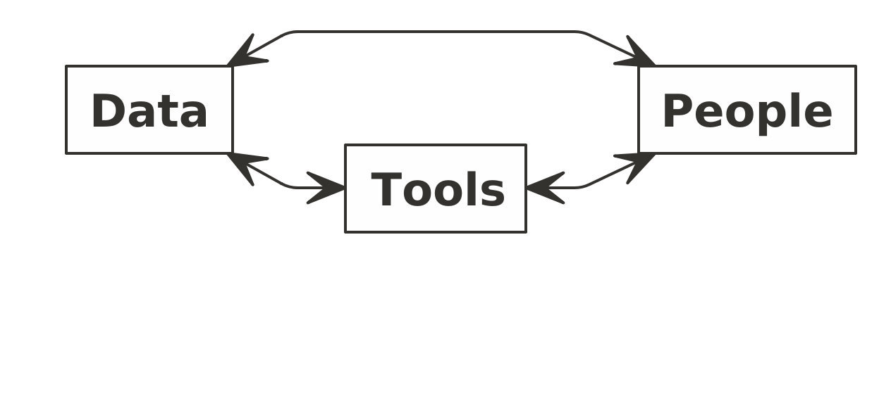
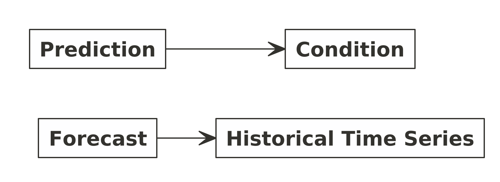

Pertanyaan Seputar Data yang Sering Saya Temui (Bagian I)
================

## Pertanyaan 1

> Apakah ada *tips* and *trick* untuk menyaring *the right data* dari
> sebuah *big data*? Bagaimana mengasah diri agar dapat mendapatkan
> *insight* dari data yang sekarang cenderung terlalu banyak?

Untuk menjawab ini, saya akan menggunakan konsep berikut ini:

<!-- -->

Sebelum jauh berbicara mengenai analisa data. Ada baiknya kita [memahami
terlebih dahulu](https://ikanx101.com/blog/mengenal-data/) tipe dan
jenis data yang kita miliki itu seperti apa. Mungkin hal ini terlihat
*remeh* tapi percayalah bahwa dengan memahami data yang kita miliki,
kita bisa lebih baik dalam menganalisa data tersebut.

Untuk menganalisa data, setidaknya ada dua pendekatan yang bisa
dilakukan, yakni:

1.  Eksplorasi, bahasa simpelnya bertualang *ngoprek* dari data yang
    ada. Apakah ada *insights* yang bisa diambil dari data tersebut?
2.  Konfirmasi, bahasa simpelnya mengecek hipotesis yang kita miliki.
    Apakah hipotesa tersebut bisa diterima atau ditolak?

Namun demikian, hal yang terpenting adalah menetapkan [tujuan terlebih
dahulu](https://ikanx101.com/blog/tujuan/). Jika kita memiliki tujuan
yang jelas, setidaknya kita bisa menentukan dari sekian banyak variabel
yang ada dalam data, mana saja yang perlu diperhatikan dan
diprioritaskan. Kita juga bisa menentukan *filter* apa saja yang harus
diaplikasikan dalam data dan model perhitungan.

Mengekstrak *insights* dari data sama halnya dengan semua keahlian atau
kompetensi lainnya: **harus dilatih** dan tidak boleh berhenti di suatu
titik (harus tetap belajar terus). Sedikit bercerita, saya kuliah di
[jurusan
Matematika](https://passingthroughresearcher.wordpress.com/2018/04/06/kuliah-di-matematika-itu-belajar-apa-saja-satudekade/).
Jangan pernah berpikir kuliah di Matematika itu akan menemukan angka dan
mengolah data ini itu *yah*\! Justru baru belajar dan mengenal data saat
bekerja di bidang *market research*.

Salah satu panduan yang saya pelajari di dunia *market research* adalah:
*follow the rabbit*.

Mungkin sebagai inspirasi agar teman-teman mau mulai belajar walau
sedikit adalah artikel berjudul [**Competing on
Analytics**](https://hbr.org/2006/01/competing-on-analytics).

Setiap perusahaan bisa menawarkan produk yang sama, bisa memberikan jasa
yang sama. Lalu apa pembedanya? Kemampuan melakukan *analytics*.

Mengenai masalah *data preparation* dan *data cleaning* dalam suatu
*workflow* pengerjaan data:

Ada beberapa *rules* yang bisa diaplikasikan:

  - *Consistency check*; yakni melihat konsistensi *content* dari suatu
    *cells* yang ada di dalam data. Hal yang biasa dicek adalah:
      - Konsistensi antara `character` atau `number`.
      - Penggunaan tanda baca tertentu seperti: `,` atau `.`.
      - Standarisasi penulisan `character` di dalam *cell*.
      - *Structured* dan *format checked*.

Contohnya data pada tabel berikut ini:

| Nama         | Berat Badan |
| :----------- | :---------- |
| Abdul Lateef | 45,7kg      |
| Saood        | 69 kilogr   |
| ABDUL LATEEF | 45.7 kilo   |
| Gregory      | 70,5        |
| Braden       | 80 kilogram |
| Efren        | 67 kg       |
| Oscar        | 71,4        |
| saood        | 69kg        |

Proses *data cleaning* mencakup:

  - Ada kemungkinan kita menemui data yang kosong (bolong-bolong).
    Bagaimana menghadapi masalah ini?
      - Jangan terburu-buru untuk menghapus baris data yang kosong
        tersebut\!
      - Jika kita memiliki baris data yang relatif banyak, kita bisa
        mempertimbangkan untuk menghapus baris data yang kosong
        tersebut.
      - Kita bisa mengisi kekosongan data yang ada dengan nilai `mean`,
        `median`, atau `modus` tergantung dari tipe data yang kita
        miliki.
  - Ada kemungkinan kita menemui data yang memiliki nilai pencilan
    (*extreme values*). Bagaimana menghadapi masalah ini?
      - Jangan terburu-buru untuk menghapus baris data yang memiliki
        nilai pencilan tersebut\!
      - Ingat\! untuk menghapus nilai pencilan ada aturan secara
        statistik yang harus dilakukan (analisa *boxplot*).
      - Daripada menghapus baris data yang mengandung nilai pencilan,
        ada baiknya untuk menambah banyaknya baris data kita.

Perlu diperhatikan bahwa **tidak ada jawaban baku** dalam hal penanganan
data kosong dan *outlier*. Kita bisa mengembalikannya ke *business
process* yang terjadi.

Selain itu, *right tools may help you finding the right answers*. Pernah
mendengar istilah *machine learning* dan *artificial intelligence*?
Kemampuan otak manusia dalam *crunching numbers* itu terbatas. Oleh
karena itu, mereka memerlukan komputer yang telah diprogram sedemikian
rupa agar bisa melakukan *crunching a lot of big numbers in a seconds*.

-----

# Pertanyaan 2

> Dalam hal pengambilan *final decision*, berarti pengalaman menjadi
> faktor penentu juga ya?

Pertanyaan ini masih berhubungan dengan pertanyaan pertama barusan
*yah*.

Perlu diingat kembali bahwa yang namanya *science* adalah aproksimasi
yang berlaku dalam suatu limitasi dan asumsi tertentu. Ada kalanya hasil
perhitungan berbeda dengan kondisi *real*. Oleh karena itu, diperlukan
*wisdom* dalam membaca dan menginterpretasikan hasil model.

Banyak orang mempertentangkan *intuition-based decision making* dengan
*data-based decision making*. Menurut saya, intuisi berasal dari
pengalaman dan semua data yang sudah masuk ke alam bawah sadar. Saya
sendiri berada di posisi bukan untuk mempertentangkan intuisi dengan
data. Namun lebih bersifat *balancing* antara keduanya.

Salah satu cara termudah untuk menentukan *final decision* dengan
berdiskusi dengan membawa hasil analisa data untuk mendapatkan *another
point of views*.

Pernah suatu ketika saya membantu *business user* untuk membuat analisa
dari data mereka. Setelah selesai, saya mempresentasikan hasil analisa
saya. Sebagai seorang *data analyst* yang tidak memiliki pengetahuan
*business process* yang mendalam, saya memerlukan *another point of
view* dari *business user*. *Final decision* yang akhirnya disepakati
adalah jalan tengah di mana analisa masih bisa dipertanggungjawabkan
secara keilmuan dan memudahkan *business user* untuk mengeksekusinya.

-----

## Pertanyaan 3

> Bagaimana cara menentukan *tools* pengolahan data? Hal-hal apa saja
> yang tidak bisa diasumsikan dalam *analytics*?

Pertanyaan ini masih berhubungan dengan pertanyaan pertama barusan
*yah*.

*Tools* disesuaikan dengan jenis dan tipe data, tujuan, serta kemampuan
dari orang yang akan melakukan analisa.

Hal-hal yang bisa atau tidak bisa diasumsukan dalam suatu penelitian
biasanya tergantung dari tujuan penelitian itu sendiri. Namun biasanya
jika sudah ada fakta atau bukti yang cukup, kita tidak boleh
mengasumsikan hal tersebut.

## Pertanyaan 6

> Saya bekerja di bidang *sales*. Setiap hari saya melihat data
> penjualan tapi kenapa saya tidak bisa menemukan persamaan
> *forecasting* yang akurat? Bagaimana cara membuatnya?

Apa perbedaan antara *prediction* dan *forecast*?

<!-- -->

Contoh simpel, saya ingin meramalkan apakah besok akan hujan atau tidak.

Jika saya menggunakan *prediction*, saya akan menentukan hujan atau
tidak berdasarkan kondisi-kondisi cuaca di hari itu seperti kecepatan
angin, kelembapan udara, suhu udara, keberadaan awan, dll.

Jika saya menggunakan *forecast*, saya akan melihat *trend* hujan yang
terjadi selama sekian hari terakhir.

Kembali ke kasus *sales*, kita harus terus mencari model *time series*
yang terbaik untuk bisa melakukan forecast yang akurat. Jikalau tidak
bisa akurat `100%`, minimal berada dalam **rentang kesalahan** yang bisa
kita terima. Tidak ada cara mudahnya untuk ini. Mungkin kita bisa
melakukan *benchmark* ke perusahaan lain mengenai hal ini tapi saya
ingatkan bahwa ada yang namanya [*no free lunch
theorem*](https://ikanx101.com/blog/no_free-lunch/).

-----

## Pertanyaan 7

> Bagaimana sih menentukan
>  dan
>  pada uji
> hipotesis? Bagaimana menentukan pernyataan dan pertanyaannya?

Simpelnya, 
adalah pernyataan yang mengandung unsur sama dengan. Sedangkan
 adalah
kebalikannya.

Misalkan:

1.  Jika  maka 
2.  Jika  maka 
3.  Jika  maka 

Saya rasa contoh tulisan saya [berikut
ini](https://ikanx101.com/blog/epl-pre-covid/) sudah cukup jelas terkait
cara penulisan pernyataan
 dan
.

-----

## Pertanyaan 8

> Uji organoleptik (uji kesukaan) terhadap suatu produk makanan/minuman
> merupakan uji yang cukup subjektif, untuk bisa mendapatkan hasil yang
> tidak bias, bagaimana sebaiknya uji itu dilaksanakan?

Simpel, perbanyak jumlah sampel.

Pernah bertemu dengan orang yang selalu memberikan jawaban positif saat
survey? Atau kebalikannya, pernah bertemu dengan orang yang selalu
memberikan jawaban negatif saat survey? Ada berapakah orang seperti
mereka di populasi?

Dengan memperbesar jumlah sampel, maka bias seperti ini akan hilang
dengan sendirinya.

-----

## Pertanyaan 9

> Kalau data berupa *text* (misal artikel atau *reviews*) seperti apa
> analisanya?

Silakan baca tulisan saya [berikut
ini](https://ikanx101.com/blog/blog-posting-sunyi/). Data berupa teks
bisa dikategorikan sebagai data nominal.

PERHATIKAN kembali yah, data kualitatif itu bukan berarti tidak bisa
dihitung\! Data kualitatif tetap bisa kita hitung (*counting*). *Central
tendency* yang bisa dihitung dari data kualitatif adalah **MODUS**.

Silakan baca juga [ini](https://ikanx101.com/blog/tahun-baru/) dan
[ini](https://passingthroughresearcher.wordpress.com/2019/08/15/menelusuri-pencarian-keyword-diabetes-mellitus-di-detikhealth/).

-----

## Pertanyaan 10

> Apa perbedaan terbesar dari distribusi normal dan pareto?

Distribusi normal memiliki kurva density berbentuk *bell curved*
sementara pareto tidak.

Contoh *density plot* distribusi normal:

Contoh *density plot* distribusi pareto:

Salah satu data yang saya duga memiliki distribusi pareto adalah sebaran
[*mortality rate* COVID-19 per
negara](https://ikanx101.com/blog/angka-real-covid/).

-----

## Pertanyaan 11

> Kapan data boleh ditransformasi?

Transformasi data boleh dilakukan jika analisa yang digunakan
mengharuskan kita untuk memiliki data yang *compact* (agar sebarannya
tidak terlalu besar).

Bagaimana cara melakukan transformasinya? Kita bisa berpegang pada
*Tukey’s Transformation Ladder* sebagai berikut:

Cara membacanya:

  - Jika data terlalu condong ke kiri, maka gunakan fungsi
    ") di
    sebelah kiri agar data bisa ke tengah.
  - Jika data terlalu condong ke kanan, maka gunakan fungsi
    ") di
    sebelah kanan agar data bisa ke tengah.

*Hal kayak gini pernah dipakai di Nutrifood gak sih?* Pernah\! Silakan
baca
[ini](https://passingthroughresearcher.wordpress.com/2019/08/09/mencari-peluang-kegagalan-dari-data-yang-tak-pernah-gagal/).

-----

## Pertanyaan 12

> Dalam perhitungan probabilitas dengan perhitungan monte carlo, apakah
> ada asumsi yang digunakan adalah bahwa semua orang punya hasrat dan
> tanggung jawab yang sama untuk mencapai tujuan yang kita maksud dalam
> contoh (memenangkan hadiah dari tutup botol coca cola)

Pertanyaan ini terkait tulisan saya di
[sini](https://ikanx101.com/blog/coupon-collector/).

Kalau membaca dengan detail proses perhitungan simulasi Monte Carlo pada
kasus [*coupon collector’s
problem*](https://ikanx101.com/blog/kolektor-kupon/), untuk menghitung
ada berapa banyak tutup botol yang harus dikumpulkan HANYA berdasarkan
asumsi sebaran jenis tutup botol yang ada di pasaran.

Kita tidak memerlukan asumsi hasrat atau keninginan setiap konsumen
sama.

-----

## Pertanyaan 13

> Dari perkembangan teknologi menyebabkan terciptanya Big Data hingga
> Triliunan Giga per hari. Apakah hal itu bisa disebut “tidak apa apa”
> dan apakah kapasitas penyimpanan bisa menampung Big Data tersebut
> hingga puluhan tahun ke depan?

Teknologi penyimpanan data secara *cloud* selalu berkembang. Pernah
dengar [*project github
artic*](https://www.engadget.com/github-arctic-vault-success-020240808.html?guccounter=1&guce_referrer=aHR0cHM6Ly93d3cuZ29vZ2xlLmNvbS8&guce_referrer_sig=AQAAAJg_16oZ8NxHkGuOS5Y3dQbxH2FveTc_ozgXJWSp8jA9LK7AhZx4lDdlDg0XB9GDOd8EhBESY2jfmxkH-9wyvsYEk60XXoUZd2j6GxoN_ahJ1sR7tnC6NMlD9kygbxGjo0LWboF6rreLG2ZijqAgspaOYDU-xuxB2LjNgxVhLZwg_)?

Pernahkah kita bertanya:

> Apakah Instagram akan “kepenuhan” suatu hari nanti?
