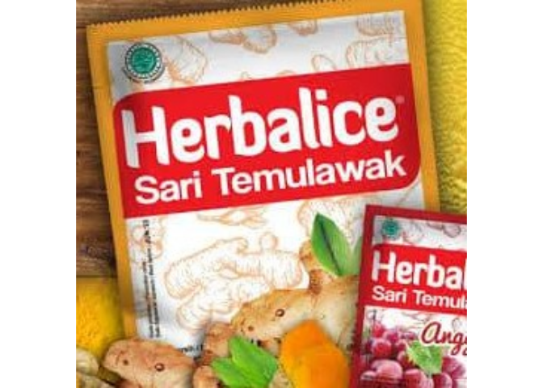

Menghitung Probabilitas Kesamaan Packaging Dua Produk Minuman
Menggunakan Algoritma Deep Learning di R
================

# *Prolog*

Pada tahun `2013` lalu, saya dan beberapa rekan kerja berdiskusi seru
mengenai adanya satu produk *low calorie sweetener* yang memiliki
*packaging* yang `mirip` dengan *brand* yang diproduksi perusahaan saya.
Jika dilihat sekilas, tidak tampak ada perbedaan berarti. Apalagi
pemilihan warna dan *layout* gambarnya hampir mirip.

> Jika kita bisa membuktikan bahwa kejadian ini membuat konsumen
> bingung, kita bisa membawanya ke ranah hukum.

Begitu celetuk salah seorang rekan saya.

Sempat kami berpikir untuk melakukan suatu studi dan survey yang bisa
membuktikan bahwa konsumen menjadi bingung tapi survey ini harus
benar-benar *robust* sehingga tidak bisa dipatahkan di meja hijau.

Walau akhirnya studi tersebut tidak dilaksanakan tapi kasus seperti ini
saya yakin akan berulang di masa mendatang.

-----

# Menghitung Probabilitas Kesamaan *Packaging* Dua Produk Minuman Menggunakan Algoritma *Deep Learning* di **R**

## Latar Belakang

Sudah menjadi hal lumrah bagi setiap *brand* untuk mengikuti *brand*
yang menjadi *market leader* dalam kategorinya. Mereka bisa menjadi
*follower* dalam hal *marketing*, *campaign* iklan, profil rasa, sampai
tema *packaging* produk.

Beberapa hari belakangan ini, saya melihat sebuah iklan dari produk
minuman bermerek `Herbalice` di televisi. Jika saya lihat sekilas
*packaging* yang ditampilkan di dalam iklan tersebut, rupa
*packaging*-nya mirip dengan *brand* minuman terkenal `NutriSari`.

Berikut gambar yang saya dapatkan di internet:

## Tujuan

Saya dan beberapa teman merasa *packaging* tersebut mirip dengan
*packaging* `NutriSari`. Tapi seberapa mirip? Apakah ada cara
mengkuantifikasi kemiripan tersebut?

Kali ini saya akan mencoba menghitung peluang kesamaannya dengan membuat
algoritma *deep learning* menggunakan **TensorFlow** dan **Keras** di
**R**.

## Metode

Saya akan membuat algoritma *supervised learning* dengan metode *deep
learning* untuk mengklasifikasi gambar `NutriSari` dan `non NutriSari`.
Kemudian algoritma akan disuruh membaca gambar `Herbalice` tersebut.

> Saya akan melihat berapa angka probabilitas hasil klasifikasinya\!
> Apakah *packaging* tersebut lebih diklasifikasikan ke `NutriSari`?
> Atau diklasifikasikan ke `non NutriSari`?

-----

# Dasar Teori

## *Deep Learning*

Apa sih yang dimaksud *deep learning*? Apa bedanya dengan *machine
learning*? Lalu apa bedanya dengan *artificial intelligence*?

    ## [1] "Sumber: smartcityindo.com"

Secara simpel, saya bisa katakan bahwa:

  - *Artificial intelligence* merupakan *umbrella terms* dari disiplin
    ilmu seperti *applied science*, *engineering*, dan *computer
    science*.
  - *Machine learning* merupakan kumpulan metode atau algoritma untuk
    melakukan baik analisa *supervised learning* dan *unsupervised
    learning*.
  - *Deep Learning* merupakan algoritma *machine learning* yang dibuat
    dengan metode *Neural Network*.

Lalu apa lagi itu *Neural Network*?

par(mfrow=c(2,4)) for(i in 1:8) plot(train\[\[i\]\])
