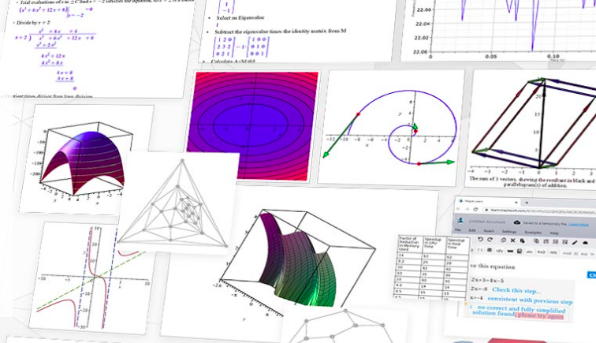

```{r setup, include=FALSE}
setwd("~/ikanx101 BLOG/_posts/advance analysis/maths")
knitr::opts_chunk$set(echo = TRUE)
library(dplyr)
library(ggplot2)
library(Ryacas)
library(matlib)
```

Saat kuliah dulu di Matematika, salah satu _software_ yang menjadi andalan saya mengarungi perkuliahan adalah [__Maple__ (Mathematical Pleasure)](https://www.maplesoft.com/). 

```{r out.width="60%",echo=FALSE,fig.align='center',fig.cap="Courtesy: maplesoft.com"}

```

Memangnya apa sih kegunaannya?

Apakah kalian tahu layanan Microsoft bernama [__MathSolver__](https://mathsolver.microsoft.com/)?

> Sebelum Microsoft membuat _MathSolver_, sudah ada Maple yang bisa digunakan untuk menurunkan formula, membuktikan teorema, membuat simulasi, dan membantu menyelesaikan masalah atau model matematika.

Selepas lulus kuliah, otomatis saya tidak pernah menggunakannya lagi sampai suatu ketika di tahun 2016 saya harus menggunakannya kembali karena suatu kasus di kantor. Sayangnya, walau laptop kantor sudah sangat bagus _spec_-nya, Maple yang saya gunakan waktu itu berjalan sangat lamban.

---

Beberapa minggu ini saya berkutat kembali dengan kalkulus dan aljabar linear elementer. Mau tidak mau, saya harus belajar kembali mengingat beberapa pembuktian dan penurunan formula. Entah kenapa saya merasa ___kurang greget___ menggunakan _MathSolver_. 

> Ada yang hilang.

Bagi generasi saya yang terbiasa menuliskan formula dengan format `LaTex`, mungkin jadi terasa agak janggal. _hehe_

Setelah _googling_ sana-sini, saya mendapatkan beberapa _libraries_ di __R__ yang bisa saya gunakan untuk belajar kalkulus dan aljabar linear elementer. Mungkin tidak mirip 100% dengan _Maple_ dan _MathSolver_, tapi beberapa fungsi seperti simplifikasi, faktorisasi, integral, dan diferensial bisa diselesaikan dengan _libraries_ tersebut.

# Kalkulus 

## `library(Ryacas)`

`library(Ryacas)` memiliki _backbone_ berupa _software Command Line Interface_ (___CLI___) bernama [__YACAS__ (_Yet Another Computer Algebra System_)](https://yacas.readthedocs.io/en/latest/license.html). Ternyata __YACAS__ mulai dibuat sejak tahun 2006. Mungkin karena kurang populer jadi jarang yang menggunakan. Padahal menurut saya isinya sangat menjanjikan.

> Apa saja sih fiturnya?

Saya berikan contoh ya:

### Simplifikasi

Misalkan saya memiliki persamaan linear sebagai berikut:

$$f(x) = 10x - 3 + 4x - 10$$

__YACAS__ bisa digunakan untuk melakukan simplifikasi fungsi.

```{r}
eq = "10*x - 3 + 4*x - 10"

eq %>% y_fn("Simplify") %>% yac_str()
```

Terlihat fungsinya menjadi lebih sederhana.

Misalkan saya memiliki persamaan berikut:

$$f(x) = \frac{1}{x^2} + x - x^3$$

simplifikasinya adalah:

```{r}
eq = "1/x^2 + x - x^3"

eq %>% y_fn("Simplify") %>% yac_str()
```

Nah, jika bentuk tersebut masih rumit dilihat. Kita bisa membuat bentuk tersebut menjadi `TEX` format:

```{r}
eq %>% y_fn("Simplify") %>% y_fn("TeXForm") %>% yac_str() 
```

Tinggal kita _render_ saja menjadi:

$$f(x) = \frac{x ^{3} - x ^{5} + 1}{x ^{2}}$$

### Faktorisasi
Hal menarik berikutnya adalah __YACAS__ bisa digunakan untuk mencari faktor dari persamaan kuadrat.

Misal saya memiliki persamaan kuadrat:

$$f(x) = x^2 - 1$$

Berapa faktornya?

```{r}
eq = "x^2 - 1"

eq %>% y_fn("Factor") %>% yac_str()
```

Misal saya memiliki persamaan kuadrat:

$$f(x) = x^3 - 1$$

Berapa faktornya?

```{r}
eq = "x^3 - 1"

eq %>% y_fn("Factor") %>% yac_str()
```

### Mencari Akar Kuadrat
Sebenarnya dari faktor di atas, kita bisa menghitung sendiri akar kuadratnya. Tapi jika malas, biarkan __YACAS__ yang melakukannya:

```{r}
eq %>% y_fn("FindRealRoots") %>% yac_str()
```

### Turunan
Kegunaan lainnya adalah menurunkan fungsi.

Misalkan:

$$f(x) = x^3 + sin(x)$$

Turunannya adalah:

```{r}
eq = "x^3 - Sin(x)"

eq %>% y_fn("D(x)") %>% yac_str()
```

### Integral
Lawannya turunan adalah integral, berikut jika kita integralkan $f(x)$ di atas:

```{r}
eq %>% y_fn("Integrate(x)") %>% yac_str() 
```

Jika kita hendak melakukan:

$$\int_{0}^{1} x^3 + sin(x) dx$$

Cukup lakukan:

```{r}
eq %>% y_fn("Integrate(x,0,1)") %>% yac_str() 
```

### Limit
Sekarang giliran untuk menghitung limit.

Misalkan:

$$\lim_{x \to 1} \frac{1}{x-1}$$

Maka:

```{r}
eq = "1 / (x-1)"

eq %>% y_fn("Limit(x,1)") %>% yac_str()
```

### Deret
Kita juga bisa menghitung jumlah dari suatu deret:

Misalkan:

$$\sum_{n = 1}^{\infty} \frac{1}{2^n}$$

```{r}
yac_str("Sum(n, 1, Infinity, (1/2)^n)")
```

### Menyelesaikan Persamaan Diferensial
__YACAS__ juga bisa digunakan untuk menyelesaikan persamaan diferensial.

Misalkan:

$$y'' + y = 0$$

Di mana $y$ adalah fungsi dari $x$, maka:

```{r}
yac_str("OdeSolve( y' + y == 0 )")
```

### Menyelesaikan Persamaan
Misalkan:

$$x^2 +xy = 10$$

Kita hendak mencari nilai $y$, maka:

```{r}
yac_str("OldSolve(x^2+x*y==10,y)")

```

# Aljabar Linear Elementer
## `library(matlib)`

Kali ini saya akan membahas `library(matlib)` untuk keperluan perhitungan matriks.

Salah satu kegunaannya yang saya ingin _highlight_ adalah kemampuannya menyelesaikan sistem persamaan linear.

Contoh:

Selesaikan sistem persamaan linear berikut:

$$x_1 - x_2  =  2 \\ 
2x_1 + 2x_2  =  1$$

Bentuk tersebut akan di-_input_ dalam bentuk matriks di __R__ berikut:

```{r}
A = matrix(c(1, 2, -1, 2), 2, 2)
b = c(2,1)
showEqn(A, b)
```

Berikutnya, kita perlu mengecek apakah sistem persamaan ini cukup syaratnya untuk mendapatkan solusi.

```{r}
c( R(A), R(cbind(A,b)) )          # show ranks
all.equal( R(A), R(cbind(A,b)) )  # consistent?
```

Kita bisa buatkan grafiknya sebagai berikut:

```{r}
plotEqn(A,b)
```

Untuk menyelesaikannya, ada dua cara.

#### Cara Pertama
Langsung melakukan _solving_ sebagai berikut:

```{r}
Solve(A, b, fractions = TRUE)
```

#### Cara Kedua
Melakukan operasi baris elementer (__OBE__) dari matriks yang ada:

```{r}
echelon(A, b, verbose=TRUE, fractions=TRUE)
```

---

`if you find this article helpful, support this blog by clicking the ads.`

