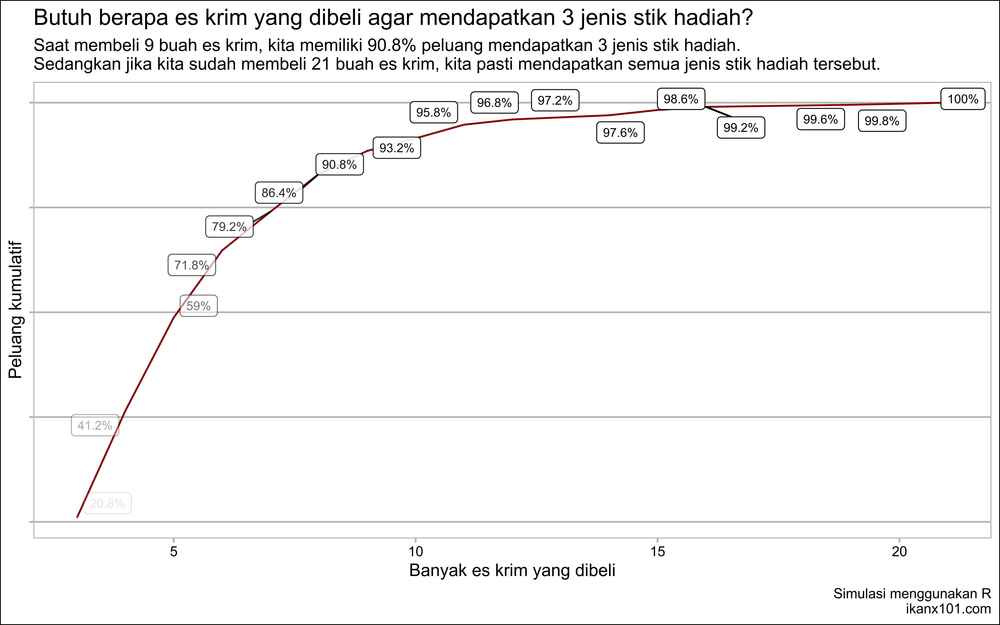
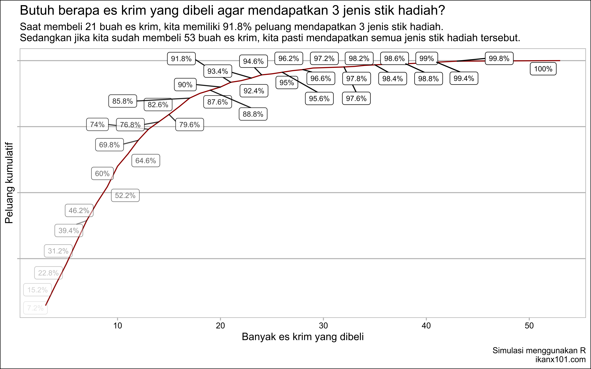
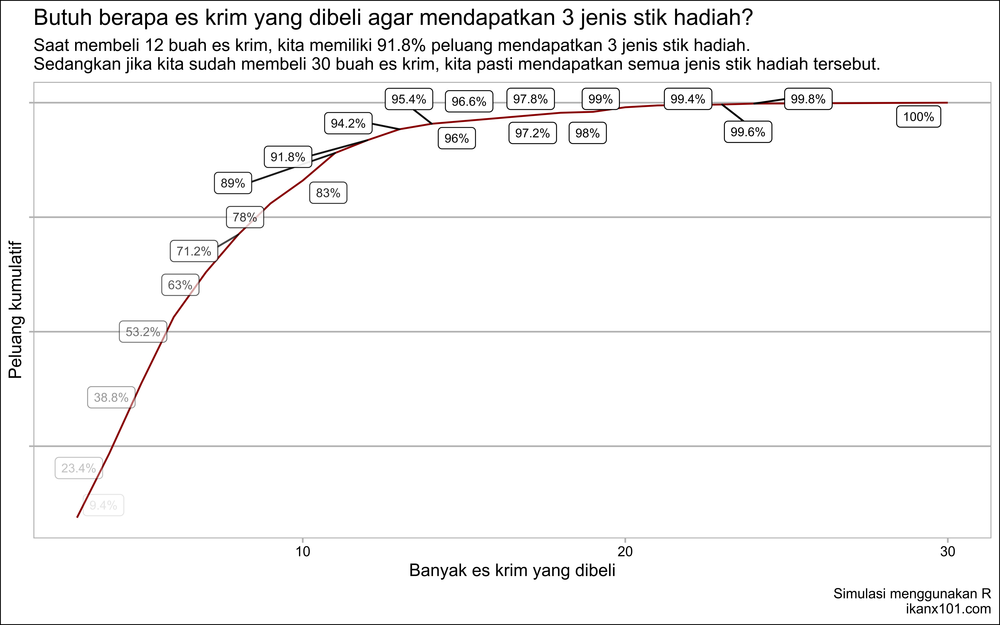

Membuat Konsumen Membeli Barang Lebih Banyak dengan Sayembara
Pengumpulan Kupon
================

Pernahkah kalian mengumpulkan stik es krim bergambar seperti di bawah
ini?

<!-- -->

Jika kita berhasil mengumpulkan `3` jenis gambar seperti di atas, kita
berhak mendapatkan hadiah yang menarik.

## Pertanyaannya:

> Berapa banyak es krim yang harus kita beli agar bisa mendapatkan `3`
> jenis gambar tersebut?

Untuk menjawabnya, saya akan membuat beberapa kondisi sebagai berikut:

### Asumsi 1:

Jika saya asumsikan hanya ada `3` jenis stik es krim dan ketiganya
terdistribusi merata (bisa ditulis:
), maka hasil simulasinya sebagai berikut:

### Asumsi 2:

Jika saya asumsikan hanya ada `3` jenis stik es krim **berhadiah** tapi
ketiganya tidak terdistribusi merata. Misalkan stik `A` lebih banyak
dibandingkan stik `B` dan `C`.

Contoh:

) dan  maka hasil simulasinya sebagai
berikut:

### Asumsi 3:

Jika saya asumsikan hanya ada `3` jenis stik es krim **berhadiah** dan
`1` jenis stik es krim **tak bercorak**. Lalu keempatnya terdistribusi
merata (bisa ditulis:
), maka hasil simulasinya sebagai berikut:

Cara perhitungan simulasi ini bisa dilihat di [tulisan saya yang
ini](https://ikanx101.com/blog/kolektor-kupon/).
