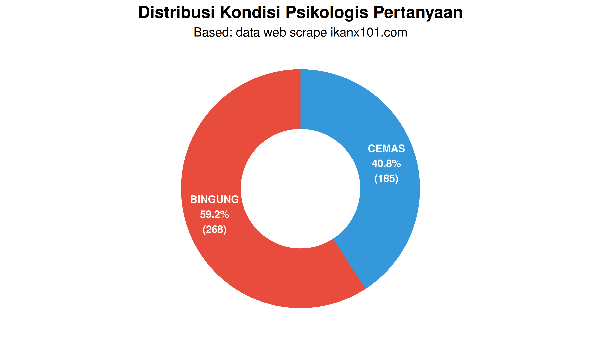

# xxx


Tahun lalu, saya pernah menulis tentang [analisa teks
pertanyaan-pertanyaan *netizen* seputar diabetes yang saya ambil dari
situs alodokter](https://ikanx101.com/blog/wd-d/). Pagi ini saya
terpikir untuk melakukan satu analisa psikologi publik terhadap diabetes
secara sederhana.

Bagaimana caranya? Yakni dengan menilai semua pertanyaan yang saya ambil
tersebut apakah termasuk ke dalam **bingung**, **cemas**, atau
**optimis**. Untuk melakukan ini, saya akan menggunakan *AI agent* untuk
menilai semua pertanyaan tersebut. Setelah itu, saya akan coba kaitkan
dengan strategi komunikasi kesehatan.

Bagaimana hasilnya?

## Penilaian Psikologi Publik

``` r
rm(list=ls())

library(dplyr)
library(ggplot2)
library(tidyr)
library(janitor)
library(epoxy)

load("hasil.rda")

df_new = df %>% tabyl(psikologi)
```

``` r
# Load function
source("donut_chart_function.R")

# Dengan customisasi
donut_plot <- create_donut_chart(
  data = df_new,
  title = "Distribusi Kondisi Psikologis Pertanyaan",
  subtitle = "Based: data web scrape ikanx101.com",
  colors = c("#E74C3C", "#3498DB"),
  show_labels = TRUE,
  label_size = 3.5
) +
  theme(legend.position = "none")
donut_plot
```



## Alasan Cemas

Berdasarkan analisis pertanyaan-pertanyaan yang diajukan, berikut 5 poin
utama yang menjadi sumber kecemasan pengguna:

1.  **Kekhawatiran terhadap gejala diabetes** - Banyak pertanyaan
    mengenai gejala seperti sering haus, sering buang air kecil,
    kesemutan, dan luka yang sulit sembuh
2.  **Komplikasi luka diabetes** - Kekhawatiran mendalam tentang luka
    yang tidak kunjung sembuh, bernanah, dan risiko amputasi
3.  **Faktor keturunan dan usia muda** - Kecemasan akan potensi mewarisi
    diabetes meski masih berusia relatif muda
4.  **Keterbatasan biaya pengobatan** - Kekhawatiran tentang biaya
    perawatan luka dan obat-obatan yang berkelanjutan
5.  **Ketidakpastian penanganan** - Kebingungan dalam membedakan
    diabetes tipe 1 dan 2, serta keraguan terhadap efektivitas
    pengobatan yang dijalani

## Alasan Bingung

Berdasarkan analisis pertanyaan-pertanyaan yang diajukan, berikut 5 poin
utama yang membuat orang merasa bingung terkait diabetes:

1.  **Kebingungan membedakan jenis diabetes** - Banyak yang bertanya
    tentang perbedaan diabetes tipe 1 dan 2, serta mitos “diabetes
    kering vs basah” yang sebenarnya bukan terminologi medis resmi

2.  **Keterbatasan pemahaman tentang pola makan** - Banyak pertanyaan
    mengenai makanan/minuman yang diperbolehkan (roti, tape, buah manis,
    kopi) dan cara mengatur pola makan yang tepat untuk penderita
    diabetes

3.  **Kekeliruan tentang pengobatan alternatif** - Banyak yang mencari
    obat herbal, daun salam, pare, atau metode tradisional lainnya tanpa
    memahami efektivitas dan risikonya

4.  **Kebingungan mengelola komplikasi** - Pertanyaan tentang luka
    diabetes yang sulit sembuh, gatal-gatal, kaki hitam, dan masalah
    kulit lainnya menunjukkan kurangnya pemahaman penanganan komplikasi

5.  **Ketidaktahuan tentang monitoring dan pengobatan** - Kebingungan
    mengenai cara cek gula darah, penggunaan insulin, aturan minum obat,
    dan target kadar gula yang normal

| Emosi | Strategi Komunikasi |
|----|----|
| Bingung | Gunakan bahasa sederhana, visualisasi, FAQ interaktif |
| Cemas | Tambahkan elemen empati, testimoni pasien, reassurance dari dokter |
