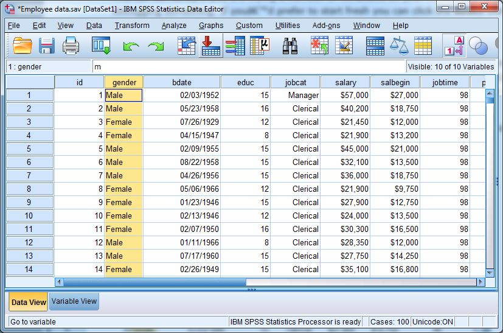

```{r setup, include=FALSE}
knitr::opts_chunk$set(echo = TRUE)
setwd("~/Documents/ikanx101/_posts/expss/bagian 1")
rm(list=ls())
```

```{r}
kable::
```

> Siapa sih yang gak kenal dengan __SPSS__? Software yang paling banyak digunakan untuk menyelesaikan masalah statistik. 

Mulai dari membuat analisa deskriptif yang sederhana sampai membuat model _machine learning_ yang kompleks bisa dilakukan di __SPSS__. Dulu ketika masih menjadi mahasiswa tingkat akhir, saya pernah menjadi asisten lab `bio statistik` yang memberikan tutor __SPSS__. Menariknya adalah bagi mahasiswa Matematika sendiri, kami tidak diberikan materi lab __SPSS__.

> __SPSS__ membuat kamu malas.

Begitu selentingan yang saya dengar.

Lalu software apa yang dipelajari oleh mahasiswa Matematika untuk menyelesaikan masalah statistik terkait data?

__Microsoft Excel__

Oh iya, dulu kami menggunakan __SPSS__ versi `13` _student edition_ resmi di lab Matematika.

---

Kisah __SPSS__ saya berlanjut saat saya mulai bekerja di bidang _market research_ pada tahun 2008. Hampir semua orang tim _data processing_ di _market research agency_ tempat saya bekerja menggunakan __SPSS__. Waktu itu mereka menggunakan versi `17`. Usut punya usut ternyata versi yang digunakan itu bukan berasal dari jalur resmi.

Istilahnya versi _crack_-an yang didapatkan dari forum `berbagi-file` populer pada zamannya.

Kisah terus berlanjut sampai saya berlabuh di perusahaan tempat saya bekerja saat ini. Ternyata __@nutrifood__ memiliki _license_ resmi SPSS versi `13` yang digunakan oleh semua _member_ tim _market research_. Namun versi tersebut sudah cukup _usang_ untuk melakukan beberapa analisa dan mengolah data survey yang semakin banyak. Apalagi semenjak IBM membeli kepemilikan __SPSS__, memakai versi bajakan dari _software_ ini bukanlah pilihan yang bijak. 

Setelah mencari informasi terkait harga resminya, ternyata harganya lumayan juga _yah_. 

```{r}
knitr::include_graphics("https://raw.githubusercontent.com/ikanx101/ikanx101.github.io/master/_posts/expss/bagian%201/Screenshot_20201023-101029.png")
```

Tipe __SPSS__ yang dibutuhkan untuk mengolah data market riset adalah yang `standar` karena sudah bisa mengakomodir _multiple response answer_.

---

## Perbedaan Data Survey dengan Data Lainnya

Apa sih perbedaan antara data survey dengan data lain? (Misalkan data transaksi atau data _scrape_ dari _social media_).

Disadari atau tidak, dalam survey, responden bisa ditanyakan suatu pertanyaan yang bisa lebih dari satu jawaban. _Market researcher_ menyebutnya dengan istilah _multiple answer question_. Jawaban responden akan disimpan menjadi _multiple column_. 

> Prinsipnya adalah satu responden disimpan dalam satu baris data. 

Berbeda dengan data transaksi atau data _social media_ yang memungkinkan dibentuk menjadi __tabular__ (satu _response_ bisa disimpan _as multiple columns_).

Maka dari itu, _tools_ pengolahan data market riset harus bisa mengakomodir hal ini.

---

## Masalah dengan __SPSS__

Seperti yang telah saya sampaikan sebelumnya, faktor harga menjadi salah satu kendala terbesar bagi (hampir semua) perusahaan untuk bisa menggunakan __SPSS__ secara legal. Banyak di antara perusahaan malah tetap memilih untuk menggunakan _software_ bajakan. Menurut beberapa sumber, IBM sedang galak-galaknya melakukan sidak ke perusahaan-perusahaan untuk menangkap perusahaan yang _nakal_. 

Setau saya memang ada konsekuensi hukum bagi yang melakukan hal ini. 

> Selain itu, memakai _software_ bajakan bisa jadi menghilangkan __keberkahan__ pekerjaan kita lho.

## Alternatif __SPSS__

Kita sebenarnya bisa memakai _software_ olah data selain __SPSS__ yang bersifat _open source_ alias gratis. Salah satunya dengan __R__ melalui `library(expss)`. 

Bagaimana caranya? Saya mulai tutorialnya _yah_.

---

## Bahan-Bahan yang Dibutuhkan

Oke, untuk melakukannya kita memerlukan __R__ dan atau __R Studio__. Kemudian kita harus menginstall beberapa _libraries_ seperti:

1. `dplyr`
1. `expss`

Cara installnya adalah:

```{r}
# install.packages("dplyr")
# install.packages("expss")
```

Selepas instalasi selesai, mari kita panggil kedua _libraries_ tersebut:

```{r,warning=FALSE,message=FALSE}
library(dplyr)
library(expss)
```

Sekarang saya akan menggunakan contoh data hasil survey mengenai kebiasaan belanja. Survey dilakukan kepada `1.000` orang responden di 5 kota (Jakarta, Bandung, Tasikmalaya, Garut, dan Sukabumi). Berikut adalah datanya:

```{r}
read.csv("")
```

Oh iya, salah satu kelebihan menganalisa data survey menggunakan __R__ adalah kita tidak perlu repot-repot mengubah tipe data menjadi _numeric with labels_. Pada __SPSS__, kita tahu ada dua _tab_, yakni _variabel view_ dan _data view_. Biasanya salah satu _preparation_ yang harus dilakukan di __SPSS__ adalah mengubah data _text_ hasil _entry_ kuesioner menjadi _numeric_ lalu diberikan _value label_.

Menggunakan __R__, kita tidak perlu melakukan hal itu. Hasil _entry_ kuesioner yang sudah berupa _text_ bisa langsung kita pakai. Biasanya ini terjadi saat kita menggunakan _platform online survey_ yang memberikan data _as it is_.
