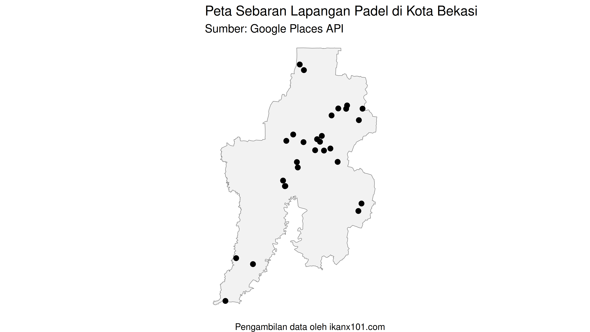
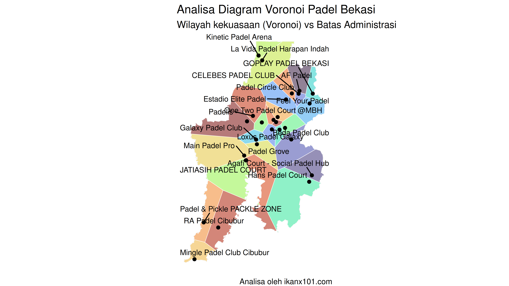

Beberapa tahun terakhir, olahraga padel benar‑benar jadi buah bibir.
Lapangannya bermunculan di mana‑mana—mulai dari pusat kota sampai
pinggiran yang sebelumnya tidak pernah kita pikirkan bakal ada arena
olahraga kekinian. Olahraga yang mirip gabungan tenis dan *squash* ini
kini sudah naik level: bukan cuma tren musiman, tapi sudah jadi bagian
dari gaya hidup, mirip seperti *mini soccer* saat sempat *booming* dulu.

Dengan perkembangan secepat ini, wajar kalau banyak investor mulai
melirik kota‑kota satelit sebagai target berikutnya. Bekasi, misalnya,
punya jumlah penduduk besar, kawasan hunian yang terus tumbuh, dan
mobilitas warganya yang tinggi. Tapi muncul pertanyaan penting:

> **Apakah Bekasi masih cukup “seksi” untuk dibangun lapangan padel
> baru?**

Jangan‑jangan, justru beberapa area sudah mulai penuh dan suplai
lapangan hampir mengejar jumlah pemain.

Tantangannya bukan cuma soal “Bekasi layak atau tidak,” tapi lebih ke
**di mana lokasi yang belum tersentuh dan masih punya peluang besar?**
Kota seluas Bekasi tentu tak seragam; beberapa kecamatan mungkin sudah
punya fasilitas olahraga modern, sementara area lain, terutama yang
sedang berkembang pesat—masih kosong melompong. Menemukan *titik buta*
inilah yang bikin perbedaan antara investasi yang strategis dan yang
sekadar ikut tren.

Alih-alih menggunakan *feeling*, kita akan menggunakan data lokasi
lapangan eksisting dan algoritma matematika sederhana namun *powerful*:
**Voronoi Diagram**.

## Konsep Dasar *Diagram Voronoi*

*Diagram Voronoi* membagi sebuah bidang menjadi beberapa wilayah
(poligon) berdasarkan jarak terdekat ke titik tertentu (dalam hal ini,
lapangan Padel). Artinya: Setiap titik di dalam poligon lebih dekat ke
lapangan padel tertentu daripada ke lapangan padel lainnya. Dari area
poligon, kita bisa mendapatkan:

- **Poligon Besar:** Area layanan luas (kompetisi rendah, potensi
  *underserved*).
- **Poligon Kecil:** Area layanan sempit (kompetisi tinggi, pasar
  jenuh).

Untuk data lokasi lapangan padel di Bekasi, saya mengambil dan
mengumpulkannya menggunakan **Google Places API**. Saya dapatkan 28 buah
titik lapangan yang ada di Kota Bekasi.

    Reading layer `gadm41_IDN_2' from data source 
      `/home/rstudio/ikanx101.github.io/_posts/geo marketing/padel/gadm41_IDN_2.shp' 
      using driver `ESRI Shapefile'
    Simple feature collection with 502 features and 13 fields
    Geometry type: MULTIPOLYGON
    Dimension:     XY
    Bounding box:  xmin: 95.00971 ymin: -11.00761 xmax: 141.0194 ymax: 6.076941
    Geodetic CRS:  WGS 84

Jika kita lihat, memang beberapa lapangan padel berkumpul di “tengah”
kota. Dari peta di atas, saya akan hitung dan buat visualisasi *diagram
Voronoi* berikut ini:

Dari perhitungan *Diagram Voronoi* yang saya lakukan, **Hans Padel
Court** di Cimuning, Mustika Jaya memiliki “area kekuasaan” terbesar
dengan luas sebesar
.
Sedangkan **Spin Padel** di Marga Jaya, Bekasi Selatan hanya memiliki
“area kekuasaan” sebesar
.

Untuk sebagian investor, mungkin bersaing langsung di tengah kota yang
sudah padat untuk berebut “area kekuasaan” menjadi hal yang menarik
untuk dilakukan. ***Cluster* persaingan** seperti pada area-area di mana
banyak titik berkumpul (misal Summarecon atau Galaxy), poligonnya akan
kecil-kecil. Ini tanda *Red Ocean*. Investor yang mau masuk ke area ini
biasanya sudah punya atau menawarkan diferensiasi kuat (harga,
fasilitas, komunitas).

Sedangkan untuk sebagian investor lain, mereka mungkin akan melihat
area-area kekuasaan yang lebih luas untuk di-“ambil” dan di-“pecah”
kekuasaannya. Sekarang kita lihat kembali bagian peta Bekasi yang
poligonnya paling besar. Apakah itu daerah padat penduduk atau justru
area sepi? Sebagai contoh kita bisa melihat “area kekuasaan” **Main
Padel Pro** di Cikunir dan **Hans Padel Court** di Cimuning. *Diagram
Voronoi* hanya menghitung jarak geometris dan belum tentu berarti
potensial secara langsung. Kita perlu melihat kondisi *target market* di
area tersebut.

> Poligon besar di area *target market* padat adalah **tambang emas**.

Selain itu, kita bisa melihat beberapa lapangan padel di perbatasan
Jakarta Timur atau Bogor yang mungkin memiliki *catchment area* yang
terpotong oleh batas administrasi, padahal realitanya mereka juga
melayani warga Jakarta.

------------------------------------------------------------------------

`if you find this article helpful, support this blog by clicking the ads.`
