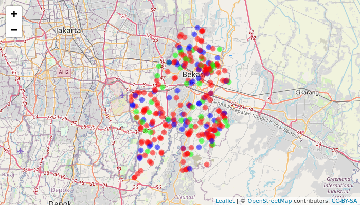
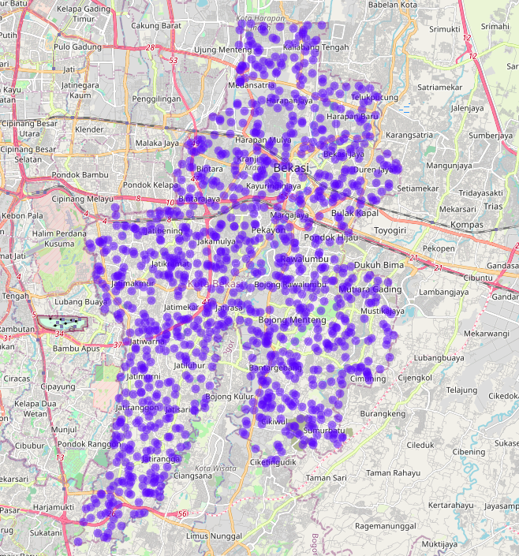

```{r setup, include=FALSE}
knitr::opts_chunk$set(echo = TRUE)
rm(list=ls())

library(dplyr)
library(ggplot2)
library(leaflet)
library(htmlwidgets)
library(webshot)
```

Melanjutkan _posting_ saya sebelumnya terkait [pre-analisa dalam _geomarketing_](https://ikanx101.com/blog/geo-marketing/), kali ini saya akan melanjutkan ke bagian __analisa apa yang bisa kita lakukan pada__ ___geomarketing___. Tulisan ini juga melanjutkan _posting_ saya sebelumnya terkait [_merchant Grab_ pada Ramadhan tahun lalu](https://ikanx101.com/blog/grab-buburit/).

---

## Warteg, Restoran Padang, dan Bakso - Mie Ayam

Sejak kecil, saya sudah berdomisili di Kota Bekasi. Sudah banyak perkembangan yang saya rasakan di kota ini. Salah satu hal yang menarik bagi saya adalah keberadaan tempat-tempat makan kekinian di Bekasi yang semakin menjamur. Namun, apapun tempat makannya, menurut saya hanya ada tiga kategori tempat makan yang __paling juara__ di antara yang lain. Yakni:

- Warung Tegal,
- Restoran Padang,
- Bakso - Mie Ayam.

Sepenglihatan saya di Kota Bekasi, ketiga kategori ini tetap bertahan di tengah gempuran tempat makan kekinian bahkan seperti tersebar di mana-mana. Pada awal 2023, saya mengambil semua data tempat makan di Kota Bekasi. 

Ada satu pertanyaan yang muncul di benak saya:

> _Di antara ketiga kategori tersebut, siapa yang lebih unggul?_

- Jika kita menjawab berdasarkan __rasa__, tentunya akan menimbulkan perdebatan karena bergantung dengan preferensi pribadi. 
- Jika kita menjawab berdasarkan __harga__, ini juga akan menimbulkan perdebatan yang tak kunjung selesai. _hehe_.

Maka dari itu, saya akan menjawabnya menggunakan prinsip bernama __aksesbilitas__.

---

## Apa itu Aksesbilitas?

__Aksesbilitas__ saya definisikan sebagai:

> _Seberapa terjangkau suatu lokasi dari penggunanya._

Mari kita lihat data sebagai berikut:

```{r,include=FALSE}
load("bahan post.rda")

plt_1 = 
  df_post %>% 
  group_by(kategori) %>% 
  tally() %>% 
  ungroup() %>% 
  mutate(persen = n / sum(n) * 100,
         persen = round(persen,2),
         label  = paste0(persen,"%"))

pal <- colorFactor(c("red", "blue", "green"), # padang, bakso, warteg
                   domain = unique(df_post$kategori))

m = 
  leaflet(df_post) %>%
  addTiles() %>%
  addCircleMarkers(lng = ~lon,
                   lat = ~lat,
                   color = ~pal(kategori),
                   radius = 3)
## save html to png
# saveWidget(m, "temp.html", selfcontained = FALSE)
# webshot("temp.html", file = "Rplot.png",vwidth = 700, vheight = 400)
```

```{r,echo=FALSE,fig.align='center',fig.retina=4}
plt_1 %>% 
  ggplot(aes(x = kategori,
             y = persen)) +
  geom_col(color = "black",
           aes(fill = kategori)) +
  scale_fill_manual(values = c("red", "blue", "green")) +
  geom_label(aes(label = label)) +
  theme_minimal() +
  theme(axis.title = element_blank(),
        axis.text.y = element_blank(),
        legend.position = "none") +
  labs(title = "Berapa Banyak Tempat Makan ... di Kota Bekasi?",
       subtitle = "Base: data semesta tempat makan di Google Maps",
       caption = "n = 283\nScraped and Visualized using R\nikanx101.com")
```

Dari banyaknya kategori tempat makan, kita bisa lihat bahwa bakso / mie ayam memiliki persentase terbanyak. Namun apakah bakso / mie ayam memiliki aksesbilitias yang terbaik?

Jawabannya: __belum tentu__. Kenapa? Bisa jadi bakso / mie ayam banyak tapi tidak tersebar secara merata. Perhatikan peta sebaran sebagai berikut:

```{r,echo=FALSE,fig.align='center'}

```

Jika kita lihat sekilas, titik merah (bakso / mie ayam) sepertinya tersebar merata namun di beberapa area terlihat kosong. Analisa visual seperti ini tentunya menimbulkan misinterpretasi, oleh karena itu bagaimana caranya agar kita bisa menghitung __aksesbilitas__ dengan lebih saintifik?

Untuk menghitung __aksesbilitas__, saya menggunakan perhitungan jarak _Euclidean_. Rekan-rekan bisa membacanya di tulisan saya [berikut ini](https://ikanx101.com/blog/jarak-simmilarity/). 

Saya mengusulkan ide perhitungan sebagai berikut:

---

## Ide Perhitungan Aksesbilitas

Perhatikan ilustrasi sebagai berikut:

> Ada dua orang konsumen yang hendak membeli makan dari tiga restoran. Posisi semua konsumen dan restoran bisa digambarkan dalam gambar di bawah. Jika diasumsikan ketiga restoran ini memiliki makanan yang sama, dan memiliki rasa serta harga yang sama, maka konsumen __akan memilih restoran yang terdekat__.

__Aksesbilitas__ bisa dihitung dari jarak terpendek seorang konsumen untuk mencapai restoran.

```{r,echo=FALSE,fig.align='center',fig.retina=4}
rm(list=ls())

data.frame(x = c(1,5,3,
                 4,3),
           y = c(1,7,8,
                 4,1),
           z = c("Resto A","Resto B","Resto C",
                 "Konsumen 1","Konsumen 2")) %>% 
  ggplot(aes(x,y)) +
  geom_label(aes(label = z)) +
  theme_void() +
  ylim(0,8) +
  xlim(0,7) +
  geom_segment(aes(x=4-0.25,xend=1+0.25,
                   y=4-0.25,yend=1+0.25),
               arrow = arrow(length = unit(.2,"cm")),
               alpha = .1,
               color = "red") +
  geom_segment(aes(x=4+0.25,xend=5,
                   y=4+0.25,yend=7-0.25),
               arrow = arrow(length = unit(.2,"cm")),
               alpha = .1,
               color = "red") +
  geom_segment(aes(x=4-0.25,xend=3,
                   y=4+0.25,yend=8-0.25),
               arrow = arrow(length = unit(.2,"cm")),
               alpha = .1,
               color = "red") +
  geom_segment(aes(x=3-0.45,xend=1+0.4,
                   y=1,yend=1),
               arrow = arrow(length = unit(.2,"cm")),
               alpha = .1,
               color = "blue") +
  geom_segment(aes(x=3+0.25,xend=5-0.25,
                   y=1+0.25,yend=7-0.25),
               arrow = arrow(length = unit(.2,"cm")),
               alpha = .1,
               color = "blue") +
  geom_segment(aes(x=3-0.25,xend=3-0.25,
                   y=1+0.25,yend=8-0.25),
               arrow = arrow(length = unit(.2,"cm")),
               alpha = .1,
               color = "blue")
```

Pada kasus ini:

- Aksesbilitas `Konsumen 1` adalah jarak antara `Konsumen 1` dan `Resto B`.
- Aksesbilitas `Konsumen 2` adalah jarak antara `Konsumen 2` dan `Resto C`.

---

## Menghitung Aksesbilitas Warteg, Restoran Padang, dan Bakso - Mie Ayam

Untuk menjawab pertanyaan utama:

> _Di antara ketiga kategori tersebut, siapa yang lebih unggul?_

Saya akan menghitung nilai __aksesbilitas__ ___overall___ untuk ketiga kategori tempat makan tersebut. Secara simpel bisa saya bahasakan:

> Di antara warteg, restoran Padang, dan Bakso - Mie Ayam: mana yang lebih mudah dijangkau oleh konsumen?

Algoritma perhitungan __aksesbilitas__-nya sebagai berikut:

```
STEP I
  generate n random longlat konsumen di kota bekasi
STEP II
  hitung jarak masing-masing konsumen ke masing-masing tempat makan
STEP III
  untuk setiap konsumen:
    pilih salah satu tempat makan terdekat per masing-masing kategori tempat makan
    simpan jarak tempat makan terdekat per kategori
STEP IV
  hitung rata-rata jarak per kategori tempat makan
STEP V
  ulangi STEP I hingga STEP IV dengan prinsip montecarlo
```

Sebagai ilustrasi, perhatikan peta berikut:

```{r,echo=FALSE,fig.align='center',fig.retina=4,message=FALSE,warning=FALSE}
rm(list=ls())

n = 30

label = sample(c("bakso","konsumen","padang","warteg"),
               (n-1),
               replace = T)

df = data.frame(x = runif(n),
           y = runif(n),
           label = c("konsumen",label))

df$label_xy = NA
n_kon       = 1
for(i in 1:n){
  if(df$label[i] == "konsumen"){
    df$label_xy[i] = paste("Konsumen",n_kon)
    n_kon          = n_kon + 1
  }
}


df %>% 
  ggplot(aes(x = x,
             y = y,
             color = label)) +
  geom_point(size = 3) +
  ggrepel::geom_label_repel(aes(label = label_xy)) +
  scale_color_manual(values = c("red","#cf5fcd","green","blue")) +
  theme_void() +
  labs(color = "Keterangan:")
```

Maka untuk setiap konsumen akan saya hitung jarak terdekat masing-masing ke `bakso`, `padang`, dan `warteg`. 

Contohnya ini adalah matriks jarak antara konsumen dengan masing-masing kategori tempat makan:

```{r,echo=FALSE}
n_warteg = df$label[df$label == "warteg"] %>% length()
n_padang = df$label[df$label == "padang"] %>% length()
n_bakso  = df$label[df$label == "bakso"] %>% length()
n_konsu  = df$label[df$label == "konsumen"] %>% length()

contoh = 
  matrix("x",nrow = n_konsu,ncol = n_warteg) %>% 
  as.data.frame() %>% 
  mutate(konsumen = paste0("Konsumen-",1:n_konsu)) %>% 
  relocate(konsumen,.before = "V1")

colnames(contoh) = gsub("V","Warteg-",colnames(contoh))

contoh %>% knitr::kable()

contoh = 
  matrix("x",nrow = n_konsu,ncol = n_padang) %>% 
  as.data.frame() %>% 
  mutate(konsumen = paste0("Konsumen-",1:n_konsu)) %>% 
  relocate(konsumen,.before = "V1")

colnames(contoh) = gsub("V","Padang-",colnames(contoh))

contoh %>% knitr::kable()

contoh = 
  matrix("x",nrow = n_konsu,ncol = n_bakso) %>% 
  as.data.frame() %>% 
  mutate(konsumen = paste0("Konsumen-",1:n_konsu)) %>% 
  relocate(konsumen,.before = "V1")

colnames(contoh) = gsub("V","Bakso-",colnames(contoh))

contoh %>% knitr::kable()
```

Kemudian akan saya pilih tempat makan dengan jarak terpendek pada masing-masing konsumen, lalu saya hitung rata-rata untuk setiap kategori. 

Bagaimana hasilnya?

---

```{r,include=FALSE}
rm(list=ls())
load("akses.rda")
df_akses = merge(hitung_bakso,hitung_padang) %>% merge(hitung_warteg)
```

## Nilai Aksesbilitas Warteg, Restoran Padang, dan Bakso - Mie Ayam

Saya gambarkan terlebih dahulu sebaran konsumen yang telah saya _generate_:

```{r out.height="40%",echo=FALSE}

```

Kelak, menggunakan prinsip Montecarlo saya akan mengulangi proses _generating_ konsumen berulang kali.

Singkat cerita, saya telah menghitung nilai __aksesbilitas__ masing-masing kategori tempat makan. Berikut adalah statistik deskriptifnya:

```{r,echo=FALSE,message=FALSE,warning=FALSE}
df_akses %>% 
  reshape2::melt(id.vars = "konsumen") %>% 
  mutate(variable = case_when(
    variable == "akses_bakso" ~ "Bakso / Mie Ayam",
    variable == "akses_padang" ~ "Padang",
    variable == "akses_warteg" ~ "Warteg"
  )) %>% 
  ggplot(aes(x = variable,
             y = value)) +
  geom_boxplot(size = .5,
               notch = 4,
               aes(color = variable)) +
  scale_fill_manual(values = c("red","blue","green")) +
  theme_minimal() +
  theme(legend.position = "none") +
  labs(x = "Kategori Tempat Makan",
       y = "Aksesbilitas",
       title    = "Boxplot Nilai Aksesbilitas Antar Kategori Tempat Makan",
       subtitle = "Hasil Perhitungan yang Saya Lakukan",
       caption  = "Calculated and Visualized using R\nikanx101.com")
  
```

Saya hitung _mean differences_-nya untuk pasangan-pasangan data sebagai berikut:


```{r,message=FALSE,warning=FALSE}
# bakso vs padang
t.test(df_akses$akses_bakso,df_akses$akses_padang)
```

Kesimpulan I: Mean aksesbilitas `Bakso / Mie Ayam` __lebih rendah signifikan__ dibandingkan `Padang`.

```{r,message=FALSE,warning=FALSE}
# bakso vs warteg
t.test(df_akses$akses_bakso,df_akses$akses_warteg)
```

Kesimpulan II: Mean aksesbilitas `Bakso / Mie Ayam` __lebih rendah signifikan__ dibandingkan `Warteg`.

```{r,message=FALSE,warning=FALSE}
# padang vs warteg
t.test(df_akses$akses_padang,df_akses$akses_warteg)
```

Kesimpulan III: Mean aksesbilitas `Padang` __lebih rendah signifikan__ dibandingkan `Warteg`.


Bisa saya tuliskan __aksesbilitas__: `Bakso / Mie Ayam` < `Padang` < `Warteg`.

---

## Kesimpulan

Terlihat dengan jelas bahwa secara sebaran data, tempat makan kategori `Bakso / Mie Ayam` memiliki nilai __aksesbilitas__ terkecil. Artinya:

> Mie ayam lebih mudah dijangkau oleh konsumen di Kota Bekasi dibandingkan dengan kategori tempat makan lainnya (Padang dan Warteg).

Terjawab sudah pertanyaan saya sebelumnya.

---

`if you find this article helpful, support this blog by clicking the ads.`