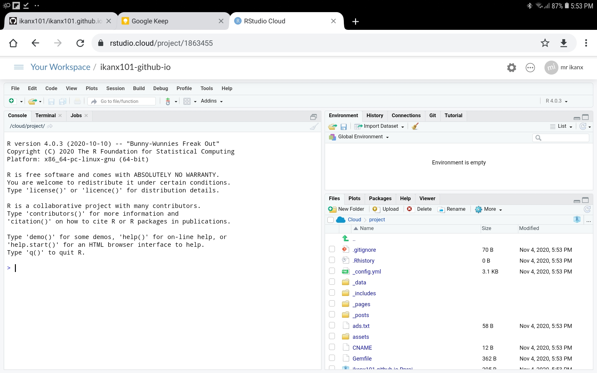
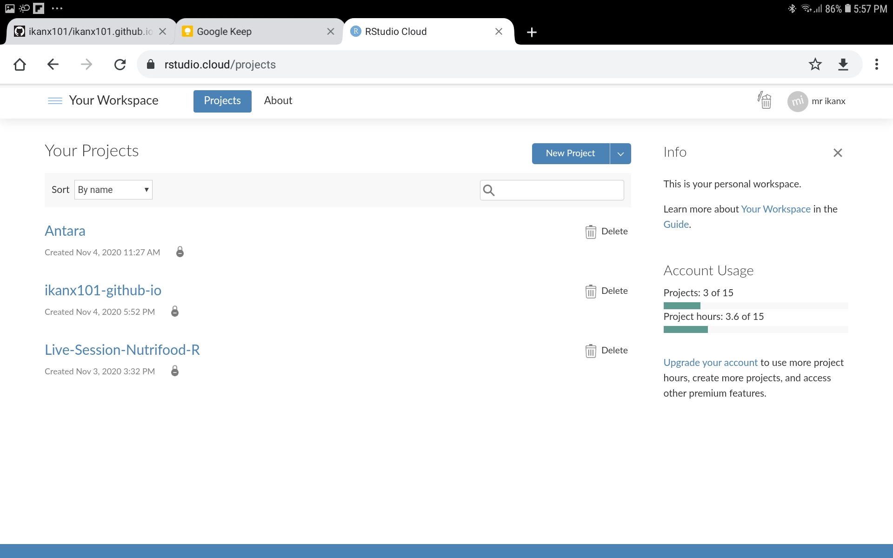

```{r setup, include=FALSE}
knitr::opts_chunk$set(echo = TRUE)
```

Kondisi _work from home_ yang saat ini sedang saya jalani sejak bulan `Maret 2020` bukanlah suatu hal yang selalu menyenangkan. Dalam beberapa kesempatan, _work hours_ saya menjadi kacau balau.

Saking kacaunya, saya bisa berkoordinasi (balas-balas _email_) pada dini hari.

Selain itu, walau cuma di rumah saja, mobilitas saya tergolong tinggi. Mulai dari _workspace_ yang saya set di lantai 2, kamar tidur utama, ruang tamu, garasi, hingga dapur. _hehe_.

> _Gak_ mungkin saya bawa-bawa [laptop kantor](https://ikanx101.com/blog/review-ubuntu/) ke mana-mana. 

Karena bobotnya yang berat dan ternyata sekarang bermasalah di _hardware wifi_-nya sehingga koneksi internet membutuhkan _fixed USB tethering_. Bukan berarti saya tidak puas dengan performa __Ubuntu__ _yah_. Justru sangat puas sekali tapi aspek lainnya membuat mobilitas saya kurang fleksibel.

Bagaimana dengan laptop mini yang saya _install_ [Chromium OS](https://ikanx101.com/blog/laptop-chromium/)?

Laptop tersebut malah sudah saya jadikan _daily driver_ selama `2` minggu ke belakang. Lumayan _powerful_ untuk harga segitu. Ukurannya yang kecil dan ringan membuat mobilitasnya cukup oke.

__TAPI__

Beberapa hari ini, saya ternyata membutuhkan _gadget_ yang lebih _mobile_ lagi tapi harus tetap _reliable_. Pilihan saya kembalikan ke __Tablet Samsung Galaxy Tab A 10 inch__ yang sempat saya bebas tugaskan. 

> Sayang nih nganggur. Harus kembali dioptimalkan.

Bermodalkan [__Github__](https://ikanx101.com/blog/github-rstudio/) dan koneksi internet, sebenarnya saya bisa (dan sudah biasa) menggunakan [__R Studio Cloud__](https://ikanx101.com/blog/r-cloud/) untuk tetap bekerja.

Meng-_install_ [__R__ di android](https://passingthroughresearcher.wordpress.com/2019/07/30/install-r-3-5-2-di-android/) sepertinya bukan pilihan bijak bagi saya saat ini mengingat ketiadaan _memory card_.

```{r,echo=FALSE}

```

Jadi dengan menggunakan __R Studio Cloud__, pekerjaan saya sekarang bisa diakses dimana saja dan kapan saja.

> Semua berjalan mulus sampai saya menyadari satu hal.

## _R Studio Cloud is no longer free!_

```{r,echo=FALSE}

```

Akun _free_ kini hanya dibatasi menjadi `15` _projects_ dan `15` _project hours_.

Jangan pernah berpikir untuk melakukan _cheat_ atau _hacks_ terkait ini _yah_. Saya sudah mencoba berbagai cara agar _project hours_ bisa turun tapi tidak berhasil _guys_.

> Berapa sih harga akun berbayarnya?

Ternyata lumayan juga sih kalau merogoh kantong sendiri. Jadi harus ada cara lain nih yang harus saya gunakan saat _project hours_ saya sudah habis. 

> Kalau kalian melihat, baru tanggal `4` November tapi _project hours_ saya sudah habis sekitar `20%`.

---

## Solusinya bernama __Google Colab__

_Google Colab_ adalah salah satu layanan di _Google_ yang memungkinkan penggunanya untuk membuat _coding_ menggunakan __Jupyter Notebook__ dalam bahasa _Python_. Saya sudah pernah mencobanya sejak tahun lalu. Namun beberapa hari yang lalu saya baru mengetahui bahwa kini _Google_ sudah memberikan dukungan untuk bahasa __R__ bisa digunakan di _Google Colab_ dengan tampilan ala __Jupyter Notebook__.

```{r,echo=FALSE}
knitr::inlude_graphics("Screenshot_20201104-175901_Chrome.jpg")
```

Kita bisa menambahkan _libraries_ dan meng-_upload_ _dataset_ kita ke sana dengan mudah layaknya bekerja di __R__ menggunakan _command line interface_.

Saya kemudian jadi berpikir:

> Jika saya selamat hanya dengan mengandalkan laptop 2 juta bernafaskan Chromium OS, barangkali saya bisa selamat juga dengan bermodalkan tablet android ini!
