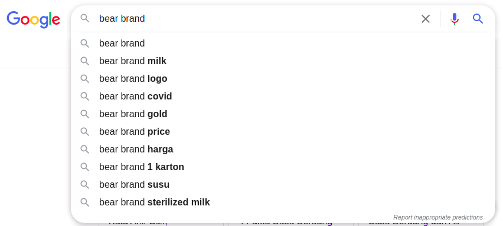

```{r setup, include=FALSE}
knitr::opts_chunk$set(echo = TRUE)

rm(list=ls())

library(dplyr)
library(ggplot2)
library(tidyr)

load("bahan blog.rda")
load("twit.rda")
```

Ada hal yang _viral_ belakangan ini di masa __PPKM Darurat__ di Jabodetabek, yakni fenomena masyarakat memborong Susu _Bear Brand_.

> Susu Bear Brand diyakini ampuh untuk membantu penyembuhan dan pencegahan Covid 19.

Harga susu tersebut di beberapa _marketplaces_ juga meningkat tajam. Sampai-sampai terjadi kelangkaan dan pembatasan pembelian di toko dan _retailers_ di beberapa daerah.

Mitos seputar __susu beruang__ ini sudah pernah saya dengar ketika SMP lalu. Saat itu, beberapa teman saya yang menjadi perokok sengaja meminum __susu beruang__ saat hendak mengikuti seleksi masuk suatu SMA. Gunanya agar susu tersebut bisa __membersihkan paru-paru__ saat pemeriksaan kesehatan di SMA tersebut.

---

## _Google Trends_

_Google Trends_ adalah salah satu layanan yang sering saya pakai untuk melihat seberapa antusiasme warganet Indonesia seputar isu-isu atau _keywords_ tertentu.

Kali ini saya mencoba mengambil data _trend_ pencarian warganet terhadap _keywords_:

1. __Bear Brand__
1. __Susu Beruang__

Jika saya buatkan _timeline chart_, hasilnya sebagai berikut:

```{r,echo=FALSE,warning=FALSE,message=FALSE,fig.align='center',fig.retina=7,fig.cap="fig1. Timeline Chart"}
ppkm = as.Date("2021-7-3","%Y-%m-%d")

data_int %>%
  mutate(date = lubridate::date(date),
         tahun = lubridate::year(date),
         hits = as.numeric(hits)) %>%
  filter(tahun > 2019) %>% 
  ggplot(aes(x = date,
             y = hits,
             group = keyword,
             color = keyword)) +
  annotate("label",
           x = ppkm-35,
           y = 30,
           label = "Garis abu\nmenandakan permulaan\nPPKM darurat",
           size = 3,
           alpha = .2) +
  geom_line() +
  theme_minimal() +
  labs(title = "Trend Pencarian Warganet",
       subtitle = "Sumber: Google Trend, 9 Juli 2021 13:27 WIB",
       caption = "Scraped and Visualized using R\nikanx101.com",
       color = "Brand",
       x = "Timeline",
       y = "Relative Search Hits") +
  geom_vline(xintercept = ppkm,
             color = "grey") +
  theme(legend.position = "bottom",
        plot.title = element_text(hjust = .5,size = 20),
        plot.subtitle = element_text(hjust = .5),
        plot.caption = element_text(hjust = .5))


```

Terlihat bahwa beberapa saat sebelum __PPKM darurat__ diberlakukan, _trend_ pencarian terhadap __Bear Brand__ dan __susu beruang__ sudah mulai meningkat tajam.

Salah seorang teman saya berujar:

> Coba lihat _suggestion_-nya Google deh saat kamu menuliskan `bear brand` di kolom pencarian!

Benar saja. Saat saya mencoba menuliskannya, saya mendapatkan _suggestion_ berikut ini:

```{r out.width="90%",echo=FALSE,warning=FALSE,message=FALSE,fig.align='center',fig.retina=7,fig.cap="fig2. Suggestion Google"}

```

Sekarang saya akan coba cek data _related queries_ dari dua _keywords_ tersebut berdasarkan _Google Trend_:

```{r out.width="90%",echo=FALSE,warning=FALSE,message=FALSE,fig.align='center',fig.retina=7,fig.cap="fig2. Suggestion Google"}
library(tidytext)
library(igraph)
library(ggraph)

data_query %>% 
  unnest_tokens("bigrams",value,"ngrams",n=2) %>% 
  group_by(bigrams) %>% 
  tally() %>% 
  ungroup() %>% 
  arrange(desc(n)) %>% 
  filter(n > 1) %>% 
  separate(bigrams,
           into = c("from","to"),
           sep = " ") %>% 
  graph_from_data_frame() %>% 
  ggraph(layout = 'fr') +
  geom_edge_bend(aes(edge_alpha=n),
                 show.legend = F,
                 color='darkred') +
  geom_node_point(size=1,color='steelblue') +
  geom_node_text(aes(label=name),alpha=0.4,size=3,repel = T) +
  theme_void()
```

Dari semua _related queries_ yang ada, tidak secara eksplisit ada pencarian yang ke arah __covid__ atau __corona__. Setelah saya telaah kembali datanya, saya temukan bahwa:

```{r out.width="90%",echo=FALSE,warning=FALSE,message=FALSE}
data_query %>% 
  filter(grepl('covid|corona',value)) %>% 
  select(related_queries,value,keyword,geo) %>% 
  rename("Status" = related_queries,
         "Related Queries" = value,
         Keyword = keyword,
         Geo = geo) %>% 
  knitr::kable()
```

Pencarian dengan penambahan _keyword_ __covid__ dan __corona__ baru berstatus ___rising___. Mungkin baru akan muncul detail datanya dalam beberapa hari kemudian.

---

## Twitter

Selain data dari _Google Trends_, saya juga mengambil data warganet di Twitter. Siang ini saya mendapatkan 526 buah twit ber-_hashtag_ __#bearbrand__. Ini adalah twit asli (buka merupakan _retweet_ dari _user_ lain).

Saya ingin tahu, siapa _user_ yang mendapatkan _favorites_ atau _likes_ terbanyak pada _hashtag_ ini:

```{r out.width="90%",echo=FALSE,warning=FALSE,message=FALSE,fig.align='center',fig.retina=7,fig.cap="fig3. User Twitter"}
rt =
  rt %>% 
  select(screen_name,text,favourites_count)

rt %>% 
  group_by(screen_name) %>% 
  summarise(likes = sum(favourites_count)) %>% 
  ungroup() %>% 
  mutate(label = likes/1000,
         label = round(label,1),
         label = paste0(label,"rb")) %>% 
  arrange(desc(likes)) %>% 
  head(20) %>% 
  ggplot(aes(y = reorder(screen_name,likes),
             x = likes)) +
  geom_col(fill = "steelblue",
           color = "black",
           width = .4) +
  geom_label(aes(label = label)) +
  theme_minimal() +
  labs(title = "Siapa yang mendapatkan favourites terbanyak\npada twit #bearbrand?",
       subtitle = "Sumber: Twitter, 9 Juli 2021 13:27 WIB",
       caption = "Scraped and Visualized using R\nikanx101.com",
       color = "Brand",
       y = "User") +
  theme(axis.text.x =  element_blank(),
        axis.title.x = element_blank(),
        plot.title = element_text(hjust = .5,size = 20),
        plot.subtitle = element_text(hjust = .5),
        plot.caption = element_text(hjust = .5))
```

Sekarang kita lihat, apa saja isi twit dari `3` _users_ dengan _favourites_ terbanyak:

```{r,echo=FALSE,warning=FALSE,message=FALSE}
rt %>% 
  filter(screen_name %in% c("herlambang_tan",
                            "totoagungcom",
                            "yangyangbestie4")) %>% 
  arrange(desc(favourites_count))
```


Ternyata _user_ __totoagungcom__ adalah sebuah _bot_ judi yang menggunakan _hashtag_ ini.

Oke, kita lihat ada topik pembicaraan apa saja yang ada di twitter:

```{r out.width="90%",echo=FALSE,warning=FALSE,message=FALSE,fig.align='center',fig.retina=7,fig.cap="fig4. Twit"}
rt %>% 
  unnest_tokens("bigrams",text,"ngrams",n=2) %>% 
  group_by(bigrams) %>% 
  tally() %>% 
  ungroup() %>% 
  arrange(desc(n)) %>% 
  filter(n > 6) %>% 
  separate(bigrams,
           into = c("from","to"),
           sep = " ") %>% 
  graph_from_data_frame() %>% 
  ggraph(layout = 'fr') +
  geom_edge_bend(aes(edge_alpha=n),
                 show.legend = F,
                 color='darkred') +
  geom_node_point(size=1,color='steelblue') +
  geom_node_text(aes(label=name),alpha=0.4,size=3,repel = T) +
  theme_void()
```

Di luar _bot_ yang memberikan informasi pemenang judi, kita bisa dapatkan beberapa informasi secara kualitatif seperti ___panic buying___, ___harga susu beruang naik___, dan ___rebutan___.

Di luar benar atau tidaknya manfaat Bear Brand, ada baiknya kita tetap menjaga kesehatan agar terhindar dari penyakit apapun.

_Stay safe_ semuanya.

---

`if you find this article helpful, support this blog by clicking the ads.`