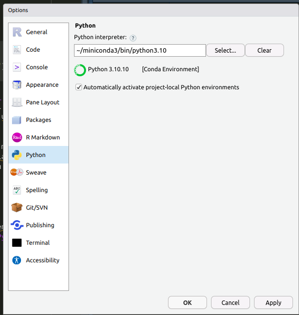

```{r setup, include=FALSE}
knitr::opts_chunk$set(echo = TRUE)
setwd("~/ikanx101.github.io/_posts/home tester club/tulisan keempat")
```

Beberapa bulan yang lalu, saya menuliskan tentang komentar _netizen_ terhadap [susu oat Tropicana Slim](https://ikanx101.com/blog/clustering-oat/). Dari dulu, saya bercita-cita untuk melakukan _sentimen analysis_ namun belum sempat untuk membuat modelnya sendiri.

Kali ini, saya akan mencoba membuat _sentimen analysis_ menggunakan model yang sudah ada di _Huggingface_. Namun sebelum melakukannya, ada beberapa persiapan yang harus dilakukan. _Oh iya_, sebagai pengingat saya menggunakan Linux Ubuntu 20.04 LTS.

---

# Langkah I

Saya akan melakukan _sentimen analysis_ ini dengan __R__. Namun karena model yang saya gunakan dari _Huggingface_ merupakan _object_ _transformers_ dari _Python_, maka perlu dipastikan bahwa komputer kita memiliki Python yang ter-_install_.

Kemudian pastikan juga __R Studio__ kita sudah di-_set_ _Python_ _interpreter_-nya versi apa dan di _path folder_ mana.

```{r,echo=FALSE}

```

Di laptop saya, saya gunakan _Python_ versi `3.10`.

# Langkah II

_Install transformers Huggingface_:

```
pip install  huggingface transformers
```

# Langkah III

_Install pytorch_:

```
pip3 install torch torchvision torchaudio --index-url https://download.pytorch.org/whl/cpu
```

---

_Nah_, persiapan telah selesai. Kita sudah bisa membuat model dan melakukan analisanya. Bagaimana caranya? 

Bersambung...

---

`if you find this article helpful, support this blog by clicking the ads.`
