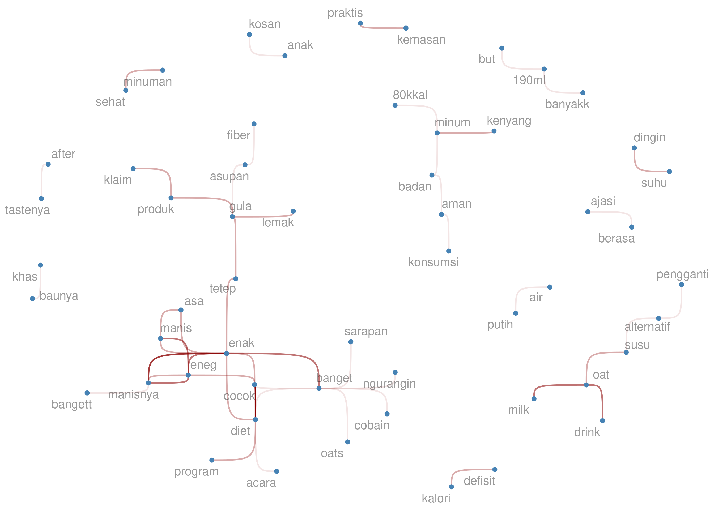
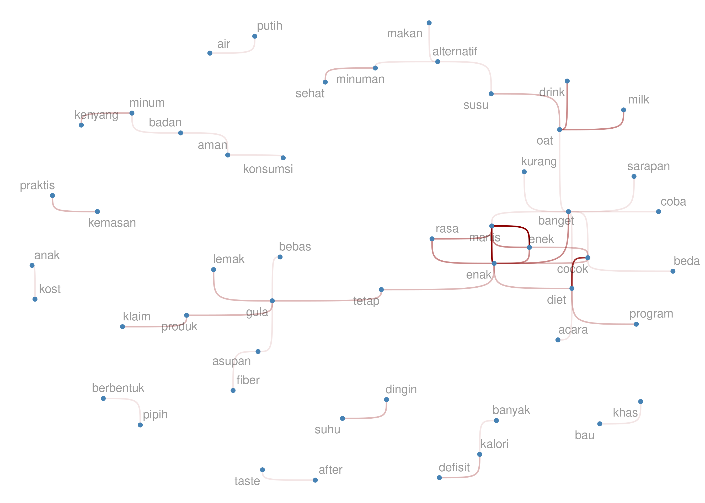

Text Clustering dengan R: Case Study Komentar Netizen Terhadap Produk
Susu Oat
================

Ternyata setelah saya lihat kembali *blog* saya ini, sudah lama saya
tidak menuliskan tentang *text analysis*. Semua tulisan saya terkait
*text analysis* bisa dibaca di [*link* berikut
ini](https://ikanx101.com/tags/#text-analysis).

*Nah*, kali ini saya akan mencoba satu hal baru yang sebenarnya sudah
lama dipendam yakni *text clustering* dengan metode *clustering* yang
sudah saya bahas di [tulisan
ini](https://ikanx101.com/blog/clustering-R/).

> Ya betul, saya akan mengaplikasikan metode clustering pada data berupa
> teks!

Jadi, metode *clustering* atau pengelompokkan juga bisa diaplikasikan
menggunakan teknik *unsupervised learning* ini. Tujuannya jelas, yakni:
**mengelompokan data teks menjadi beberapa kelompok yang homogen**.

Buat rekan-rekan yang sudah terbiasa melakukan *text analysis*, biasanya
untuk melakukan pengelompokan data teks, analisa yang digunakan adalah
LDA (*Latent Dirichlet Allocation*). Saya pernah menggunakannya untuk
[mengelompokan komen-komen
netizen](https://ikanx101.com/blog/blog-posting-sunyi/) pada suatu *web
series* di **Youtube**.

Berbeda dengan LDA, prinsip yang digunakan saat ini adalah *clustering*
yang menurut saya lebih intuitif dan mudah untuk diikuti.

Saya mulai *yah*.

------------------------------------------------------------------------

Data yang saya gunakan adalah data *review* para konsumen **Tropicana
Slim Oat Drink** yang saya dapatkan dari situs **Hometester Club
Indonesia**. *Oh iya*, kenapa saya penasaran melakukan analisa untuk
produk ini? Karena menurut saya produk ini menawarkan alternatif minuman
susu vegan yang sehat dengan rasa yang **pas**. Kalau tidak percaya,
silakan dicoba *yah*.

Dulu, saya pernah juga [menganalisa *review* produk-produk lain dari
situs tersebut](https://ikanx101.com/blog/home-tester/).

Saya mendapatkan `45` buah *reviews*. Berikut adalah sampel
*review*-nya:

    ##                                                                                                                                                                                                                  komen
    ## 1                                                                                                                                                               Rasanya kurang berasa oatnya,lebih ke hambar bgt sih..
    ## 2                                                                                            enakkk bangett, manisnya pas menurut aku. tipikal kaya oatmilk pada umumnya tapi rasa vanilla dan lumayan bikin kenyang. 
    ## 3                       Produk sangat baik kualitas terjamin dan lembut waktu di buat bikin kue sangat memuaskan produk ini dan selalu di buat buat usaha jualan apa buat di jual di warung2 hargga yerjamin dan murah
    ## 4                                                       Sesuai dengan labelnya less sugar, rasanya tidak terlalu manis jadi tidak bikin eneg, rasa susunya terasa dan bikin kenyang. Semoga ada varian rasa lainnya ya
    ## 5                                                                                                                                                           Bikin kenyang cocok untuk diet\nRasanya enak, g bikin eneg
    ## 6 Manisnya pas ga bikin eneg,cocok buat yang ga sempet sarapan ga bikin sakit perut juga.buat yang lagi diet tapi pengen minum susu bisa dialihkan minum ini. Recommend buat yang mau diet dan ga sempat bikin sarapan
    ##   resp_id
    ## 1       1
    ## 2       2
    ## 3       3
    ## 4       4
    ## 5       5
    ## 6       6

### *Workflow* Analisis

Dari data di atas, saya tidak bisa langsung melakukan *clustering*
karena data teks-nya masih sangat kotor. Setidaknya, saya harus
melakukan beberapa *pre-processing* sebagai berikut:

1.  Mentransformasi semua *uppercase* menjadi *lowercase*.
2.  Membuang semua *punctuation*.
3.  Membuang semua *stopwords* dan kata-kata tak bermakna.

Untuk melakukan ketiga proses di atas, saya menggunakan
`library(tidytext)` dari `tidyverse`. Sementara daftar *stopwords* saya
himpun dari [rekapan *Github
User*](https://raw.githubusercontent.com/ikanx101/ID-Stopwords/master/id.stopwords.02.01.2016.txt)
yang saya *enrich* dari data yang dihimpun. Cara *enrich*-nya adalah
dengan membuat *bigrams*, lalu mendeteksi secara manual kata mana saja
yang perlu dibuang.

> Kenapa harus *bigrams*? Kenapa bukan *wordcloud*?

Bagi saya, *bigrams* menawarkan konteks dibanding kata semata. Maka
harusnya saya bisa memilih kata-kata mana saja yang benar-benar tak
bermakna untuk dibuang.

Sekarang saya akan buat langkah 1-3 serta *bigrams* sebagai berikut:

``` r
# kita ambil stopwords
stop = readLines("https://raw.githubusercontent.com/ikanx101/ID-Stopwords/master/id.stopwords.02.01.2016.txt")

# kita lakukan langkah 1-2
df = 
  df |>
  # lowercase
  mutate(komen = tolower(komen),
         komen = stringr::str_trim(komen)) |>
  # remove punctuation
  mutate(komen = gsub("[[:punct:]]|\\n|\\r|\\t"," ",komen),
         komen = stringr::str_trim(komen)) |>
  unnest_tokens("words",komen) |>
  # remove stopwords
  filter(!words %in% stop)

# mengembalikan ke bentuk awal
raw = 
  df |> 
  group_by(resp_id) |> 
  summarise(komen = paste(words,collapse = " ")) |>
  ungroup()

# kita buat grafik bigram dulu
bigram_plot = 
  raw |>
  unnest_tokens("bigrams",komen,token = "ngrams",n = 2) |>
  group_by(bigrams)|>
  tally(sort = T) |>
  ungroup() |>
  head(30) |>
  separate(bigrams,into = c("from","to"),sep = " ") %>% 
  graph_from_data_frame() %>% 
  ggraph(layout = 'fr') +
  geom_edge_bend(aes(edge_alpha=n),
                 show.legend = F,
                 color='darkred') +
  geom_node_point(size=1,color='steelblue') +
  geom_node_text(aes(label=name),alpha=0.4,size=3,repel = T) +
  theme_void()

bigram_plot
```



Dari *bigrams* di atas, saya akan eliminasi beberapa kata yang tak
bermakna menurut saya, seperti `but` dan `190ml`. Proses ini saya
lakukan secara iteratif hingga semua kata tak bermakna hilang. Berikut
adalah hasil akhir *bigrams*-nya:


