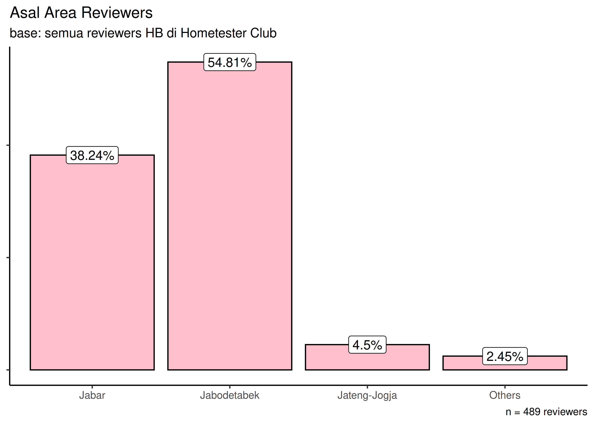

Melanjutkan *posting* saya sebelumnya tentang [kenapa saya menggunakan
kembali *Pop OS*](https://ikanx101.com/blog/pop-os25/). Akhirnya saya
bisa menggunakan [*Playwright*](https://playwright.dev/) untuk melakukan
*web scraping*. Saya menggunakan *framework web scrape* yang telah
dibuat oleh [Mas Apriandito di *github repository*
-nya](https://github.com/apriandito/playwright-scraper/tree/main).

Proses instalasinya saya lakukan di *Linux terminal* dengan cara
mengeksekusi perintah berikut ini:

    # install python pip
    apt install python3-pip

    # install playwright
    pip install playwright
    playwright install

Setelah itu, saya cukup melakukan *clone git repository* milik Mas
Apriandito.

Eksekusi perintah:

    npm install

Ubah target *url* pada file `config.js`. Lakukan *web scrape*
(menggunakan metode *saving webpage*) dengan mengeksekusi perintah
berikut ini:

    node index.js

------------------------------------------------------------------------

*Webpage* yang hendak saya ambil adalah *review* konsumen terhadap
produk *yogurt* merek ***Heavenly Blush*** di situs [**Hometester Club
Indonesia**](https://www.hometesterclub.com/id/id/reviews/heavenly-blush)

Kemudian saya mengekstrak data sebagai berikut:

| kota_asal | n_reviews | tanggal | komen |
|:---|---:|:---|:---|
| Bandung | 38 | 2025-03-23 | Sumpah ini minuman yogurt terenak persi aku banyak parian rasa dan semua rasanya enak enak. Minuman sehat bikin kenyang |
| Depok | 75 | 2025-03-20 | Yogurt favorit keluarga karena rasanya enak, dan komposisi nya pas tidak terlalu asam dan cocok di lambung. |
| Kabupaten Tangerang | 41 | 2025-03-06 | Dari sekian banyak produk yogurt di pasaran ini sih terbaik , rasanya buah nya enak paling suka strawberry |
| Jakarta Selatan | 51 | 2025-02-25 | ini yogurt paling enak yang pernah dicoba, rasa buahnya juga terasa, apalagi yg plain enak banget ga terlalu asam. cocok di lidah |
| Kota Bekasi | 92 | 2025-02-21 | Heavenly blush ini rasanya enak banget Apalagi kalau di sajikan dingin |
| Mojokerto | 157 | 2025-02-21 | Heavenly Blush Ini jadi salah satu yogurt favorit aku. Rasanya sedikit manis dan asamnya juga nggak terlalu strong, cocok dengan seleraku. Kadang yogurt itu bikin enek, tapi ini ngga sama sekali. Malah sangat menikmati. |

Saya dapatkan sebanyak **489** ***reviews***. Saya akan melakukan
beberapa analisa sederhana dari data tersebut.

------------------------------------------------------------------------

## Siapa *Reviewer*-nya?

Analisa pertama adalah siapa *sih* yang menulis *review* ini?

**Saya tidak bisa mendapatkan data detail *user* yang menulis
*review***. Saya hanya mendapatkan data domisili dan seberapa banyak
*user* tersebut menulis *review*. Mari kita lihat satu persatu:

Ternyata separuh *reviewers* berasal dari area Jabodetabek, setelah itu
`38.24%` *reviewers* berasal dari area Jawa Barat. Kita bisa duga bahwa
**kedua area tersebut merupakan basis *trialist* (atau mungkin *user*)
Yogurt HeavenlyBlush yang *aware* dengan keberadaan Hometester Club
Indonesia**.

Sekarang kita lihat grafik berikut ini:

Jika kita lihat, mayoritas *reviewer* Yogurt HeavenlyBlush sudah pernah
menuliskan 9 - 54 buah *reviews* di situs Hometester Club Indonesia.
Dari *range* nilai ini bisa kita lihat ada variasi *novice to expert
reviewers*. Grafik berikut ini bisa memberikan kita gambaran terkait hal
ini:

------------------------------------------------------------------------

## Apa Isi *Review* -nya?

Sekarang kita coba lihat, apa isi dari review yang diberikan.

Hasil pengelompokkan terhadap semua *review* yang ada adalah sebagai
berikut:

**1. Taste - Enak dan Segar:**

- “Sumpah ini minuman yogurt terenak persi aku banyak parian rasa dan
  semua rasanya enak enak.”
- “Rasanya enak, apalagi diminum dingiiin.”
- “Segar, enak banget diminum kapan aja.”

**2. Taste - Tidak Terlalu Asam/Manisnya Pas:**

- “Yogurt favorit keluarga karena rasanya enak, dan komposisi nya pas
  tidak terlalu asam dan cocok di lambung.”
- “Rasanya sedikit manis dan asamnya juga nggak terlalu strong, cocok
  dengan seleraku.”
- “Rasanya pas, nggak terlalu asam, nggak terlalu manis.”

**3. Taste - Rasa Buah Alami/Terasa:**

- “Dari sekian banyak produk yogurt di pasaran ini sih terbaik , rasanya
  buah nya enak paling suka strawberry.”
- “ini yogurt paling enak yang pernah dicoba, rasa buahnya juga terasa,
  apalagi yg plain enak banget ga terlalu asam.”
- “Rasa buahny pas,gak bikin eneg.”

**4. Taste - Tidak Bikin Eneg:**

- “Kadang yogurt itu bikin enek, tapi ini ngga sama sekali.”
- “Enaaaaak banget, rasanya light dan after taste nya ga bikin eneg,
  asamny pas ga asem banget gitu.”
- “Rasanya seger enak gak bikin eneg, bisa buat campuran buah jadi lebih
  nikmat.”

**5. Health - Baik untuk Pencernaan/Melancarkan BAB:**

- “Yoghurt yg beneran bagus untuk pencernaan.”
- “Maksimalkan kecantikan dari dalam mulai dari pencernaan yang sehat
  dengan Heavenly Blush.”
- “Ini enak banget diminum melancarkan bab juga.”

**6. Health - Cocok untuk Diet/Low Sugar/Hi Calcium:**

- “Memenuhi kebutuhan fiber untuk tubuh tapi pengen yang less sugar dan
  hi calcium, bisa coba yogurt ini.”
- “Greek Yogurt yang tinggi protein yang bisa mengganjal lapar kamu,
  supaya pola makan terkontrol & pencernaan sehat…”
- “Cocok untuk diet kalori karena kalori rendah dan gula juga rendah,
  rasa enak.”

**7. Health - Disukai Anak-anak:**

- “Ini andalanku sih buat dikasihin ke anakku. Anakku pun doyan.”
- “Rasanya juga enak, kecut manis, anakku suka bgt.”
- “Apalagi yogurt juga tinggi protein jadi sangat bagus untuk anak
  anak.”

**8. Ingredients - Alami/Minim Bahan Tambahan:**

- “Dari segala jenis yogurt, cuman merk ini aja yg minim pe pe pe pe.
  Komposisinya cuman susu sapi, gula, dan strain bakteri.”
- “Heavenly Blush, yogurt yang terbuat dari susu sapi pilihan dan bahan
  baku premium…”
- “Ini terbuat dari yoghurt susu pilihan…”

**9. Texture - Lembut/Creamy/Pas:**

- “Rasanya bervariasi dan sangat light.”
- “Enaaaaak banget, rasanya light…”
- “Lembut banget di mulut dan rasa buahnya terasa banget.”

**10. Overall Favorit/Sangat Suka:**

- “Heavenly Blush Ini jadi salah satu yogurt favorit aku.”
- “Menurut saya ini yogurt yg worth to buy sih enak bgt saya suka.”
- “Ini salah satu brand yogurt yang paling endulita menurutkuuuuh.”

**11. Convenience - Praktis dan Mudah Dikonsumsi:**

- “Simpel, praktis, dan pastinya bikin happy!.”
- “Sangat cocok dinikmati kapan saja. Dengan kemasan yang praktis dan
  pas.”
- “Rasanya tidak terlalu asam cocok diminum sehari-hari.”

**12. Specific Types/Flavors Disukai (Greek, Plain, Strawberry, Peach,
Yoguruto, Yogurt Drink, Classic/Original, Tummy):**

- “rasanya buah nya enak paling suka strawberry.” (Strawberry)
- “apalagi yg plain enak banget ga terlalu asam.” (Plain)
- “Aku suka yang Greek Yogurt.” (Greek)
- “Pernah coba minum ini yg rasa peach, enak banget enggak neg sama
  sekali…” (Peach)
- “Yoguruto heavenly blush berhasil membuat saya jadi suka minum
  yogurt…” (Yoguruto)
- “Aku suka banget sama yoghurt drink apalagi dari heavenly blush.”
  (Yogurt Drink)
- “paling suka yg classic, terutama kalau lagi diet.” (Classic/Original)
- “Favourit bgt sama serian yang Tummy.” (Tummy)

**13. Comparison Positif dengan Merk Lain:**

- “Dari sekian banyak produk yogurt di pasaran ini sih terbaik…”
- “Kadang yogurt itu bikin enek, tapi ini ngga sama sekali.”
- “Aku kira semua yogurt itu sama rasanya. tetapi yang ini bener2 beda.”

**14. Value for Money/Worth to Buy:**

- “Untuk harganya memang lebih tinggi dari produk sejenis, tapi
  kualitasnya premium.”
- “Menurut saya ini yogurt yg worth to buy sih enak bgt saya suka.”
- “Intinya ini produk bagus dengan harga sesuai kualitas…”

**15. Availability - Mudah Ditemukan:**

- “Bisa di nikmati dimana saja karena praktis tentunya rasanya sangat
  enak dan bisa dibeli di minimarket terdekat.”
- “Sebelumnya udah sering belanja produknya juga kok di indomaret.”
- “Trus, kualitas rasanya itu terjamin, mudah dicari di semua indomaret
  ataupun alfamart dekat rumah ibu-ibu hebat lainnya.”

------------------------------------------------------------------------

`if you find this article helpful, support this blog by clicking the ads.`
