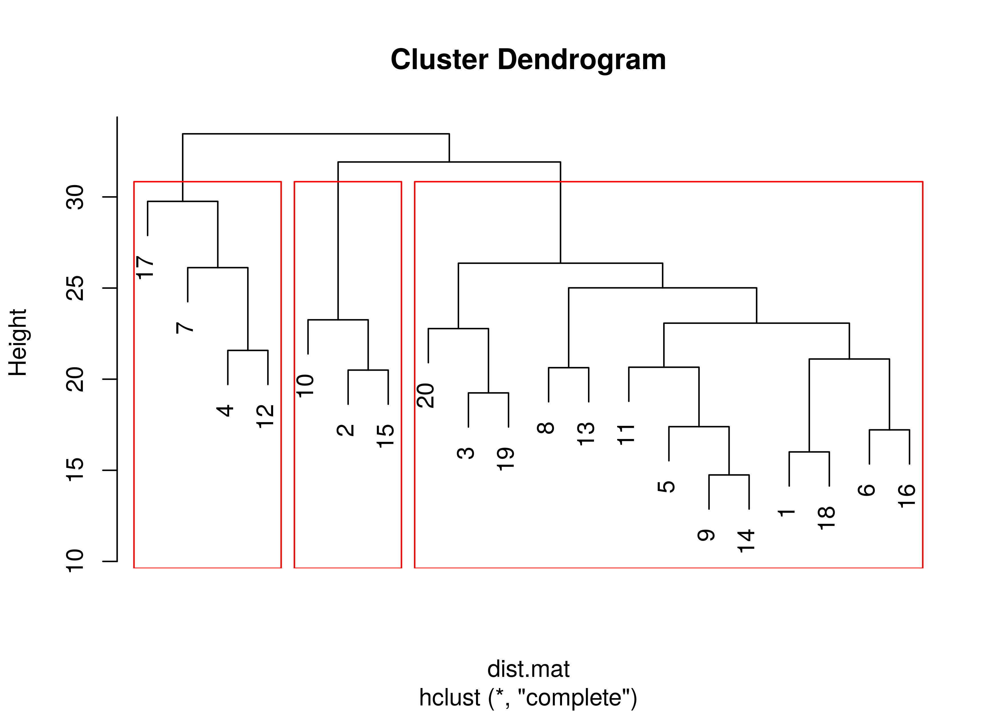

Setahun yang lalu, saya sempat menuliskan bagaimana caranya [melakukan
*clustering* terhadap data teks berupa komentar atau *review* terhadap
*oat drink* merek Tropicana
Slim](https://ikanx101.com/blog/clustering-oat/). Lima tahun yang lalu,
saya menuliskan cara [melakukan pengelompokan data teks menggunakan
metode LDA](https://ikanx101.com/blog/blog-posting-sunyi/).

*Jujurly*, saya belum puas terhadap hasil keduanya karena masih terlalu
kuantitatif dan tidak melibatkan konteks dari teks tersebut.

> Belum cukup pintar untuk bisa membaca dan mengelompokan konteks dari
> teks yang ada.

Begitu pikir saya.

Dengan perkembangan *large language model* (**LLM**) yang sangat pesat
beberapa bulan belakangan ini, saya mencari cara lain bagaimana
melakukan pengelompokkan teks menggunakan metode *clustering* seperti
*k-means* atau *hierarchical* tapi dengan proses **pembacaan konteks
yang lebih pintar**.

*Flowchart*-nya kira-kira sebagai berikut:

Titik kritis yang membedakan analisa kali ini dengan analisa
*clustering* sebelumnya terletak pada saat melakukan *word embedding*
yang dibantu **LLM**. Model yang saya gunakan adalah
`firqaaa/indo-sentence-bert-base` yang kita bisa dapatkan di situs
[**Huggingface**](https://huggingface.co/firqaaa/indo-sentence-bert-base).

Semua proses ini saya lakukan di **R** dengan *environment* `Python3`
yang saya panggil menggunakan `library(reticulate)`. Oleh karena itu,
pastikan *local computer* sudah ter-*install* **R** dan `Python3` *ya*.
Jika kalian hendak menggunakan *Google Colab* juga dipersilakan.

Bagaimana caranya? *Cekidots!*

## Data yang Digunakan

Data yang saya gunakan adalah 20 baris teks berisi komplain *customer*
**sintetis** yang saya buat menggunakan Gemini Google berikut:

     [1] "Kecepatan internet XL di daerah saya cukup stabil, terutama saat digunakan untuk streaming."   
     [2] "Sering mengalami gangguan sinyal saat berada di dalam gedung atau area tertentu."              
     [3] "Dibandingkan dengan provider sebelumnya, XL lebih cepat untuk mengunduh file besar."           
     [4] "Kuota sering habis lebih cepat dari yang diharapkan, meskipun penggunaannya terbilang normal." 
     [5] "Semoga XL dapat meningkatkan kualitas jaringan di daerah-daerah yang masih kurang stabil."     
     [6] "Sangat puas dengan paket internet yang ditawarkan XL, fitur-fiturnya sangat lengkap."          
     [7] "Perlu ada peningkatan kecepatan upload, terutama untuk pengguna yang sering mengunggah konten."
     [8] "Sinyal XL sering hilang saat bepergian menggunakan transportasi umum."                         
     [9] "Kecepatan internet XL masih kalah cepat dibandingkan dengan provider lain di kota besar."      
    [10] "Sering mengalami kesulitan saat melakukan panggilan video dengan kualitas yang baik."          
    [11] "Layanan pelanggan XL cukup responsif dalam mengatasi masalah yang saya hadapi."                
    [12] "Harganya bisa lebih terjangkau lagi, terutama untuk paket data dengan kuota besar."            
    [13] "Sinyal XL lebih stabil di malam hari dibandingkan siang hari."                                 
    [14] "XL lebih unggul dalam hal jangkauan jaringan dibandingkan dengan provider lainnya."            
    [15] "Sering mengalami gangguan sinyal saat cuaca buruk."                                            
    [16] "Fitur hotspot XL sangat berguna untuk berbagi internet dengan perangkat lain."                 
    [17] "Perlu ada promo yang lebih menarik untuk pelanggan setia."                                     
    [18] "Kecepatan internet XL sangat membantu dalam bekerja dari rumah."                               
    [19] "Dibandingkan dengan provider lain, XL lebih sering memberikan kuota tambahan."                 
    [20] "Aplikasi XL Center seringkali mengalami error saat digunakan."                                 

Kita akan cek apakah hasil *clustering* saya saat ini lebih baik
dibandingkan sebelumnya atau tidak.

## Langkah Pengerjaan

### Tahap I

Langkah awal pengerjaan adalah *setting* awal *environment* `Python3`.
Rekan-rekan bisa *copy, paste, and run* skrip berikut di **R**:

    system("pip install sentence-transformers")

Kegunaan skrip tersebut adalah meng-*install* sistem
`sentence-transformers` ke dalam *local computer*.

Selanjutnya adalah memanggil semua *libraries* yang diperlukan:

    # Load necessary libraries
    library(reticulate)
    library(readr)
    library(dplyr)

Kemudian membuat **R** menggunakan *environment* dari `Python3`. Silakan
dimodifikasi *path* sesuai kebutuhan.

    use_python("/usr/bin/python3")

Berikutnya kita *load* *library* di `Python3` berikut:

    transformers <- reticulate::import("sentence_transformers")

Kemudian kita unduh model *word embedding* yang diperlukan:

    model <- transformers$SentenceTransformer('firqaaa/indo-sentence-bert-base')

Proses ini mungkin memakan waktu yang relatif lama karena ukurannya yang
cukup besar.

Kemudian saya akan memasukkan kembali komplen konsumen dari *file*
`komplen.txt` yang ada.

    complaints = readLines("komplen.txt")

### Tahap II

Selanjutnya saya akan lakukan *word embedding* dari model yang ada.
Kemudian saya ubah menjadi matriks jarak untuk keperluan *k-means
clustering*.

    complaint_embeddings <- model$encode(complaints)
    embeddings_matrix    <- as.matrix(reticulate::py_to_r(complaint_embeddings))

### Tahap III

Tahap selanjutnya adalah melakukan *clustering* dari data
`embedding_matrix` hasil keluaran dari **LLM**. *Nah* sebelum menentukan
apakah saya akan menggunakan metode *k-means* atau *hierarchical*, saya
akan coba membuat visualisasi dari matriks tersebut.

Sebagai informasi, matriks tersebut berukuran

alias berdimensi tinggi. Agar memudahkan membuat visualisasinya, saya
akan lakukan *dimension reduction* dengan *principal component analysis*
(**PCA**). Berikut adalah grafik **PCA**-nya

Jika saya lihat grafik di atas, saya bisa menggunakan metode:

1.  *k-means* untuk
     atau
    , ATAU
2.  *Hierarchical cluster* dengan metode perhitungan jarak *complete*
    (*max*) dengan *cut off cluster* di `3` atau `4`.

Kedua metode tersebut akan menghasilkan hasil yang sama (secara teori).
Sebagai penjelasan *how to do clustering*, rekan-rekan bisa melihat
[tulisan saya sebelumnya ini](https://ikanx101.com/blog/clustering-R/).

### Tahap IV

Selanjutnya saya akan lakukan *hierarchical clustering* dengan membuat
*dendogram* dengan *cut off* sebanyak `3` *clusters* berikut ini:

Sekarang kita lihat bentuk akhir grafik **PCA** dengan *clusters* yang
sudah final:

Berikut adalah hasil pengelompokkan komplain konsumen final:

| cluster | complaints |
|---:|:---|
| 1 | Kecepatan internet XL di daerah saya cukup stabil, terutama saat digunakan untuk streaming. Dibandingkan dengan provider sebelumnya, XL lebih cepat untuk mengunduh file besar. Semoga XL dapat meningkatkan kualitas jaringan di daerah-daerah yang masih kurang stabil. Sangat puas dengan paket internet yang ditawarkan XL, fitur-fiturnya sangat lengkap. Sinyal XL sering hilang saat bepergian menggunakan transportasi umum. Kecepatan internet XL masih kalah cepat dibandingkan dengan provider lain di kota besar. Layanan pelanggan XL cukup responsif dalam mengatasi masalah yang saya hadapi. Sinyal XL lebih stabil di malam hari dibandingkan siang hari. XL lebih unggul dalam hal jangkauan jaringan dibandingkan dengan provider lainnya. Fitur hotspot XL sangat berguna untuk berbagi internet dengan perangkat lain. Kecepatan internet XL sangat membantu dalam bekerja dari rumah. Dibandingkan dengan provider lain, XL lebih sering memberikan kuota tambahan. Aplikasi XL Center seringkali mengalami error saat digunakan. |
| 2 | Sering mengalami gangguan sinyal saat berada di dalam gedung atau area tertentu. Sering mengalami kesulitan saat melakukan panggilan video dengan kualitas yang baik. Sering mengalami gangguan sinyal saat cuaca buruk. |
| 3 | Kuota sering habis lebih cepat dari yang diharapkan, meskipun penggunaannya terbilang normal. Perlu ada peningkatan kecepatan upload, terutama untuk pengguna yang sering mengunggah konten. Harganya bisa lebih terjangkau lagi, terutama untuk paket data dengan kuota besar. Perlu ada promo yang lebih menarik untuk pelanggan setia. |

Jika kita baca secara seksama, terlihat bahwa *clusters* yang terbentuk
sudah memiliki kesamaan konteks di internal *cluster* dan perbedaan
konteks antar *cluster*. Namun tetap kita bisa menemukan ada tiga
pernyataan di *cluster 1* yang tampaknya **salah masuk cluster**, yakni:

1.  **Sinyal XL sering hilang saat bepergian menggunakan transportasi
    umum**.
2.  **Kecepatan internet XL masih kalah cepat dibandingkan dengan
    provider lain di kota besar**.
3.  **Aplikasi XL Center seringkali mengalami error saat digunakan**.

Untuk **pernyataan 1** seharusnya lebih cocok masuk ke dalam **cluster
2** sedangkan **pernyataan 2** lebih cocok masuk ke dalam **cluster 3**.
Sementara **pernyataan 3** memang seharusnya menjadi *cluster* baru.

> Ternyata penggunaan *word embedding* dan pemilihan metode perhitungan
> *hierarchical cluster* menjadi hal yang kritis.

Saya sudah mencoba beberapa kemungkinan metode perhitungan *hierarchical
cluster* dan memang saat memilah *dendogram* menjadi cluster yang lebih
banyak saya bisa dapatkan hasil yang lebih baik. *Nah*, ini untuk
keperluan contoh, **saya rasa tiga cluster sudah cukup**.

### Tahap V

Untuk memberikan nama atau istilah umum dari masing-masing *cluster*,
saya akan coba rangkum menggunakan bantuan **Gemini** sebagai berikut:

1.  **Cluster 1**: XL memberikan layanan internet yang cukup baik,
    terutama dalam hal kecepatan dan fitur tambahan. Namun, kualitas
    jaringan masih perlu ditingkatkan di beberapa area.
2.  **Cluster 2**: Sinyal XL sering lemah dan tidak stabil di berbagai
    kondisi.
3.  **Cluster 3**: Layanan XL perlu ditingkatkan di berbagai aspek,
    seperti kuota, kecepatan, dan harga.

## Apa Gunanya *Clustering* Ini?

Bagi saya yang setiap hari berkecimpung di dunia *market research*,
metode pengelompokan data teks yang saya lakukan saat ini sangat
berguna. Pada setiap survey, biasanya ada setidaknya satu pertanyaan
*open ended* yang harus dikelompokkan terlebih dahulu agar bisa
dianalisa lebih lanjut.

Metode ini memberikan satu cara alternatif yang lebih cepat untuk
melakukan analisa teks yang banyak dalam waktu yang lebih singkat.

`if you find this article, please support this blog by clicking the ads`.
