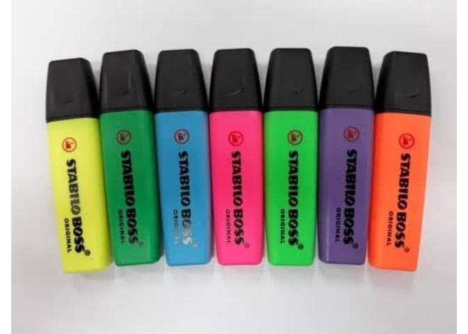
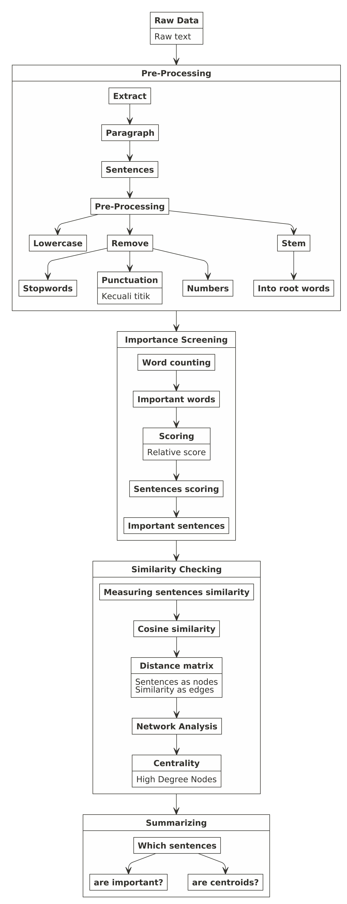

> Suatu masih SD, SMP, hingga SMA dulu. Pernah beberapa kali guru
> menugaskan saya dan teman-teman sekelas untuk merangkum materi dari
> buku.

Untuk beberapa guru, malahan kami disuruh untuk mencari sumber selain
buku yang digunakan di sekolah.

-----

## Bagaimana cara kita merangkum?

Setidaknya ada dua cara merangkum, yakni:

1.  **Merangkum dengan kata-kata sendiri**. Biasanya kita harus membaca
    semua tulisan terlebih dahulu, lalu menuliskan apa yang penting
    sesuai dengan pemahaman kita.
2.  **Merangkum dengan menuliskan kata-kata sesuai dengan yang ada di
    buku**. Biasanya saat membaca semua tulisan, kita menandai kata atau
    kalimat mana yang penting. Lalu kita tuliskan ulang kalimat-kalimat
    tersebut apa adanya.

Pertanyaannya:

> Bisakah kita membuat algoritma yang bisa merangkum sebuah tulisan?

Saya jawab *yah*:

> **Jawabannya bisa\!**

Sebelum saya membuat algoritmanya menggunakan **R**, mari saya
perkenalkan dulu dua cara tersebut.

### Merangkum dengan kata-kata sendiri

Dalam dunia *data science*, merangkum dengan kata-kata sendiri disebut
dengan *abstraction based summarization*.

Contoh sederhananya adalah sebagai berikut. Misalkan saya punya kalimat:

> Manchester United baru saja kalah dari RB Leipzig dengan skor 3-2 di
> laga penyisihan Liga Champion Eropa/

Maka hasil *abstraction based summarization*-nya kira-kira sebagai
berikut:

> Manchester United dikalahkan RB Leipzig.

*Summary* yang dihasilkan adalah kalimat baru hasil *rephrase* dari
konteks tulisan. Untuk bisa melakukan hal ini, kita perlu membuat model
*deep learning* yang rumit dan melatih model dengan berbagai macam
prinsip-prinsip **NLP** atau *language modelling*.

Analoginya itu seperti pulpen.

Kita bisa menuliskan apapun yang kita mau untuk merangkum tulisan
tersebut.

### Merangkum dengan menuliskan kata-kata yang sesuai di buku

Dalam dunia *data science*, merangkum dengan cara ini disebut dengan
*extraction based summarization*.

Cara kerjanya relatif lebih mudah dibandingkan dengan cara pertama.
Yakni dengan menentukan:

1.  Kalimat yang `penting`.
2.  Kalimat yang `sama`.

Analoginya seperti stabilo.

Kita hanya memberikan *highlight* terhadap kata atau kalimat yang
menurut kita penting dari tulisan tersebut.

Saya akan membuat algoritma berdasarkan cara kedua ini.

-----

# *Extraction Based Summarization*

## *Framework*

Misalkan saya memiliki suatu tulisan atau artikel atau buku yang panjang
dan saya diharuskan untuk merangkumnya. Cara yang akan saya lakukan
adalah menentukan kalimat mana saja yang penting. Setelah itu, dari
kalimat-kalimat tersebut, saya akan cek bagaimana *similarity* dari
kata-kata tersebut.

Logikanya, jika terdapat dua atau lebih kalimat yang `sama`, saya hanya
perlu menuliskan satu kalimat saja. Tidak perlu semuanya.

Berdasarkan *framework* sederhana itu, saya akan membuat algoritmanya
sebagai berikut:

Dari kesederhanaan *framework* di atas, ada beberapa titik kritis yang
perlu diperhatikan, yakni:

### *Pre-processing*

Dari tulisan yang ada, kita perlu mengetahui kalimat mana masuk ke dalam
paragraf mana. Untuk itu, tanda `titik` menjadi krusial sebagai pembeda
kalimat. Namun pada kenyataannya, `titik` tidak hanya digunakan sebagai
penanda antar kalimat tapi bisa digunakan sebagai pengganti `koma` dalam
*metric* atau *currency*.

Oleh karena itu, perlu ada algoritma yang bisa melakukan *tricky parts*
semacam ini memanfaatkan *regex* (*reguler expression*) dari pola-pola
karakter yang ada.

### *Importance*

Ini adalah proses yang termudah dari sekian langkah yang ada. Prinsipnya
adalah *word counting*. Secara logika, kata-kata yang sering muncul
merupakan kata yang penting dalam tulisan tersebut.

Agar tidak terjadi bias, maka *stopwords* dan *numbers* harus sudah
dihapus di tahap *pre-processing*.

Langkah yang penting di sini adalah mengembalikan *importance score* per
kata kembali ke kalimat awalnya. Lalu menghitung *importance score* dari
masing-masing kalimat.

Agar tidak terjadi bias, *importance score* suatu kalimat dihitung
dengan cara: .

### *Similarity*

*Similarity* dari dua kalimat dihitung dengan *cosine similarity*.

*Cosine similarity is a metric used to measure how similar the documents
are irrespective of their size. Mathematically, it measures the cosine
of the angle between two vectors projected in a multi-dimensional
space.*

Kita perlu menghitung angka *cosine similarity* dari semua kombinasi
pasangan kalimat yang ada. Oleh karena itu *output* dari perhitungan ini
berupa *matriks*.

> Sekarang sudah mengerti kenapa aljabar menjadi penting kan? *hehe*

Misalkan saya punya 51 buah kalimat. Maka akan terbentuk matriks `51
x 51` dengan isinya berupa *cosine similarity*. Matriks ini kita ubah
menjadi matriks jarak.

Setelah itu, saya akan menentukan kata mana yang menjadi *centroid*
dengan menghitung *degree* menggunakan prinsip [*network
analysis*](https://ikanx101.com/blog/sna-feedback/).

Sebenarnya ada beberapa cara menentukan *centroids* (pusat dari
*network* graf). Saya sudah mencoba menggunakan *degree*, *betweenness*,
dan *eigen value*. Tapi *degree* menghasilkan *summary* yang lebih baik.

Saya juga sudah mencoba alternatif lain seperti algoritma *Travelling
Salesperson Problem* untuk *clustering* *nodes* berdasarkan jaraknya.
Tapi cara *network analysis* masih memberikan hasil *summary* yang lebih
baik.

### *Summarizing*

Langkah terakhir ini adalah menentukan *threshold* untuk *importance
score* dan *degree*. Pada nilai berapa saja algoritma memilih kalimat
yang diinginkan.

-----

# *Case Study*

## *Toxic Seniority*

Sebagai contoh, saya akan mencoba melakukan *extraction based
summarization* dari tulisan di blog CEO
[Nutrifood](https://www.nutrifood.co.id/) (Pak
[Wumard](https://www.instagram.com/wumard/?hl=en)) berjudul: **Toxic
Seniority**.

> Bagi rekan-rekan yang menjadi *leader* di organisasi apapun, saya
> menyarankan kalian membaca tulisan beliau *yah*.

Tulisan lengkap beliau bisa dibaca di [*link* berikut
ini](https://wumard.wordpress.com/2020/09/20/toxic-seniority).

Berikut adalah data yang saya *scrape*:

    ##   id_paragraf
    ## 1           1
    ## 2           2
    ## 3           3
    ## 4           4
    ## 5           5
    ## 6           6
    ## 7           7
    ##                                                                                                                                                                                                                                                                                                                                                                                                                                                                                                                                                                                                                                                                                                                                                                                                                                                                                                                                                                                                                                                                                                                                                                                                                                                                          paragraf
    ## 1                                                                                                                                                                                                                                                                                                                                                                                                                                                Musim penerimaan mahasiswa baru saja dimulai. Seperti tahun-tahun sebelumnya, isu tentang ospek mulai melintas di linimasa media sosial. Walaupun sudah menjadi kontroversi bertahun-tahun, tetap saja ada kampus yang melaksanakannya dengan kekerasan, walaupun tahun ini hanya berupa kekerasan verbal karena aktivitas kampus masih dijalankan secara daring.  Ospek dengan kekerasan adalah salah satu perwujudan tentang pengagungan terhadap senioritas. Senior dianggap lebih mampu, lebih tahu, sehingga bisa membimbing junior dengan berbagai cara, termasuk dengan menggunakan kekerasan dan tekanan. Pengagungan terhadap senioritas bukan hanya terjadi di kampus, tapi juga mudah ditemukan di berbagai organisasi, termasuk di berbagai tempat kerja. Pengagungan berlebihan ini menjadi beracun, menjadi toxic.
    ## 2                                                                                                                                                                                                                                                                                                                    Saya mencoba mencari di wikipedia definisi toxic seniority, dan ternyata belum ada yang memulai mendeskripsikan isitilah ini. Kalau kita googling, yang kita temui adalah toxic leadership dan toxic masculinity. Di Wikipedia, kita bisa temukan kutipan tentang toxic masculinity seperti berikut: “In the social sciences, toxic masculinity refers to traditional cultural masculine norms that can be harmful to men, women, and society overall.” Sama halnya dengan toxic masculinity, norma tentang senioritas bisa menstigma pihak junior sebagai yang lebih tidak berekemampuan, lebih tidak berdaya, dan bahkan lebih tidak perlu dihargai. Sekilas kelihatan tidak ada yang salah, karena yang junior mungkin identik dengan yang masih hijau, tidak berpengalaman, tidak punya banyak hal untuk dihargai dan tidak berhak mendapatkan privilege. Namun, di dunia yang terus berubah dengan cepat, pernyataan tersebut makin lemah kebenarannya.
    ## 3 Di dunia yang bergerak makin cepat, pengetahuan bisa berubah menjadi beban atau liabilities, dan ketidaktahuan bisa menjadi berkah. Mengapa? Karena di era yang sangat dinamis ini, beberapa pengetahuan cepat menjadi usang, kebenaran yang diyakini sebelumnya bisa berubah seiring penemuan-penemuan baru, kebiasaan atau kompetensi lama yang menjadi keunggulan menjadi tidak relevan dan bahkan menjadi halangan untuk maju. Di dunia manajemen, perubahan yang cepat menuntut level agility yang tinggi. Strategic planning yang diagungkan di era sebelumnya kini makin berkurang relevansinya dan digantikan dengan strategic agility. Mengelola organisasi dengan birokrasi yang teratur dan kaku makin terengah-engah mengikuti era digital. Kontrol yang ketat makin kalah efektif dengan pemberdayaan. Struktur organisasi piramida tersaingi dengan struktur jaringan yang lebih cair. Di era seperti ini, belajar melepaskan pengetahuan menjadi tidak kalah penting dengan belajar mendapatkan pengetahuan baru. Sebagai analoginya, untuk membangun rumah baru, mungkin akan lebih mudah membeli tanah kosong dibandingakn dengan membeli rumah tua yang harus dirobohkan terlebih dahulu. Delearning dari para senior menjadi beban tambahan bagi organisasi.
    ## 4                                                                                                                                                                                                                                                                                                                                                                                                                                                                                                   Memang benar bahwa senioritas membawa kebijaksanaan. Tapi jangan lupa bahwa kebijaksanaan hanya akan hadir bila ada kerendahan hati. Senioritas akan berharga bila disertai hal tersebut. Tidak ada yang perlu dihargai berlebihan dari senioritas. Senior dan junior bisa saling melengkapi dan berkolaborasi dengan produktif dalam satu organisasi bila bisa saling menghargai. Jangan takut untuk merekrut orang-orang yang tidak berpengalaman tapi mempunyai kemampuan untuk belajar secara cepat. Jangan takut mengamanahkan orang yang masih junior untuk jabatan yang berat. Sebaliknya, tidak perlu alergi untuk menerima para senior untuk menangani teknologi-teknologi kekinian, sepanjang mereka punya semangat untuk terus belajar, delearning dan relearning.
    ## 5                                                                                                                                                                                                                                                                                                                                                                                                                               Seperti hukum pertama Newton tentang inersia, apa yang bergerak cenderung akan terus bergerak ke arah yang sama, apa yang diam cenderung akan tetap diam. Penghargaan berlebihan terhadap senioritas telah mendarah daging bukan hanya di berbagai organisasi, tapi juga di dalam budaya. Untuk mengubah hal tersebut tidak mudah. Tidak mudah bagi para junior untuk bersuara di sebagian besar organisasi. Dibutuhkan inisiatif dari para pemimpin organisasi untuk lebih memnberi ruang dan suara bagi para junior. Buat organisasi atau perusahaan yang sudah mapan, anda bisa sedinamis para perusahaan start-up. Mulailah dengan memberikan ruang bagi yang lebih muda, seimbangkan telinga anda dalam mendengar tanpa menekankan senioritas. Saatnya jurang pemisah antara senior dan junior dijembatani untuk kolaborasi yang lebih baik.
    ## 6                                                                                                                                                                                                                                                                                                                                                                                                                                                                                                                                                                                                                                                                                                                                                                                                                  Tidak mudah, tapi bukan tidak bisa. Sebagian dari kita mungkin pernah berkontribusi menyuburkan toxic seniority, entah masih saat ini, atau cuma saat masih di kampus. Entah dengan menggunakan kesungkanan para junior untuk menitipkan sanak keluarga di organisasi tersebut, atau cuma sekedar dulu ikut dalam panitia ospek. Saya ingin menutup ini dengan meminta maaf kalau ada tindakan dan kelalaian saya yang telah ikut menyuburkan toxic seniority.
    ## 7                                                                                                                                                                                                                                                                                                                                                                                                                                                                                                                                                                                                                                                                                                                                                                                                                                                                                                                                                                                                                                                                                                                                                                                                                                                  Tag:seniority, toxic seniority

Jika saya pecah ke bentuk kalimat, hasilnya sebagai berikut:

    ## [1] "7 Kalimat Teratas"

    ##   id_paragraf
    ## 1           1
    ## 2           1
    ## 3           1
    ## 4           1
    ## 5           1
    ## 6           1
    ## 7           1
    ##                                                                                                                                                                                                                   kalimat
    ## 1                                                                                                                                                                            musim penerimaan mahasiswa baru saja dimulai
    ## 2                                                                                                                               seperti tahun-tahun sebelumnya, isu tentang ospek mulai melintas di linimasa media sosial
    ## 3 walaupun sudah menjadi kontroversi bertahun-tahun, tetap saja ada kampus yang melaksanakannya dengan kekerasan, walaupun tahun ini hanya berupa kekerasan verbal karena aktivitas kampus masih dijalankan secara daring
    ## 4                                                                                                                             ospek dengan kekerasan adalah salah satu perwujudan tentang pengagungan terhadap senioritas
    ## 5                                                                        senior dianggap lebih mampu, lebih tahu, sehingga bisa membimbing junior dengan berbagai cara, termasuk dengan menggunakan kekerasan dan tekanan
    ## 6                                                                      pengagungan terhadap senioritas bukan hanya terjadi di kampus, tapi juga mudah ditemukan di berbagai organisasi, termasuk di berbagai tempat kerja
    ## 7                                                                                                                                                               pengagungan berlebihan ini menjadi beracun, menjadi toxic
    ##   id_kalimat
    ## 1          1
    ## 2          2
    ## 3          3
    ## 4          4
    ## 5          5
    ## 6          6
    ## 7          7

Jika saya cari *importance score per words* lalu saya kembalikan kembali
ke data di atas, didapatkan:

    ## [1] "7 Kalimat Teratas"

    ## # A tibble: 7 x 4
    ##   id_paragraf id_kalimat kalimat                                           score
    ##         <int>      <int> <chr>                                             <dbl>
    ## 1           1          2 media                                           0.00952
    ## 2           1          3 daring verbal yang                              0.102  
    ## 3           1          5 junior senior                                   0.0667 
    ## 4           1          7 toxic                                           0.0952 
    ## 5           2          8 seniority toxic yang                            0.143  
    ## 6           2          9 google leadership masculinity toxic toxic yang  0.0889 
    ## 7           2         10 cultural harmful masculine masculinity masculi… 0.0259

Lalu bentuk *network analysis*-nya sebagai berikut:

<!-- -->

Menggunakan *threshold* berupa *mean* dari *importance* dan *degree*,
maka hasil rangkuman dari tulisan ini adalah:

    ## [1] "pengagungan berlebihan ini menjadi beracun, menjadi toxic"                                                                                                                 
    ## [2] " namun, di dunia yang terus berubah dengan cepat, pernyataan tersebut makin lemah kebenarannya"                                                                            
    ## [3] " kontrol yang ketat makin kalah efektif dengan pemberdayaan"                                                                                                               
    ## [4] " struktur organisasi piramida tersaingi dengan struktur jaringan yang lebih cair"                                                                                          
    ## [5] " sebagai analoginya, untuk membangun rumah baru, mungkin akan lebih mudah membeli tanah kosong dibandingakn dengan membeli rumah tua yang harus dirobohkan terlebih dahulu"
    ## [6] " tidak ada yang perlu dihargai berlebihan dari senioritas"                                                                                                                 
    ## [7] " jangan takut untuk merekrut orang-orang yang tidak berpengalaman tapi mempunyai kemampuan untuk belajar secara cepat"                                                     
    ## [8] " mulailah dengan memberikan ruang bagi yang lebih muda, seimbangkan telinga anda dalam mendengar tanpa menekankan senioritas"

-----

# *Summary*

Algoritma ini sudah dicoba untuk berbagai macam tipe artikel. Saya
pribadi cukup puas dengan kinerja algoritma ini walaupun ada beberapa
celah yang bisa terus dikembangkan.

Salah satu kelemahan algoritma ini adalah saat menemui artikel yang
dipenuhi dengan angka.
