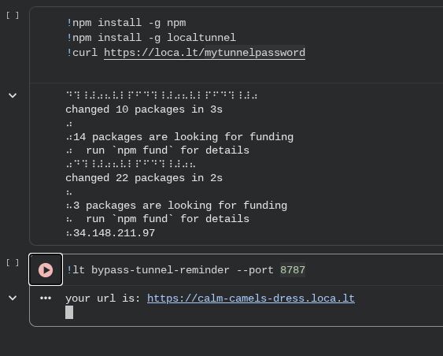
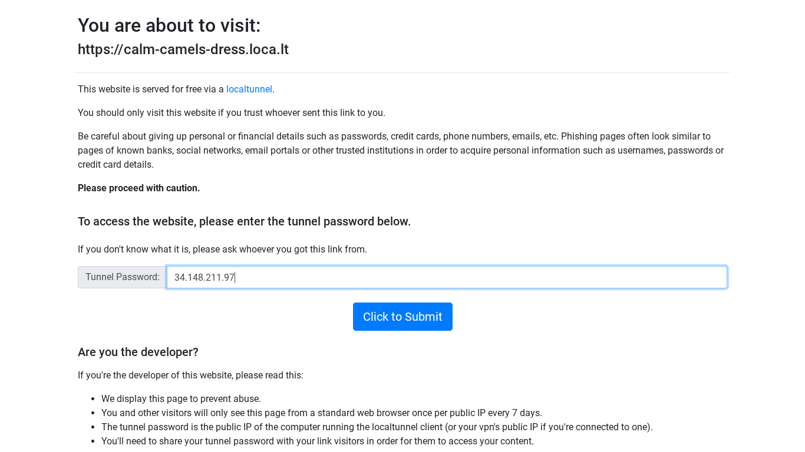
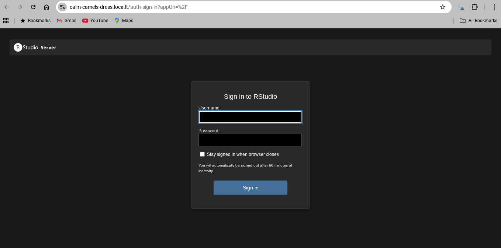

Pada tahun 2021, [pertama kali](https://ikanx101.com/blog/r-server-colab/) saya berhasil mencoba meng-_install_ __R Studio Server__ ke dalam __Google Colab__. Lalu pada 2025, saya coba _update_ skripnya dan [berhasil kembali melakukan](https://ikanx101.com/blog/r-server-april25/) hal tersebut. 

> Berhubung dunia ini sangat dinamis, maka saya perlu melakukan _update_ skrip apakah saya masih bisa melakukan hal tersebut kembali. Setidaknya versi __R Studio Server__ yang digunakan harus di-_update_ ke versi yang terbaru.

Oke, berikut adalah _update_ skripnya:

## Langkah I

Buat _user_ Linux beserta _password_-nya. Setelah itu lakukan _update_ dan _install_ `base-R`.

```
!sudo useradd -m -s /bin/bash rstudio
!echo rstudio:password | chpasswd

# melakukan update Linux
!apt-get update

# install R base (cli version)
!apt-get install r-base
```

## Langkah II

_Install_ beberapa _libraries_ di Linux.

```
# install beberapa library Linux
!apt-get install libglpk-dev # ini khusus untuk optimisasi
!apt-get install gdebi-core

!sudo add-apt-repository ppa:nrbrtx/libssl1
!sudo apt update
!sudo apt install libssl1.1
!apt install openssl
```

## Langkah III

_Download_ _installer_ __R Studio Server__ versi terbaru dan _library_ `gdebi` untuk proses instalasi.

```
!wget https://download2.rstudio.org/server/jammy/amd64/rstudio-server-2026.01.1-403-amd64.deb

!apt-get install gdebi-core

!sudo gdebi rstudio-server-2026.01.1-403-amd64.deb
```

Jika berhasil sampai sini, berarti __base-R__ dan __R Studio Server__ sudah berhasil di-_install_.

## Langkah IV

Agar bisa mengakses __R Studio Server__, kita perlu melakukan _forwarding_ _port_ `8787` dengan cara menggunakan _localtunnel_.

```
!npm install -g npm
!npm install -g localtunnel
!curl https://loca.lt/mytunnelpassword
!lt bypass-tunnel-reminder --port 8787
```

Jika berhasil, maka akan muncul seperti ini:



Simpan __alamat IP__ sebagai _password_ layanan _localtunnel_. Klik _link_ yang diberikan dan masukkan _password_:



Klik __submit__ dan __R Studio Server__ bisa dinikmati segera.



Mudah kan?

---
  
`if you find this article helpful, support this blog by clicking the ads.`


