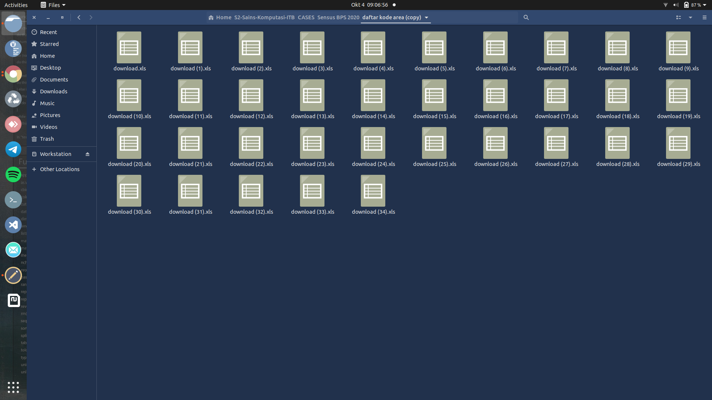

```{r setup, include=FALSE}
knitr::opts_chunk$set(echo = TRUE)
```

Bagi rekan-rekan yang sering mengunduh _files_ _excel_ dari situs BPS atau portal pemerintah lainnya, biasanya _format file_ yang akan kita dapatkan berbentuk `.xls`. Salah satu masalah yang berpeluang muncul adalah _file_ tersebut tidak bisa terbaca oleh __R__ atau __Python__ secara langsung. 

Kenapa?

> Memang agak aneh, padahal sudah menggunakan `readxl` atau `openxlsx`. Saya menghindari _libraries_ _Excel_ yang bergantung pada _Java_.

Lantas bagaimana agar _file_ tersebut bisa terbaca di __R__?

> Kita diharuskan membuka _file_ tersebut (menggunakan _Ms. Excel_ atau _Libreoffice_ di Linux) lalu men-_save_ ke dalam format `.xlsx`.

Setelah di-_convert_, baru kita bisa dengan aman mengimpor _file_ tersebut ke dalam __R__.

---

Hal ini akan menjadi masalah besar jika _files_ yang harus di-_convert_ banyak. Sebagai contoh, saya memiliki 35 _files_ hasil unduhan dari BPS dalam satu _folder_ berikut:

```{r out.width="75%",echo=FALSE,fig.align='center'}

```

> Lantas bagaimana cara saya untuk _convert_ semua _files_ ini dengan otomatis, cepat dan _reliable_?

_Alhamdulillah_, saya menggunakan Linux, sehingga saya bisa memanfaatkan perintah _Shell_ sederhana untuk melakukan ini. Caranya:

1. Buka `TERMINAL`.
1. Arahkan ke _directory folder_ tempat _files_ yang hendak di-_convert_ dengan perintah `cd`.
1. Ketik dan _run_ perintah berikut:

```
for i  in *.xls; do  libreoffice --headless --convert-to xlsx "$i" ; done
```

Perintah tersebut menyuruh Linux _run_ Libreoffice di _background process_ untuk membuat semua _files_ bertipe `xls` dan _re-save as_ ke _files_ bertipe `.xlsx` dengan tetap menggunakan nama _file_ asalnya.

---

`if you find this article helpful, support this blog by clicking the ads.`