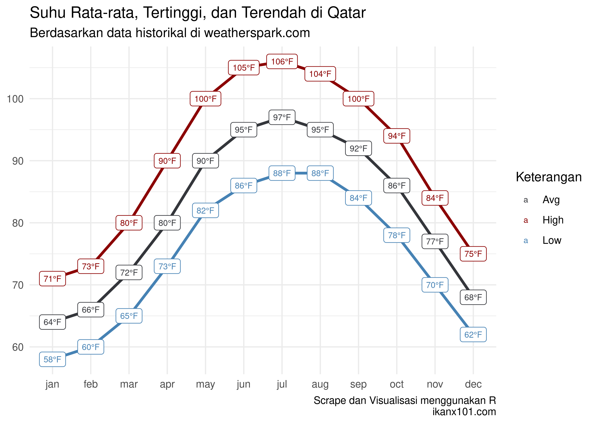

Oprek Data Terkait Piala Dunia 2022
================

Beberapa minggu lalu, saya berbincang dengan rekan kerja saya terkait
dunia sepakbola luar negeri (bukan terkait musibah di Kanjuruhan *yah*).
Ternyata saya baru sadar bahwa Piala Dunia Qatar akan diselenggarakan
dalam waktu dekat. Berbeda dengan penyelenggaraan Piala Dunia sebelumnya
yang selalu dilakukan pada musim panas jeda kompetisi (sekitar Juli -
Agustus). Karena alasan iklim di Qatar, maka waktu pelaksanaan diundur
menjadi bulan November.

Hal ini tentu merupakan hal yang baru pertama kali dilakukan sepanjang
sejarah.

> Lantas saya berpikir, apakah iklim atau cuaca berpengaruh terhadap
> kompetisi atau tidak?

Tak menunggu waktu lama, saya coba *scrape* data temperatur bulanan di
Qatar dari situs
[*weatherspark*](https://weatherspark.com/y/150272/Average-Weather-in-Qatar-Year-Round).

Kita bisa melihat bahwa musim panas di Qatar benar-benar panas sehingga
bisa jadi akan mengganggu permainan beberapa timnas sepakbola yang tidak
terbiasa dengan suhu panas seperti negara-negara dari Eropa.

Saya pernah mendengar suatu mitos dalam Piala Dunia bahwa negara Eropa
lebih sering menang jika bermain di benua Eropa. Sedangkan negara-negara
non Eropa (Amerika Latin) lebih sering menang jika bermain di luar benua
Eropa. Salah satu alasannya adalah karena faktor cuaca atau iklim atau
suhu saat bermain.

Untuk mengkonfirmasi kebenarannya, saya *scrape* data mengenai
pertandingan final setiap Piala Dunia sejak tahun `1954`.

Terlihat dengan jelas bahwa mitos tersebut benar adanya. Anomali terjadi
pada tiga pertandingan final berikut:

| year | winners | score\_2     | runners\_up | venue            | location                   | attendance |
| :--- | :------ | :----------- | :---------- | :--------------- | :------------------------- | :--------- |
| 1958 | Brazil  | 5–2          | Sweden      | Råsunda Stadium  | Solna (Stockholm), Sweden  | 51,800     |
| 2010 | Spain   | 1–0 (a.e.t.) | Netherlands | Soccer City      | Johannesburg, South Africa | 84,490     |
| 2014 | Germany | 1–0 (a.e.t.) | Argentina   | Maracanã Stadium | Rio de Janeiro, Brazil     | 74,738     |
