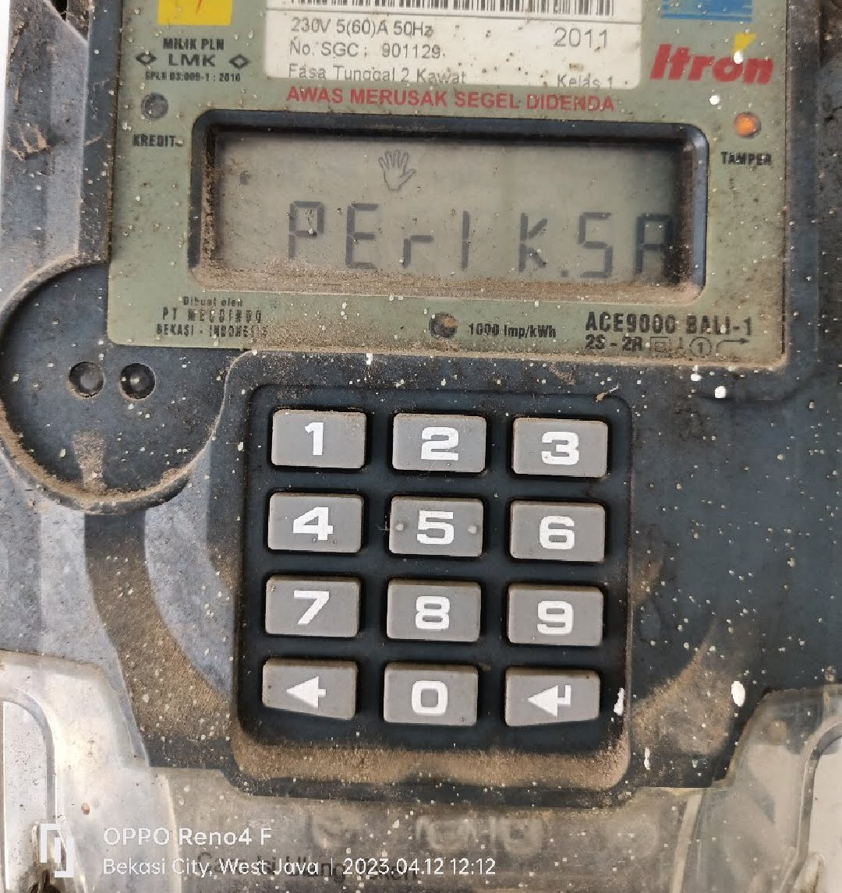
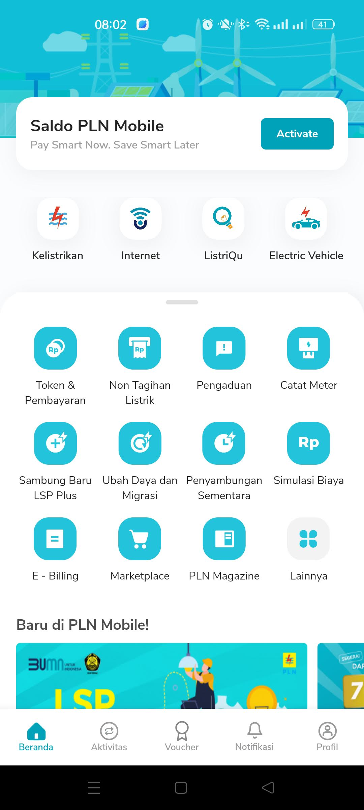
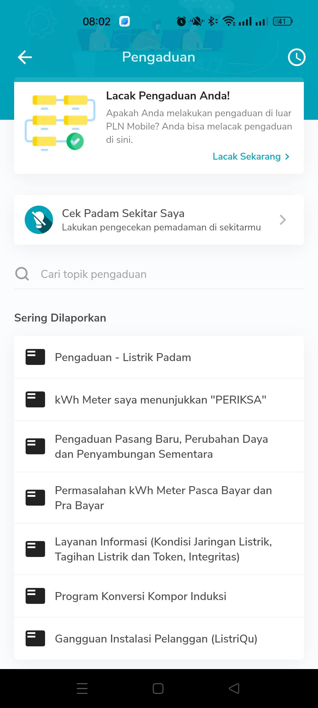
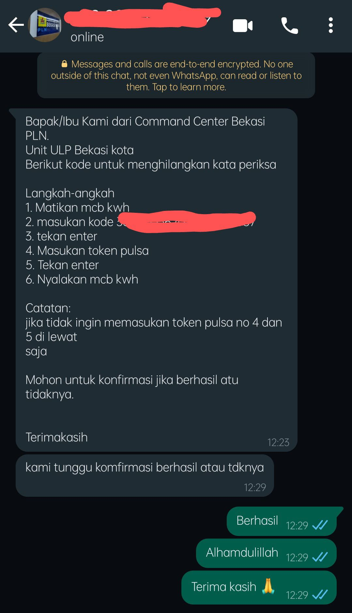
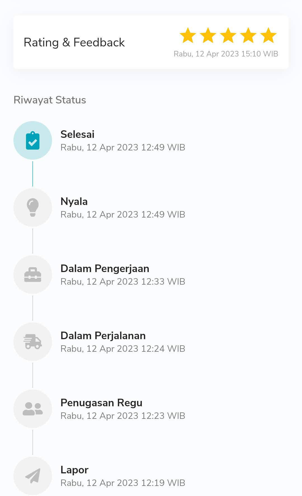

```{r setup, include=FALSE}
knitr::opts_chunk$set(echo = TRUE)
setwd("~/ikanx101.github.io/_posts/lainnya/kwh meter")
library(knitr)
```

Mohon maaf sebelumnya jika saya menuliskan sesuatu di luar topik yang biasa saya bahas pada _blog_ ini. Namun karena tadi siang saya pertama kali mengalami masalah listrik seperti ini, saya rasa hal ini menjadi penting untuk saya _share_ kepada khalayak ramai.

Jadi begini ceritanya:

---

Siang tadi, `kwh meter` di rumah saya berbunyi tanda pulsa listrik prabayar sudah mau habis. Seketika itu juga saya membeli _token_ listrik di _marketplace_. Namun ada keanehan saat saya hendak memasukkan 20 _digit token_ ke `kwh meter`. 

> Setiap usaha saya memasukkan angka token selalu GAGAL. Akibatnya pulsa listrik tidak bertambah.

Saat itu saya baru sadar bahwa ada tulisan `PERIKSA` di `kwh meter` saya tersebut.

```{r out.width="30%",echo=FALSE,fig.align='center',fig.retina=3}

```

> __Lantas bagaimana menyelesaikan masalah ini?__

Oke, hal pertama yang harus teman-teman lakukan adalah jangan panik. Kita bisa menghubungi PLN dengan berbagai macam cara. Saya sendiri memilih untuk menggunakan aplikasi __PLN Mobile__. 

Pertama-tama, buka aplikasi __PLN Mobile__.

```{r out.width="30%",echo=FALSE,fig.align='center',fig.retina=3}

```

Lalu buka `tab` __Pengaduan__.

```{r out.width="30%",echo=FALSE,fig.align='center',fig.retina=3}

```

Setelah itu, kita cukup membuat pengaduan terhadap `kwh meter` kita. Kita akan disuruh melakukan __verifikasi 9 tahap__, yakni dengan cara __menginput 2 digit angka__ yang diberikan di aplikasi __PLN Mobile__ ke dalam `kwh meter` lalu __menginput hasilnya kembali ke__ __PLN Mobile__.

Setelah selesai, kita akan diberikan informasi bahwa pengaduan akan diproses. Kita cukup menunggu 1-3 jam untuk petugas PLN menghubungi kita. Namun dari pengalaman saya kemarin, tidak sampai 15 menit saya sudah mendapatkan pesan WA mengenai cara me-_reset error_ pada `kwh meter` saya tersebut

```{r out.width="30%",echo=FALSE,fig.align='center',fig.retina=3}

```

Setelah mengikuti langkah yang diberikan, permasalahan saya selesai dengan baik.

```{r out.width="30%",echo=FALSE,fig.align='center',fig.retina=3}

```

Jika dilihat dari rekap _timeline_, pelayanan dari PLN sangat sigap. 
