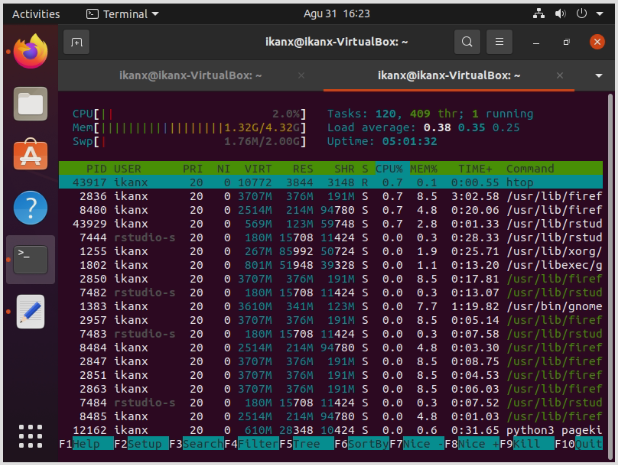

```{r setup, include=FALSE}
knitr::opts_chunk$set(echo = TRUE)
rm(list=ls())

```

Ya, Anda tidak salah baca. Tulisan ini mirip dengan [tulisan sebelumnya](https://ikanx101.com/blog/ngrok-io/) namun berbeda _server_ dan cara melakukan _forwarding_-nya.

Dalam beberapa hari ini saya masih terobsesi dengan:

> _Bagaimana cara mengakses R Studio Server yang saya install di local melalui koneksi internet dari gadget mana saja di mana saja_.

Pada tulisan sebelumnya, saya menggunakan _software_ `ngrok` untuk melakukan hal tersebut. Kali ini saya akan menggunakan _software_ `pagekite`. 

## Begini Ceritanya

Jadi selain laptop kantor, saya memiliki satu _dedicated PC_ yang ada di laboratorium di Kantor. Iya, kamu tidak salah baca. Kantor saya punya laboratorium.

_Nah_, PC tersebut memang biasa saya gunakan untuk melakukan _web scraping_ `24/7`. PC tersebut berjalan menggunakan OS Windows.

Semalam saya mencoba meng-_install_ VirtualBox agar PC tersebut bisa menjalankan Ubuntu 20.04 LTS layaknya di laptop kantor saya. Setelah berhasil, saya _install_ R [Studio Server](https://ikanx101.com/blog/rstudio-server/). Prosesnya mudah namun agak lama karena koneksinya ternyata tidak stabil.

Setelah selesai, saya bisa mengakses R Studio Server melalui `localhost:8787`. Nah sekarang untuk bisa mem-_forward_-nya, saya menggunakan _software_ `pagekite`.

Mirip dengan `ngrok`, kita cukup akses [situsnya](https://pagekite.net/) terlebih dahulu dan membuat akun gratis. Setelah itu, kita bisa mendaftarkan alamat _page_ sebagai tujuan _forward_ tadi.

Berbeda dengan `ngrok` yang selalu mendapatkan alamat _page_ yang _random_. `Pagekite` selalu mem-_forward_ ke alamat _page_ yang kita daftarkan dari awal. Hal ini akan membuat hidup kita lebih mudah karena kita tinggal menggunakan alamat _page_ yang mudah diingat.

Setelah daftar di situs dan _install_ `pagekite` di PC, melalui CLI kita bisa langsung mengaktifkan `pagekite` dengan memanggilnya melalui _Python_.

Oh iya, penggunaan _traffic_ pada `pagekite` di batasi sekitar 2.5 GB saja. Jika kuota tersebut habis, bisa jadi akan ada tambahan biaya. Nanti saya coba _update_ lagi ya.

```
Screenshot VirtualBox
```

```{r out.width="70%",echo=FALSE,fig.align='center'}

```


