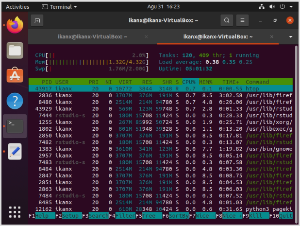

Review Menggunakan PageKite untuk Forward R Studio Server ke Internet
================

Ya, Anda tidak salah baca. Tulisan ini mirip dengan [tulisan
sebelumnya](https://ikanx101.com/blog/ngrok-io/) namun berbeda *server*
dan cara melakukan *forwarding*-nya.

Dalam beberapa hari ini saya masih terobsesi dengan:

> *Bagaimana cara mengakses R Studio Server yang saya install di local
> melalui koneksi internet dari gadget mana saja di mana saja*.

Pada tulisan sebelumnya, saya menggunakan *software* `ngrok` untuk
melakukan hal tersebut. Kali ini saya akan menggunakan *software*
`pagekite`.

## Begini Ceritanya

Jadi selain laptop kantor, saya memiliki satu *dedicated PC* yang ada di
laboratorium di Kantor. Iya, kamu tidak salah baca. Kantor saya punya
laboratorium.

*Nah*, PC tersebut memang biasa saya gunakan untuk melakukan *web
scraping* `24/7`. PC tersebut berjalan menggunakan OS Windows.

Semalam saya mencoba meng-*install* VirtualBox agar PC tersebut bisa
menjalankan Ubuntu 20.04 LTS layaknya di laptop kantor saya. Setelah
berhasil, saya *install* R [Studio
Server](https://ikanx101.com/blog/rstudio-server/). Prosesnya mudah
namun agak lama karena koneksinya ternyata tidak stabil.

Setelah selesai, saya bisa mengakses R Studio Server melalui
`localhost:8787`. Nah sekarang untuk bisa mem-*forward*-nya, saya
menggunakan *software* `pagekite`.

Mirip dengan `ngrok`, kita cukup akses [situsnya](https://pagekite.net/)
terlebih dahulu dan membuat akun gratis. Setelah itu, kita bisa
mendaftarkan alamat *page* sebagai tujuan *forward* tadi.

Berbeda dengan `ngrok` yang selalu mendapatkan alamat *page* yang
*random*. `Pagekite` selalu mem-*forward* ke alamat *page* yang kita
daftarkan dari awal. Hal ini akan membuat hidup kita lebih mudah karena
kita tinggal menggunakan alamat *page* yang mudah diingat.

Setelah daftar di situs dan *install* `pagekite` di PC, melalui CLI kita
bisa langsung mengaktifkan `pagekite` dengan memanggilnya melalui
*Python*.

Oh iya, penggunaan *traffic* pada `pagekite` di batasi sekitar 2.5 GB
saja. Jika kuota tersebut habis, bisa jadi akan ada tambahan biaya.
Nanti saya coba *update* lagi ya.

    Screenshot VirtualBox

