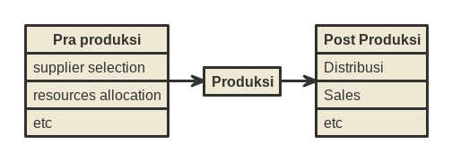

```{r setup, include=FALSE}
knitr::opts_chunk$set(echo = TRUE)
```

Tujuan mulia setiap perusahaan adalah mendapatkan _profit_. Untuk melakukannya, mereka harus menyelesaikan dua masalah utama, yakni:

1. _Cost efficiency_,
1. _Increase sales_.

Salah satu bentuk _cost efficiency_ yang bisa dilakukan oleh perusahaan manufaktur adalah dengan menelaah lebih kembali semua proses dalam _supply chain management_ (_SCM_). Secara simpel, SCM bisa saya gambarkan dalam skema berikut ini:

```{r out.width="60%",echo=FALSE}

```

Pada proses distribusi, proses _replenishment_ gudang distributor menjadi hal yang sangat krusial. Kenapa?

- Jika terjadi _overstock_, tentu hal ini akan merugikan baik distributor dan produsen. Apalagi jika produk tersebut tidak termasuk produk yang cepat terjual. Istilah lapangan untuk hal ini adalah _duit nganggur_.
- Jika terjadi _understock_, tentunya distributor dan produsen akan mengalami _loss sales_. Di saat _sales_ bisa terjadi, justru produk langka.

Oleh karena itu, biasanya ada tim khusus yang bertugas untuk menghitung kapan dan berapa gudang distributor harus diisi kembali. Untuk beberapa perusahaan, tim khusus tersebut sudah diganti dengan __AI__ (baca: algoritma prediksi dan optimisasi).

> ___Lantas bagaimana algoritma tersebut bekerja?___

Secara sederhana, kita bisa membagi keadaan gudang menjadi tiga _states_, yakni:

1. _Input_, yakni berapa produk yang harus kita _feed_ ke dalam gudang. Dalam hal _feeding_ ini, kita perlu memperhitungkan _time delivery_ produk dari pabrik hingga sampai ke distributor. Ini adalah tujuan dari algoritma _replenishment_.
1. _Current_, yakni stok _existing_ gudang dan maks kapasitas yang bisa ditampung oleh gudang.
1. _Output_, yakni tarikan produk keluar akibat _demand_ atau _sales_.

Keadaan akan semakin rumit saat produk yang terlibat memiliki banyak varian dengan _demand_ yang berbeda-beda. 

Dalam kasus ini, misalkan saya hanya memiliki data historikal stok harian produk-produk di distributor tertentu. Data tersebut sudah lebih dari cukup untuk membuat algoritma _automatic replenishment_. Kok bisa?

## Tahap I

Dari data historikal stok harian setiap produk, kita bisa membuat model _time series_ yang bertujuan untuk melakukan _forecast_ produk keluar distributor (terjadi _sales_) dalam waktu 1 - 2 minggu ke depan (rentang waktu ini tergantung pada waktu pengiriman produk dari pabrik ke distributor).

Model _time series_ ini akan dijadikan acuan angka _demand_ harian yang nilainya akan selalu berubah dan _updated_ setiap harinya.

## Tahap II

Dari hasil _forecast_ sebelumnya, kita akan membuat algoritma optimisasi dengan parameter-parameter berupa:

1. Waktu pengiriman produk.
1. Biaya pengiriman produk.
1. Kapasitas mobil pengiriman.
1. Maks kapasitas gudang.
1. _Inventory_ produk _existing_ di gudang.
1. _Forecast_ per produk.
1. Minimal _inventory_ per produk harian.

lalu _constraints_-nya:

1. Pengiriman tidak boleh melebihi kapasitas mobil dan kapasitas gudang (setelah ditambah _inventory_ _existing_ di gudang).
1. _Inventory_ per produk harian harus selalu terpenuhi.

lalu tujuannya adalah:

> ___Meminimalkan biaya pengiriman___.