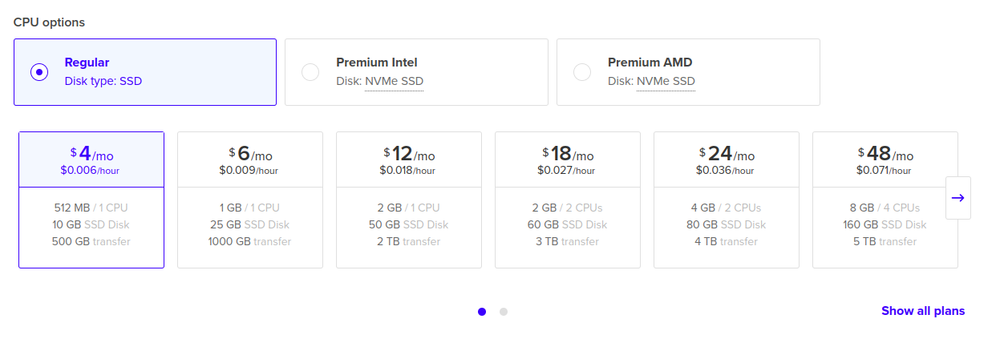
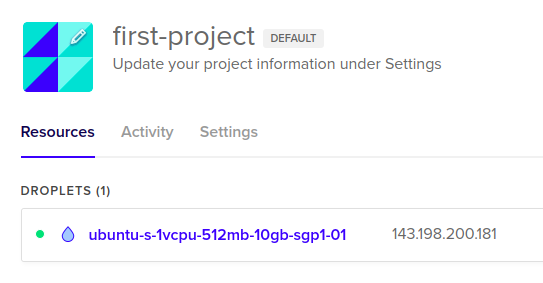
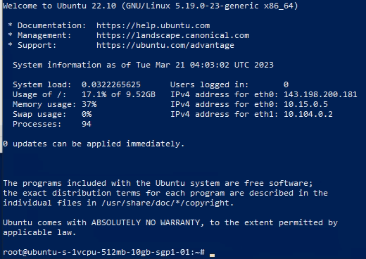
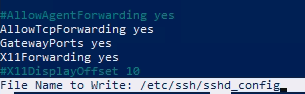
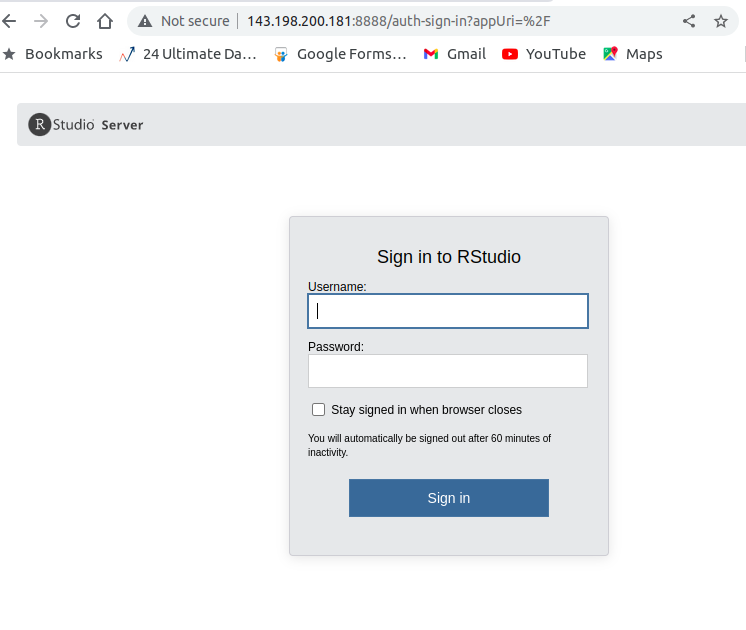

```{r setup, include=FALSE}
knitr::opts_chunk$set(echo = TRUE)
setwd("/cloud/project/_posts/lainnya/reverse tunnel")
```

Beberapa bulan yang lalu, saya sempat menuliskan bagaimana cara agar __RStudio Server__ (kini bernama __Posit Server__) yang kita miliki di _local_ bisa diakses dari jaringan internet melalui metode __IP__ _forwarding_ menggunakan dua layanan:

- [ngrok](https://ikanx101.com/blog/ngrok-io/).
    - Plus: gratis.
    - Negatif: _link_ yang digunakan berubah-ubah (jika menggunakan akun gratis).
- [pagekite](https://ikanx101.com/blog/page-kite/).
    - Plus: _link_ bisa _customize_ sesuai dengan kebutuhan.
    - Negatif: _free trial_ dengan _bandwith_ sebesar 2.5 Gb.

Salah satu yang saya _notice_ adalah keduanya memiliki limitasi di _bandwith_. Kadang _lag_ yang ditimbulkan cukup mengganggu bagi saya.

---

## Alternatif Lain

Salah satu alternatif lain yang bisa dicoba adalah dengan menggunakan teknik _reverse ssh_. Syarat yang harus dipenuhi untuk menggunakan metode ini adalah __kita harus memiliki VPS dengan IP publik__. VPS tersebut tidak harus memiliki spek yang dewa. Cukup spek sederhana saja kita bisa menggunakannya.

> Cara kerjanya simpel, yakni dengan membuat VPS mengakses __RStudio Server__ di _local_ dengan `ssh` secara kontinu.

Kali ini saya akan tunjukan caranya dengan memanfaatkan VPS dari situs [_Digital Ocean_](https://cloud.digitalocean.com/). _Yuk_ disimak.

---

### Langkah I

Buat VPS (atau disebut dengan _droplet_) di situs [_Digital Ocean_](https://cloud.digitalocean.com/).

```{r out.width="80%",echo=FALSE,fig.align='center'}

```

Saya akan sewa VPS dengan spek paling kecil dan harga paling murah (sekitar 4 USD per bulan).

Setelah selesai, kita akan memiliki satu alamat IP publik sebagai berikut:

```{r out.width="40%",echo=FALSE,fig.align='center'}

```

### Langkah II

Kita buka VPS tersebut melalui `ssh` di __terminal__.

```
ssh root@143.198.200.181
```

```{r out.width="50%",echo=FALSE,fig.align='center'}

```

Lalu kita _edit_ file berikut ini `sshd_config`. Kita bisa akses di:

```
sudo nano /etc/ssh/sshd_config
```

Ganti _setting_ ke sebagai berikut:

```
AllowTcpForwarding yes
GatewayPorts yes
```

```{r out.width="50%",echo=FALSE,fig.align='center'}

```

Kita _restart_ `ssh` nya dengan perintah:

```
sudo su
/etc/init.d/ssh restart
```

### Langkah III

Langkah terakhir adalah melakukan _reverse_ `ssh` dari _port_ `8888` _local_ saya (_RStudio Server_ saya berjalan di `localhost:8888`) ke port `8888` di VPS dengan perintah sebagai berikut:

```
ssh -NR 8888:localhost:8888 root@143.198.200.181
```

Jika sudah selesai, kita bisa akses `143.198.200.181:8888` di _browser_ dengan menggunakan _gadget_ apapun.

```{r out.width="60%",echo=FALSE,fig.align='center'}

```

---

Bagaimana? Mudah _kan_?
