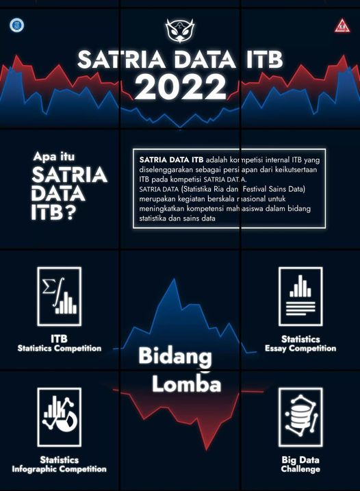

```{r setup, include=FALSE}
knitr::opts_chunk$set(echo = TRUE)
```

Setiap tahun, __Pusat Prestasi Nasional__ (Puspresnas) Kemendikbud selalu mengadakan kompetisi bagi para mahasiswa S1 se-Indonesia yang diberi judul __Satria Data__.

ITB secara _official_ belum pernah mengirimkan wakilnya ke dalam kompetisi tersebut. Oleh karena itu Ditmawa ITB dan FMIPA ITB membentuk kepanitiaan dari dosen dan profesional untuk membuat kompetisi kecil skala kampus untuk menjaring mahasiswa/i yang akan menjadi wakil resmi di kompetisi nasional Puspresnas.

Kompetisi "kecil" ini sendiri dibagi menjadi 4 kategori sesuai dengan kompetisi aslinya, yakni:

1. _Statistic Competition_,
1. _Essay Statistitc Competition_,
1. _Infographic Competition_, dan
1. _Big Data Challenge_ (BDC).

Saya didapuk menjadi penanggung jawab bagi kompetisi BDC. Tugasnya itu membuat soal dan menjadi salah satu dewan juri saat fase final nanti.

Karena tidak ada bocoran sama sekali bagaimana kompetisi Satria Data tahun lalu, maka saya membuat soal sendiri dari data publik. Hal yang penting adalah data yang digunakan bukan data sintetis. Karena tidak mungkin juga saya menggunakan data dari perusahaan tempat saya bekerja, maka kasusnya saya ambil (_web scrape_) dari situs OLX Autos, yakni:

> ___Melakukan prediksi harga mobil bekas dari informasi yang tersedia.___

Agar menantang, sengaja data yang saya berikan benar-benar _raw_. Peserta diberikan keleluasaan sebesar-besarnya untuk mengekstrak _features_ dari data tersebut. Sekalian menguji kemampuan _data pre-processing_ mereka. Parameter yang digunakan untuk menentukan kualitas akurasi dari prediksi harga tersebut adalah __MAPE__ (_mean absolute percentage error_).

Kompetisinya saya buat di _platform_ __Kaggle__ sehingga _workload_ saya menjadi _less effort_ (karena proses perhitungan dan penentuan nilai setiap tim dilakukan secara otomatis). Kompetisinya sendiri baru resmi dimulai pada Senin pagi kemarin. 

Total ada 17 tim mahasiswa yang mengikuti kemudian akan disaring menjadi 10 finalis yang kelak akan diberikan kesempatan untuk mempresentasikan model _machine learning_ (atau _deep learning_) yang mereka buat. 

```{r,echo=FALSE,fig.align='center'}

```
