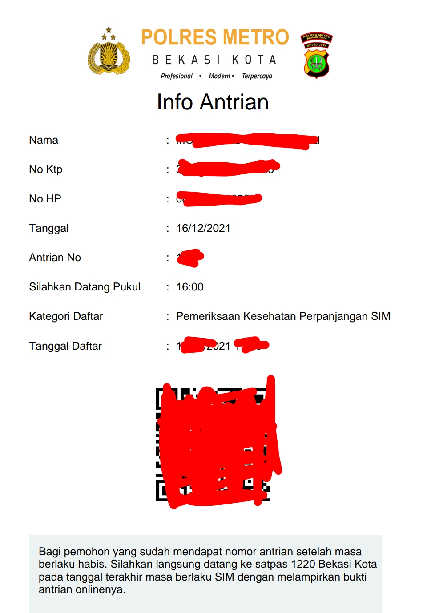

```{r,include = FALSE}
rm(list=ls())
```

Kali ini saya mau menulis sesuatu yang diluar kebiasaan _blog_ ini _yah_. Semoga bermanfaat untuk kalian semua.

---

Ceritanya pada bulan Desember 2021 ini, SIM C saya sudah habis masa berlakunya. Sempat terpikir untuk membuat SIM secara _online_ melalui __layanan SIM online Korlantas__. Tapi setelah mendapatkan saran dan rekomendasi dari beberapa teman yang sudah mencoba, akhirnya saya memutuskan untuk tetap memperpanjang SIM secara _offline_ saja.

Beberapa tahun lalu (sebelum ada pandemi), saat SIM A saya habis masa berlakunya, Polres Kota Bekasi menerapkan layanan perpanjangan SIM 24 jam. Dulu saya pernah memperpanjang SIM A pada pukul 04.30 pagi selepas shalat Shubuh.

Nah, saat kondisi pandemi ini saya belum tahu bagaimana mekanisme terbarunya.

_Alhamdulillah_, saat mendengarkan radio Dakta, saya mendapatkan informasi bahwa kini perpanjangan SIM di kota Bekasi bisa dilakukan di:

1. Mall Pelayanan Publik (MPP, untuk pagi hari), dan
1. Polres Metro Bekasi (untuk sore hingga malam hari).
1. Pelayanan SIM Keliling di beberapa tempat di Kota Bekasi.

Sistem perpanjangan SIM di MPP dan Polres memiliki kesamaan:

> __Setiap orang yang hendak memperpanjang SIM wajib mendaftar secara online terlebih dahulu.__

Berdasarkan informasi tersebut, saya mencoba untuk mendaftar antrian di Mall Pelayanan Publik melalui situs [__mpp.bekasikota.go.is__](http://mpp.bekasikota.go.id). Pada hari H, ternyata saya salah alamat. Saya malah datang ke __Bekasi Junction__ di _ex_ Pasar Proyek. Ternyata kini MPP ada di __Bekasi Trade Center__ (BTC) di Jalan Joyo Martono dekat pintu tol Bekasi Timur.

Oleh karena gagal pada percobaan pertama, saya memutuskan untuk mendaftar antrian kembali di Polres Metro Bekasi Kota. Aturannya adalah kira bisa mendaftar H-2 sebelum hari kedatangan. Silakan mendaftar ke situs [berikut ini](https://antrian.polrestrobekasikota.com).

Setelah itu, kita akan mendapatkan konfirmasi sebagai berikut:

```{r out.height = "60%",echo=FALSE}

```

Simpan baik-baik dan _print_ sebagai tanda bukti untuk diserahkan pada saat pemeriksaan kesehatan di Polres nanti. Sediakan juga dua fotokopi KTP untuk prosesnya nanti.

Pada hari H, setibanya di Polres Metro Bekasi, segera masuk ke jalan di antara Polres dan Pengadilan. Tempat perpanjangan SIM ada di jalan tersebut.

### __Langkah I__

Setelah tiba, langkah pertama yang harus kita lakukan adalah __pemeriksaan kesehatan__. _Print_ bukti pendaftaran akan digunakan di sini. Antrian pemeriksaan disesuaikan dengan antrian pada pendaftaran _online_. _Oh iya_, siapkan uang pas `Rp35.000`, SIM lama, dan satu buah _fotocopy_ KTP.

### __Langkah II__

Setelah itu, segera masukin ruang utama perpanjangan SIM. Kita akan diberikan blanko form untuk kemudian diisi. Khusus perpanjangan SIM, pengisiannya sangat mudah dan cepat.

### __Langkah III__

Lakukan pembayaran asuransi sebesar `Rp50.000` dan biaya perpanjangan SIM sesuai dengan jenis SIM-nya. Serahkan blanko form tersebut di loket pembayaran. Kita juga diminta memberikan satu buah _fotocopy_ KTP di sini.

### __Langkah IV__

Tunggu antrian pengambilan foto dan perekaman sidik jari digital.

### __Langkah V__

Tunggu antrian pengambilan SIM yang sedang dicetak.

---

Prosesnya sangat mudah, simpel, dan cepat. 

Saran saya:

1. Gunakan baju yang sopan,
1. Sedia uang pas.

---

`if you find this article helpful, support this blog by clicking the ads.`
