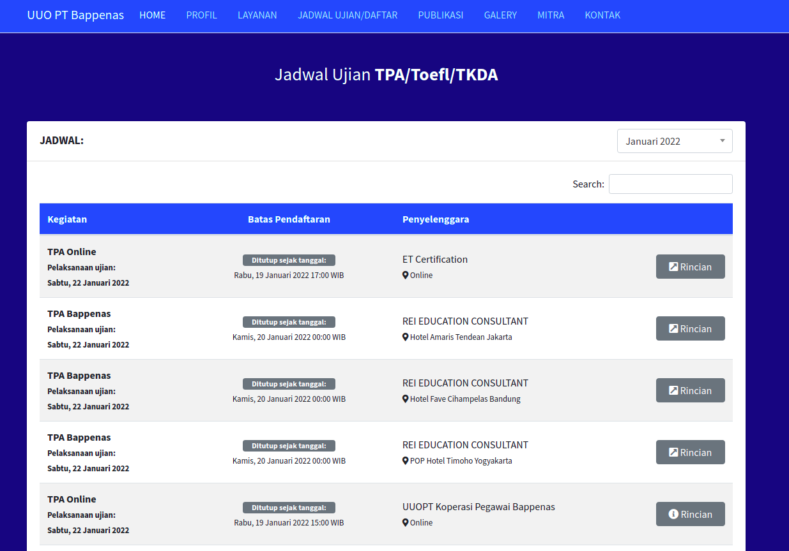
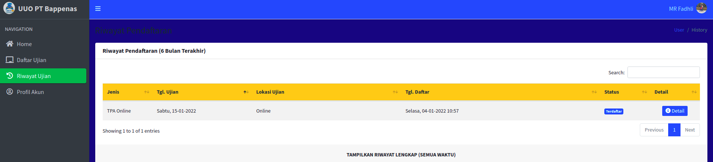
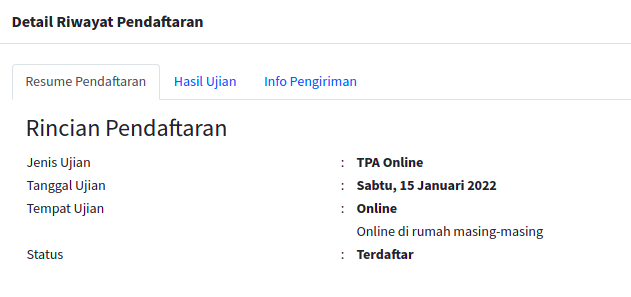

```{r setup, include=FALSE}
knitr::opts_chunk$set(echo = TRUE)
setwd("~/ikanx101 BLOG/_posts/lainnya/tpa")
```

Beberapa hari yang lalu, saya mengikuti __Tes Potensi Akademik__ (TPA) yang diselenggarakan oleh BAPPENAS.

> _Lho untuk apa ikut tes ini?_

Jadi ketika saya mendaftarkan diri untuk [kuliah lagi](https://ikanx101.com/blog/kuliah-lagi/), salah satu persyaratan administratif yang harus ditunaikan adalah lulus TPA BAPPENAS (dalam skor tertentu) dan lulus tes bahasa Inggris (dalam skor tertentu). Karena saya masuk masih dalam kondisi pandemi, maka kedua persyaratan ini ditangguhkan hingga bulan Juli 2022.

> _Daripada dilakukan mepet-mepet, lebih baik saya selesaikan lebih awal!_

Begitu pikir saya.

Maka setelah tahun baru lau, saya coba cari-cari informasi mengenai pelaksanaan TPA BAPPENAS. Bagaimana cara pendaftaran hingga pelaksanaan tes? Berikut _review_-nya:

---

## Pendaftaran

Untuk mendaftar, rekan-rekan bisa membuka _link_ [Koperasi BAPPENAS](https://koperasi.bappenas.go.id/jadwal-tpa/). Pada halaman tersebut kita bisa langsung melihat jadwal pelaksanaan tes TPA terdekat pada bulan berjalan (dan juga bulan berikutnya).

```{r,fig.align='center',echo=FALSE}

```

<br> 

Ujian dilaksanakan secara _online_ atau _offline_, baik di Jakarta ataupun di beberapa kota lainnya. Kita bisa memilih ujian mana yang sesuai dengan jadwal kita.

Saat mendaftar, kita perlu membuat akun terlebih dahulu sebagai akun _login_ _dashboard_ untuk melihat berbagai informasi seputar tes. Setelah itu, kita perlu melakukan pembayaran melalui bank transfer. Proses konfirmasi pembayaran memakan waktu sekitar 2 jam (untuk kasus saya kemarin).

_Oh iya_, kemarin saya memilih untuk melakukan tes secara _online_. Biaya yang harus dibayarkan sekitar $>Rp500.000$.

Setelah terkonfirmasi, maka kita bisa melihat status riwayat pendaftaran menjadi __terdaftar__.

```{r,echo=FALSE,fig.align='center'}


```

<br>

Perlu diingat _yah_, informasi resmi terkait penyelenggaraan TPA BAPPENAS sebaiknya langsung dilihat di situs Koperasi BAPPENAS saja. Jangan sampai mendaftar tes ke lembaga yang belum jelas kredibilitasnya.

## Persiapan

Pada H-1 ujian, kita akan mendapatkan _email_ dari panitia ujian terkait tata laksana ujian. Menurut saya, waktu ini cukup mendadak karena ada beberapa peralatan yang harus kita persiapkan terlebih dahulu. Apa saja?

1. Komputer atau laptop berbasis Windows.
    - Ini adalah salah satu persiapan yang rumit bagi saya karena di rumah hampir tidak ada laptop yang memiliki OS Windows. Setelah _deg-degan_ memikirkan mau meminjam laptop dari keluarga, _alhamdulillah_ laptop nyonya ternyata masih bisa di-_boot_ ke Windows 10.
    - Untuk apa sih perlu OS Windows? Jadi ada tiga aplikasi yang perlu di-_install_ terlebih dahulu, yakni: _Mozilla_, _SafeBrowser_, _Zoom_ (ini _custom Zoom_ dari BAPPENAS). Tujuan utamanya adalah mencegah peserta melakukan kecurangan selama ujian berlangsung.
1. Kaca besar.
    - Kegunaan dari kaca ini adalah sebagai _background_ kita. Jadi selama ujian, kaca tersebut harus diletakkan di belakang peserta ujian. Letaknya dibuat sedemikian sehingga pengawas ujian bisa melihat layar laptop kita dari kaca tersebut.
    - Ini adalah bagian yang paling ribet, jadi kalau bisa luangkan waktu banyak untuk melakukan _setting angle_ kaca dan laptop.
1. Spidol _non permanent_ dan _whiteboard_.
    - Kita tidak diperkenankan untuk menggunakan kertas sebagai coretan menghitung. Kita hanya diperbolehkan untuk menggunakan spidol dan _whiteboard_. 
    - Semua coretan perhitungan selama ujian akan diperlihatkan kepada pengawas dan dihapus di depan mereka saat kita selesai mengerjakan ujian.
1. Ruang ujian tertutup.
    - Ini merupakan hal yang wajib! Jika memungkinkan tidak boleh ada orang lain di ruang ujian selain diri kita sendiri.
    - Kelak sebelum ujian kita perlu memperlihatkan ruangan kita secara `360` kepada pengawas.
1. Koneksi internet bagus.

Pada H-1 juga kita akan dimasukkan ke dalam grup WA panitia ujian.

Untuk persiapan ujian, saya sendiri tidak melakukan persiapan khusus. Saya hanya perlu cukup tidur, istirahat, dan makan sebelum ujian.

## Waktu Ujian

Sesaat sebelum ujian, kita perlu memperhatikan semua instruksi dari pengawas. Saat ujian, kita juga tinggal menjawab soal tersebut sesuai dengan kemampuan kita saja. Tidak perlu dibawa stres.

Ujian berupa pilihan ganda tanpa ada bobot minus jika salah menjawab.

Saran saya terkait soal yang melibatkan perhitungan, kita tidak diperkenankan menggunakan kalkulator. Kenapa begitu? Karena memang soal tersebut didesain bisa diselesaikan tanpa menggunakan kalkulator. Justru kalau kita gunakan kalkulator, kita bisa bingung karena tidak ada jawaban eksaknya di pilihan jawaban.

Peserta akan dikelompokkan menjadi kelompok-kelompok kecil yang diawasi oleh seorang pengawas. Setelah selesai mengerjakan ujian, kita akan diarahkan oleh pengawas untuk melaporkan kegiatan kita selama ujian kepada kepala pengawas.

## Pasca Ujian

Nilai dan hasil akhir ujian akan ada pada H+3 di situs _dashboard_ Koperasi BAPPENAS. Sementara sertifikat akan dikirimkan ke alamat rumah sesuai dengan alamat yang kita informasikan di awal pendaftaran.